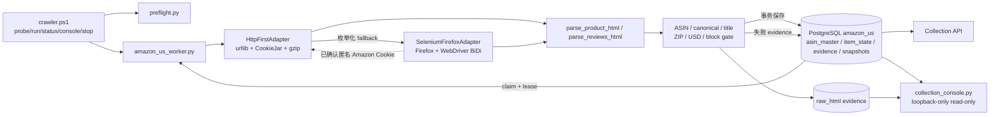
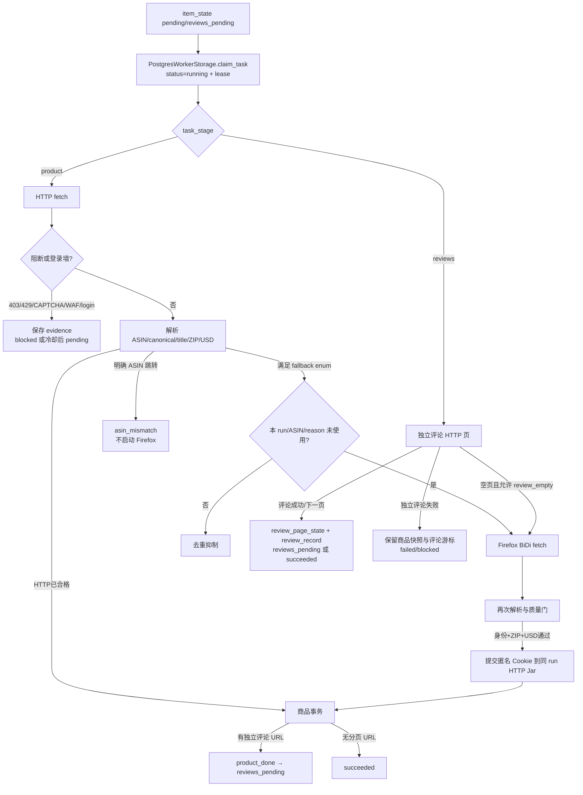

# Amazon US 采集系统技术说明

本文是 Amazon 美国站采集项目的单一技术权威文档。代码、PostgreSQL schema 和新鲜测试证据优先于本文；两者不一致时必须先按实现核对并修正文档。

## 1. 项目目标、范围与结论

### 1.1 目标

系统以 PostgreSQL 为任务、租约、断点、商品结果和历史的唯一事实源，按“HTTP first → Selenium Firefox fallback → Parser/Quality Gate → PostgreSQL transaction”采集 Amazon.com 公开商品页面。当前优化目标是在不降低标题、价格、A+、媒体 URL、内容模块和评论状态质量的前提下，使代理流量可计量、Firefox 降级可解释、匿名 ZIP 会话可在同一次运行内安全复用。

### 1.2 当前实现范围

- HTTP 使用 `urllib`、内存 `CookieJar`、`HTTPCookieProcessor` 和 gzip；
- Firefox 使用 Selenium `4.47.0`、正式 Mozilla Firefox、geckodriver 和 WebDriver BiDi；
- Firefox 只在枚举化原因获准时使用，屏蔽 image、font、media 和明确广告/遥测请求；
- 商品身份、Amazon.com、US、USD 是硬门；ZIP `90001` 是字段级软门。ZIP 未确认时可保存 partial 商品，但只有 Firefox 明确确认 ZIP/US/USD 后才把隔离 Cookie 提交给本次 HTTP 会话；
- 商品、独立评论分页和媒体二进制是不同状态/成本口径；默认只保存媒体 URL 与元数据；
- PostgreSQL 保存当前状态、追加快照、评论断点和 evidence；原始 HTML 保存到本地 evidence 目录；
- 默认 `127.0.0.1:8770` 的统一只读 Console 从 PostgreSQL 枚举可见 tenant/批次/run，展示任务、商品、evidence、领域分类和四类流量；切换 tenant 不重启服务，也不依赖浏览器缓存或单一输出目录。

### 1.3 明确不做

- 不读取个人 Firefox/Chrome profile、Cookie、Token 或登录态；
- 不自动登录、不破解 CAPTCHA、不绕过 AWS WAF/访问控制；
- 不做指纹伪装、代理轮换、开放代理扫描或个人账号轮换；
- 不迁移 Playwright，不引入 Selenium Wire、MITM 或媒体二进制下载；
- 不把 SQLite 恢复为生产事实源；SQLite 仅用于历史回放和离线测试。

### 1.4 当前结论

低流量控制、Cookie 桥接、fallback 去重、nullable 流量、terminal failure 和 full/partial 上下文合同已通过离线测试，最新完整结果为 `261 passed, 1 skipped`。2026-08-31 修复后的真实 Amazon 阶梯已验证3/10/20；继续扩到100-ASIN时在第73条首次出现HTTP 200 CAPTCHA，`stop_on_block`立即以73/100熔断，剩余27条未请求。已完成73条中60个商品全部为full，12条均为同Parent内跳向活跃Sibling Child的`asin_mismatch/variant_redirect`，1条为CAPTCHA；没有新的代码失败或stderr。60个商品页已保存338条真实top reviews，其中54条进入`reviews_pending`，但独立评论分页尚未执行。用户连接手机热点后的短探针3/3通过，但随后的100-run在第2条再次命中同型CAPTCHA；Windows路由核对发现`EFan tun2socks Tunnel`仍为Up并持有覆盖绝大多数公网地址的低metric路由，证明热点只更换底层WLAN，Amazon流量仍经过原VPN隧道。当前必须先关闭EFan或切到真正不同的合规美国出口，不能继续试探；测试账户不得用于绕过挑战。结合2026-09-01周会完成的评论分析专项调研已写入7.3：正确方法、工具候选、Customer Feedback API权限清单和测试账户Worker设计均为**研究结论**，尚未采购、授权、开发或实机验证。

2026-09-01最新美国VPN隔离100条自有ASIN验收已替代上述“当前必须等待新出口”的运行结论：100/100均形成evidence，92个商品成功、8个同Parent兄弟变体跳转、0 blocked，未出现403/429/CAPTCHA/WAF/login；详见11.6。Operation Runs、真实耗时、统一Console、run ledger、Ctrl+C/heartbeat、reviews-only和DataImpulse认证整合后的最新完整离线回归为 `310 passed, 1 skipped`；安全PostgreSQL集成通过DPAPI临时注入DSN执行，`1 passed`。

### 1.5 2026-09-02 自有 1,093 ASIN 生产准备与真实阻塞

- 新隔离 tenant 为 `owned_us_asin_20260902_full_01`。清单由授权源 `美国仓Asin清单.xlsx` 的 `Sheet2!A2:A1094` 只读生成，1,093 条均为唯一合法 ASIN；来源 SHA-256 为 `f0b8fb0fb892edcefe188bfd531dd5434387579e1cb4f69fae7657aa69013e0e`。manifest 和元数据在 `data/owned_us_asin_20260902_full_01/`（Git 忽略）。PostgreSQL 已只执行 manifest 初始化：1,093 条，未发起 Amazon 网络请求。
- 原始 evidence 新写入改为 UTF-8 明文 SHA-256 内容寻址的 `.html.gz`；数据库只保留相对路径、hash 与 metadata。相同 ASIN 的相同 body 跨 run 复用同一 raw 文件；旧 `.html` 保留且离线健康检查、覆盖率、回填和基准解析兼容两种格式。
- `scripts/secure_dpapi_launcher.ps1` 只在短生命周期子进程环境中解密 Windows CurrentUser DPAPI 仓；不会把值放入命令行、stdout/stderr、数据库或 Git。新密钥仓在明文外层只保存非秘密的 scope、owner SID、创建时间和 DPAPI ciphertext；启动器先比对当前 Windows SID，账号不匹配时在解密前以 `vault-owner-mismatch` 失败。Collection API 可从同一密钥派生只读/refresh Agent 的不同 scoped key；API 将 `requested_by` 固定派生为认证 Agent，并将无凭据、越权和接受的 refresh 写入无秘密审计记录。
- **真实出口阻塞，尚未开始 3→20→100→剩余 1,093 商品阶梯：** 当日 DataImpulse 配置 `gw.dataimpulse.com:823`、已确认的 `__cr.us` 用户名和 DPAPI 凭据在 live preflight 返回 `network_error`；本机随后对该 host:port 的 TCP 连通性为 `False`。未发生 403/429/CAPTCHA/WAF/login，也没有代理轮换、替代出口、Cookie/登录或 CAPTCHA 绕过。恢复条件是让此 Windows 主机可达已批准的 DataImpulse `gw.dataimpulse.com:823`（或由供应商确认并授权的新已批准 endpoint）；恢复后必须从 3-ASIN product gate 重新开始，不能把本次初始化当作真实采集。

## 2. 系统架构



### 2.1 模块职责

| 文件/符号 | 职责 | 不负责 |
|---|---|---|
| `crawler.ps1` | Windows 统一控制、preflight、run_id、单实例、统一 Console、PostgreSQL run ledger 与文件receipt镜像 | 解析页面、直接写商品表 |
| `scripts/amazon_us_worker.py` | HTTP/Firefox 适配、解析、质量门、运行编排 | 保存生产凭据、下载媒体二进制 |
| `HttpFirstAdapter` | HTTP 请求、gzip 响应体计量、run-scoped CookieJar、Firefox 懒加载 | 跨 run/tenant/worker 会话共享 |
| `SeleniumFirefoxAdapter` | 隔离临时 profile、ZIP/USD 设置、BiDi 控制、DOM 获取 | 个人 profile、自动登录、反检测 |
| `BrowserNetworkLedger` | 请求分类、资源阻止、主文档/子资源 nullable 计量 | 代理商计费真值 |
| `BrowserFallbackLedger` | `run_id + ASIN + fallback_reason` 去重 | 业务重排队或代理切换 |
| `RunScopedAmazonCookieSession` | Cookie 筛选、内存存储、scope 校验、销毁 | Cookie 持久化或日志输出 |
| `scripts/postgres_worker_storage.py` | claim/lease、事务写商品/评论/evidence、状态历史 | 网络访问 |
| `scripts/collection_console.py` | PostgreSQL tenant枚举、显式tenant-scoped只读查询、批次/run/ASIN领域投影与流量汇总 | 触发采集、修改状态 |
| `scripts/postgres_run_ledger.py` | 幂等创建`collection_run`，写run请求数、终态与receipt JSON | 商品/evidence事实写入 |
| `scripts/operation_ledger.py` | 独立记录egress、preflight、probe/run/reviews控制操作及失败阶段、真实耗时和安全egress_id | ASIN requested/recorded、代理URL或凭据 |
| `scripts/egress_operation.py` | 由正式控制器执行批准出口健康检查，只输出HTTP状态、分类、耗时和字节 | 保存响应正文、代理URL、用户名或密码 |
| `scripts/backfill_identity_evidence.py` | 幂等把旧`asin_mismatch` raw中的严格Parent/Child身份元数据补入既有evidence context | 写兄弟商品快照、改变原始error_code |
| `scripts/collection_metrics.py` | SQLite 历史 evidence 的离线指标 | PostgreSQL 生产写入 |

## 3. 单 ASIN 执行与状态



### 3.1 PostgreSQL claim 与租约

生产入口是 `run_postgres_actions()`。`PostgresWorkerStorage.claim_task()` 使用 `FOR UPDATE SKIP LOCKED` 原子领取任务，并写入：

- `lease_token`
- `lease_owner`
- `lease_expires_at`
- `status=running`

只有持有租约的 Worker 可以提交结果。异常退出后只能回收已过期租约；未过期任务不会被其他 Worker 重复领取。

### 3.2 `item_state` 状态

| 状态 | 含义 | 关键字段 |
|---|---|---|
| `pending` | 等待商品采集或冷却后重试 | `next_retry_at`, `attempts` |
| `running` | 已被 Worker 租约领取 | `lease_*`, `resume_status` |
| `product_done` | 商品事务已完成，准备评论阶段 | `task_stage=reviews` |
| `reviews_pending` | 独立评论分页仍有断点 | `next_review_url`, `next_review_page` |
| `succeeded` | 当前任务阶段完整结束 | 评论可能没有独立分页入口 |
| `blocked` | 403/CAPTCHA/WAF/login 等访问控制 | `block_reason`, `last_error` |
| `failed` | 非阻断错误；`attempts < max_attempts` 可有限重试，`attempts = max_attempts` 为终止失败 | `attempts`, `max_attempts`, `last_error` |

商品成功和评论成功不是同一个状态事实。独立评论失败必须保留已成功的 `product_snapshot`、`media_asset`、`content_module` 和商品页 `top_reviews`。

商品阶段的两类确定性失败在首次保存 evidence 后直接写为 `failed, attempts=max_attempts`：HTTP 404 且同时缺少 ASIN 与标题的 `missing_core_fields:asin,title`，以及已通过严格身份门确认的 `asin_mismatch`。普通 `claim_task()` 因此不会在下一 run 自动领取；显式 requeue/refresh 仍可重置 attempts。HTTP 连接/截断等 `fetch_error`、context/browser 可恢复错误、HTTP 200 缺字段和独立评论失败继续使用既有有限重试/游标语义。该表示复用现有字段，不需要 schema 迁移；升级前已经保存且 `attempts < max_attempts` 的历史失败不自动回填，若再次被领取，会在新规则下终止。

## 4. HTTP 匿名会话与 Cookie 桥接

### 4.1 会话边界

`RunScopedAmazonCookieSession` 的 scope 是：

```text
(run_id, tenant_id, worker_id)
```

`HttpFirstAdapter.begin_run()` 发现 scope 变化时会：

1. 关闭并丢弃已有 Firefox；
2. 清空旧 CookieJar；
3. 创建新 CookieJar 和 `HTTPCookieProcessor`；
4. 重建 `urllib` opener。

`close()` 同样关闭 Firefox 并清空 Jar。Cookie 值不进入 `context_json`、PostgreSQL、文件、stdout/stderr 或审计摘要。

Cookie 桥接是商品/评论结果之外的附加动作。导出 Cookie 或 scope 校验失败时，系统在 evidence 写 `cookie_bridge.status=failed` 和固定 `cookie_bridge_error`，仍保存已经通过业务门的商品/评论结果并终结租约；不会让 PostgreSQL 任务停留在 `running`。

### 4.2 Cookie 接受规则

只有 `commit_browser_context(..., context_confirmed=True)` 才会导出 Cookie。调用点必须已经确认：

- Firefox 的配送头包含配置 ZIP；
- `currencyOfPreference` 明确为 `USD`；未知货币不通过；
- 商品路径还必须通过目标 ASIN、canonical URL 和标题门禁；
- 评论路径必须是一次成功返回的 Firefox action，且 Firefox 内部 ZIP/USD 已确认。

每条 Cookie 还要满足：

| 属性 | 规则 |
|---|---|
| `domain` | 仅 `amazon.com`、`.amazon.com` 或其合法子域；拒绝相似外域 |
| `path` | 必须以 `/` 开始且无控制字符 |
| `secure` | 原样写入 Cookie 对象；仅 HTTPS 自动发送 |
| `expiry` | session Cookie 可为空；过期、非法或超范围时间拒绝 |
| `name` | 非空，拒绝分隔符和控制字符 |

HTTP 请求继续由标准 CookieJar 根据 domain/path/secure/expiry 决定是否发送，代码不手工拼接 `Cookie` header。

### 4.3 可选的 run 启动预热：仅记录，尚未实现

当前正式策略仍是按需预热：每个新 run 创建空的匿名内存 CookieJar，第一个 ASIN 先走 HTTP；只有 HTTP 暴露区域上下文问题时才启动隔离 Firefox、尝试确认 ZIP/US/USD，并在确认后把合规匿名 Cookie 桥接到同 run HTTP 会话。该策略避免美国出口本来可直接返回正确上下文时仍强制产生一次 Firefox 流量。

不得为了减少第一次 Firefox 而读取上一次 run 保存的 Cookie。跨 run 持久化会引入过期、出口国家变化、会话标识泄露、tenant/worker 污染以及旧 Cookie 与新 IP 组合异常等风险，继续明确禁止写磁盘、数据库或日志；个人登录 Cookie 也不在候选方案内。

当真实 100/500-ASIN 批次证明首次 context fallback 对耗时或代理成本有显著影响时，可评估“run 启动匿名会话预热”作为可选配置：启动一次隔离 Firefox，打开 Amazon 轻量公开页面，设置并双重确认 90001/US/USD，把筛选后的匿名 Cookie 仅放入本 run 内存 Jar，再开始领取商品。该方案不会改变 Cookie scope、full/partial 契约或退出销毁规则。

是否实现必须先用相同出口和可比 cohort 做 A/B 验证：

- 不预热与启动预热的 Firefox action/fallback 比例；
- 供应商 `U1-U0` 总流量，而不是 Raw HTML 或本地 ledger 估算；
- 首次成功耗时、整批耗时、成功率和 block 率；
- 匿名 Cookie 在同 run 内的有效持续时间；
- 预热失败时应停止、降级为按需模式还是继续 partial 的明确运行合同。

默认建议保持：小批次按需预热；大批次只有在真实数据证明净收益后才允许配置启动预热；稳定美国代理先验证是否根本不需要预热。当前没有启动预热配置、实现或验收结论，文档不得把它写成已交付能力。

### 4.4 HTTP 计量

`HttpFirstAdapter.fetch()` 默认发送 `Accept-Encoding: gzip`。`last_transfer_bytes` 是一次 HTTP fetch 的压缩响应体字节；`action_http_transfer_bytes` 累计同一 action 内的全部 HTTP 尝试，包括重试、评论 portal URL 和备用 `/product-reviews/{ASIN}`。

该数值不包含请求头、TLS、代理协议开销，也不是代理商账单。代理计费必须用供应商后台前后差值。

### 4.5 DataImpulse 粘滞会话池与有界熔断

当且仅当配置 `proxy_session_ports` 时，Worker 用 `ProxySessionPool` 包装现有 `HttpFirstAdapter`；未配置时接口和单会话行为不变。每个批准端口对应一个懒创建的粘滞会话槽，槽内拥有独立 `HttpFirstAdapter`、内存 CookieJar、opener、Firefox引用和健康统计。Cookie 不跨槽复制；会话耗尽、隔离或 run 结束时关闭 adapter 并销毁 Cookie。

```toml
[worker]
proxy_url = "http://gw.dataimpulse.com:10000" # 只提供已批准host；不得内嵌凭据
proxy_session_ports = [10000, 10001, 10002, 10003]
proxy_session_mode = "sticky"
proxy_session_max_asins = 3                 # 1..5，默认3
proxy_session_retry_per_asin = 1            # 0..1，默认1
proxy_session_consecutive_block_limit = 2   # 1..5，默认2
proxy_session_window_size = 20              # 1..100，默认20
proxy_session_window_block_limit = 3        # 1..20且不大于窗口
```

健康会话达到 ASIN 配额后主动关闭并切下一槽。CAPTCHA、WAF、403、429 立即隔离当前槽；同一 ASIN 只允许在一个新槽重试一次。连续两个新会话阻断，或滚动20次会话响应累计三个阻断时，打开全局熔断并记录未请求数；槽耗尽同样 fail closed。Transport/network error 仍由单会话 HTTP adapter 的有限重试处理，不计访问控制熔断。

Evidence 继续使用现有 `context_json.proxy_session_pool`，不新增 schema。只保存 `session-01` 形式的脱敏ID、sticky模式、ASIN/请求数、completed/variant/failed/blocked/network_error、响应字节、延迟、隔离原因、熔断原因和未请求数。跨会话重试的先前阻断正文写入原 raw store，context 仅保留content hash、raw指针和状态归因；不保存真实代理IP、端口映射、用户名、密码、Cookie、Authorization或响应正文。Console run/详情与receipt读取同一对象。

## 5. Firefox 与 WebDriver BiDi

### 5.1 启动门

Firefox 选项固定启用：

- `options.enable_bidi = True`
- `page_load_strategy = "eager"`
- 独立临时 profile
- 配置指定的 Firefox/geckodriver
- 与 HTTP 相同的显式 HTTP(S) 代理端点

初始化必须同时获得 `driver.network` 并成功注册全部 handler。缺少 BiDi、handler 注册失败或 WebSocket 不可用时，适配器关闭 driver、清理 profile 并 fail closed；不会无拦截地继续 Firefox。

配送上下文提交使用隔离 Firefox 内的 Amazon 地址弹窗：填写 `GLUXZipUpdateInput` 后，Apply 与确认控件都通过 DOM click 触发页面 handler。确认控件兼容 `button[name=glowDoneButton]`、文本型 `Done/完成` button 和旧 `GLUXConfirmClose`；若 Apply 后页面已直接更新为目标 ZIP，则不要求二次按钮。页面必须在提交后、以及刷新商品模块后两次明确满足配送头含 `90001` 且 `currencyOfPreference=USD`，才设置 `context_initialized` 并允许 Cookie 桥接。任一步无控件、点击未生效、等待超时或刷新后退回其他 ZIP，均关闭 Firefox、返回固定 browser-unavailable 错误并保留原 HTTP evidence；runner 只在身份、Amazon.com、US、USD 硬门可信时把该商品保存为 partial，否则仍失败。

`current_window_handle`、导航、ZIP 设置、DOM 和响应状态读取处于同一个受保护生命周期。窗口已丢失或 browsing context 已销毁时，适配器先把浏览器流量保守标为 unknown，幂等清理 BiDi handler、driver 和临时 profile，再只向 runner 返回固定的 `Firefox browser session is unavailable`；原始 WebDriver 异常不进入任务错误或 evidence。

### 5.2 事件与计量

使用 Selenium 4.47 高层 API：

```python
driver.network.add_request_handler("before_request", request_handler)
driver.network.add_event_handler("response_completed", response_handler)
driver.network.add_event_handler("fetch_error", fetch_error_handler)
```

请求拦截使用 Selenium 4.47 公开 `Network.add_request_handler` 的 phase-based 调用，使 `Request.fail()` / `continue_request()` 在本 adapter 实例回调内立即执行。原因是推荐 deferred registry 会在用户 callback 返回后调用内部 `_resolve()`；Gecko 若已释放被拦截请求，`network.failRequest` / `network.continueRequest` 的 `no such request: Blocked request with id … not found` 会从后台线程逃逸。Adapter 仅精确识别这一条竞态：blocked 分支记录脱敏 `blocked_request_race_count` 并把对应子资源计为 unknown；allowed 分支记录脱敏 `continued_request_race_count`，从待定请求队列取回原 main/subresource bucket 并计一次 unknown。不记录 request id、URL、Cookie，不吞其他 WebDriverException，也不使用全局线程 hook、site-packages 修改或 monkeypatch。

`BrowserNetworkLedger` 在 action 开始时记录顶层 `current_window_handle`。顶层 context 的 `document` 计入 Firefox 主文档；iframe context 的 `document` 计入子资源。`response_completed.response.bytesReceived` 有合法值时累加；以下情况计为 unknown：

- `bytesReceived` 缺失、非法或负数；
- `fetch_error`；
- action 结束时仍 pending 的请求；
- response URL 因重定向、规范化或重复请求而无法匹配已登记请求；
- Selenium 高层 `FetchErrorParameters` 未暴露请求身份，无法可靠归类。

只要某一类别存在 unknown，该类别聚合 `bytes` 就是 `null`，不能用已知部分或 0 冒充完整值。

### 5.3 资源规则

| 请求类型/目标 | 行为 |
|---|---|
| `image` | `request.fail()` |
| `font` | `request.fail()` |
| `media` | `request.fail()` |
| `document` | 保留；顶层与 iframe 分开计量 |
| `script` | 保留 |
| `style` / `stylesheet` | 保留 |
| `xhr` / `fetch` | 保留 |
| `amazon-adsystem.com`、`doubleclick.net`、`googlesyndication.com` | 阻止 |
| 已知 telemetry host + path | 阻止 |
| 仅 path 名似遥测、但位于普通业务 host | 保留 |

资源阻止不改变媒体数据合同：解析器继续从 HTML、DOM 属性和内嵌 JSON 提取媒体 URL/A+，只是浏览器不下载图片、字体或视频二进制。

## 6. Firefox fallback 状态机

`FallbackReason` 只允许以下枚举：

| 值 | 触发条件 | 后续门禁 |
|---|---|---|
| `http_transport_error` | HTTP 响应截断、超时或连接错误，且配置了配送 ZIP | 浏览器仍要过 block、身份和上下文门 |
| `missing_asin` | HTTP HTML 缺 ASIN，且没有明确指向其他 ASIN | 再解析目标 ASIN |
| `missing_canonical_url` | HTTP HTML 缺 canonical | canonical 必须为 HTTPS amazon.com `/dp` 或 `/clp`；可为任务 ASIN，或有严格页面证据的 Parent ASIN |
| `missing_title` | 只缺核心标题 | 浏览器必须补出标题 |
| `context_mismatch` | ZIP 不符/缺证据，或国家/币种不可信 | 最多一次 Firefox；US/USD失败仍拒绝，只有ZIP失败可降为 partial |
| `review_empty` | 独立评论页无 review DOM，且 reported count > 0 | 不允许伪造评论成功 |

`BrowserFallbackLedger.claim(run_id, asin, reason)` 保证同一 run、ASIN、reason 最多一次。Evidence 保存最后一个 `fallback_reason` 和本 action 的 `fallback_reasons` 列表。

商品门禁优先级固定为：HTTP status/CAPTCHA/WAF/login block → 明确 ASIN/canonical identity mismatch → 缺核心字段 fallback → 最终 HTTP 404 且缺 ASIN+标题的 terminal missing-core → 一般 US/USD/ZIP context assessment → 最终质量与持久化。只要页面 input ASIN 已明确属于其他商品，就直接保存原 HTTP body/status/transfer 的 `asin_mismatch` evidence，不允许 ZIP/币种/国家错误触发 Firefox。唯一例外是严格 Child/Parent 关系：页面 ASIN 必须仍等于任务 Child，canonical 必须为 HTTPS Amazon 且指向页面唯一 `parentAsin`，并且 `landingAsin`、`currentAsin/current_asin`、`dimensionValuesDisplayData` 或 `colorToAsin` 的明确成员集合必须包含该 Child；缺任一证据仍是 `asin_mismatch`，不得把任务 ASIN改写为 Parent。

`asin_mismatch` 与 Firefox/core fallback 后仍为 HTTP 404 且同时缺 ASIN、标题的 `missing_core_fields:asin,title` 是商品身份/存在性终态，不因下一 run 自动重试。该 404 终态在一般 US/USD context 评估前保存，避免被误写成 `currency_not_observed` / `delivery_country_not_observed`；HTTP 200 或响应状态未知时的缺核心字段保持 `missing_core_fields` 有限重试，404 但身份字段完整的响应继续走既有可恢复/严格质量语义。

以下响应不允许升级 Firefox：

- HTTP 403、429；
- CAPTCHA / Robot Check；
- AWS WAF challenge；
- 登录墙；
- 页面已明确指向其他 ASIN；
- 只缺 `product_description` 等非核心字段。

`login_wall` 必须由明确认证页证据支持：页面标题为 Amazon Sign-In，或在没有商品身份三锚点（非空可见 `productTitle`、ASIN input、`https://amazon.com` 或 `https://www.amazon.com` 的 `/dp`/`/clp` canonical）时出现以 `/ap/signin` 为 action 的认证表单、`ap_email`、`ap_password`、`signInSubmit` 等强认证 DOM。普通导航中的 `/ap/signin` 链接及商品页隐藏 trade-in/feedback 组件中的 `Sign in to continue` 都不是充分证据；canonical 与 input ASIN 不一致交给后续 identity 门判定为严格 Child/Parent 或 `asin_mismatch`，不能先误触登录墙熔断。

HTTP 网络权限错误、连接错误和响应截断属于 `fetch_error`/`http_transport_error`，不是 Amazon `block_reason`。如果 HTTP 和 Firefox fallback 都失败，PostgreSQL 与 SQLite runner 都必须写一条 body 可空的 action evidence、把任务从 `running` 终结为失败并保留有限重试语义；不能依赖租约过期来掩盖未捕获异常。Windows `WinError 10013` 表示当前执行环境或出口权限失败，代码不得将其改写成 403/429/CAPTCHA/WAF，也不得通过绕过沙箱修复。

## 7. 解析、质量门与数据分层

### 7.1 商品解析

`parse_product_html()` 从 HTML/DOM/内嵌数据中产生：

- 身份：`asin`, `canonical_url`, `title`, `brand`；parser 内部另提取 `parent_asin` 与 `identity_child_asins` 供身份门使用，不新增商品 schema
- 商业：`price`, `availability`, `buy_box`
- 评价：`rating`, `reported_rating_count`, `reported_review_count`, `top_reviews`
- 内容：`bullets`, `product_description`, `specs`, `aplus_present`, `content_modules`
- 媒体：图片/视频 URL、placement、entry_type、ordinal 等元数据
- 评论入口：`review_link`, `review_section_anchor`

商品事务前必须满足目标 ASIN、canonical host/path、标题、Amazon.com、US 与 USD 硬门。严格 Child/Parent 成功时商品仍按 Child ASIN 保存，canonical 保留 Parent URL。ZIP 上下文写入现有 evidence `context_json`，无需 schema migration：

- `context_quality=full`：目标 ZIP 已由页面或受控 Firefox 明确确认；`postal_confirmed=true`；
- `context_quality=partial`：Firefox 已尝试但 ZIP 仍未确认，且身份/US/USD可信；商品、媒体 URL、A+、参数和 top reviews 正常保存，`postal_confirmed=false`，记录 `expected_postal`、`observed_postal` 与 `location_sensitive_fields_unverified=[price,availability,buy_box,delivery]`；
- `context_quality=invalid`：明确非 US、明确非 USD，或缺少 US/USD可信证据；仍按 `context_mismatch:*` 失败。

US 正向证据必须来自已确认 Firefox 上下文、配送字段明确写出 `United States/USA/U.S.`，或配送短语与美国 5 位 ZIP 的组合；Amazon.com 域名或 `$` 价格单独都不构成 US 证据。USD 正向证据来自明确 `$`/`USD` 价格或已确认 Firefox `currencyOfPreference=USD`。

Partial 不等于 90001 结果，不能用于断言价格、库存、buy box 或配送适用于目标 ZIP。Cookie bridge 只允许 full Firefox action。失败 evidence 不覆盖已有有效商品快照。

### 7.2 独立评论

`parse_reviews_html()` 处理 `review_id`、rating、title、body、URL、日期、locale、verified、review image URL 和下一页。评论分页状态存于 `review_page_state` 与 `item_state.next_review_*`。

portal 评论 URL 为空时可尝试稳定 `/product-reviews/{ASIN}`；两者均为空后，才允许一次 `review_empty` Firefox fallback。仍为空时保存 `empty_review_page`，保持评论游标，不把 200 空页写成评论成功。

### 7.3 评论分析工具选型与采集规则（研究完成，实现待定）

> **状态边界：** 本节是截至2026-09-01、结合周会要求形成的研究合同。当前没有购买或接入第三方评论工具，没有获得Amazon Customer Feedback API授权，没有实现登录评论Worker，也没有用测试账户访问独立评论页。任何后续代码任务必须先解决本节的`待确认`项。

#### 7.3.1 业务目标

评论分析的核心是识别用户诉求，而不是只筛三星以下或把1万条评论机械翻完。目标输出至少包括：

- 正面、负面和混合观点；
- 产品主题/属性，如质量、耐用性、尺寸、安装、兼容性、包装、缺件、价格和描述一致性；
- 每个属性的情感、提及量和对星级的影响；
- 最近周期内改善、恶化或稳定的趋势；
- Parent/Child变体差异和自有/竞品差距；
- 可回到原评论、ASIN、日期和样本分母的证据；
- 面向产品、Listing、客服和供应链的行动建议。

不能只给整条评论一个正负标签。一条五星评论可能同时表达“安装方便”与“铰链不耐用”，必须做属性级情感分析（ABSA）。任何百分比都必须保存分母、cohort、时间范围和数据来源，不能由LLM自行编造。

#### 7.3.2 数据源与工具优先级

优先顺序固定为：

```text
Amazon官方Customer Feedback API
→ 合规现成工具的小样本对照
→ PostgreSQL中的top reviews和获准原文证据
→ 测试账户低频评论Worker（仅补证）
```

| 候选 | 主要能力 | 已知限制 | 当前决策 |
|---|---|---|---|
| Amazon Customer Feedback API | ASIN/Browse Node正负主题、提及量、星级影响、月度趋势和片段 | 周更、仅英文；需`Brand Analytics`或`Selling Partner Insights`角色 | **第一优先核验**，未授权 |
| Helium 10 Review Insights | 官方API主题、评分影响、6个月趋势、Parent/类目比较、CSV | 付费；共享Amazon API缺数据边界；截至2026-09-01公开约$99年付折算或$129月付 | 可做现成工具对照，未采购 |
| Jungle Scout AI Review Analysis | 任意ASIN、竞品、正负主题和改进建议 | 原始CSV需Amazon买家登录，公开限制最多100条最新评论 | 适合分析师小样本，非5,800 ASIN主链路 |
| VOC.AI | Amazon专用主题、竞品、API/MCP和批报告 | 数据新鲜度、Parent/Child和近期评论覆盖需实测；Pro公开$99/月 | **低成本试点候选**，未开通 |
| BERTopic + PyABSA | 开源主题发现、属性抽取、属性情感和观点三元组 | 通用模型存在品类错配；必须用本项目金标和人工主题治理 | 可做内部原型，未安装 |
| Thematic / Qualtrics / Chattermill | 多渠道企业VoC、工作流和仪表盘 | 成本和复杂度高；不是Amazon数据源 | Amazon单站MVP暂不采购 |

价格属于动态外部事实，采购前必须重新核验；本表不构成购买授权。

#### 7.3.3 正确的评论选择与分析规则

1. 先定义业务问题、ASIN cohort、Parent/Child、时间窗口和竞品集合，再取评论；
2. 不只抓低星，也不只依赖Amazon排序后的top reviews；
3. 评论量较少时可在访问权利允许的前提下全量；评论量很大时按以下维度分层抽样：
   - 1至5星；
   - 正面、负面、混合及待识别观点；
   - 新近与历史；
   - Parent下不同Child；
   - verified purchase、helpful count；
   - 自有与竞品；
4. 先发现和合并`aspect-sentiment`，再按其分布选择代表评论，最后生成证据约束摘要；
5. 摘要必须显示样本数、时间范围、ASIN/变体和3至5条原文证据；
6. 评分影响表示关联和优先级，不得冒充销售因果关系；
7. 趋势比较必须固定cohort、周期和主题版本，主题重命名或合并要有版本历史；
8. 原文中可能包含姓名等用户生成信息，展示层只保留分析所需最小字段，不建立用户画像。

试点目标为20至50个ASIN、1,000至2,000条评论，并覆盖高/低评论量、自有/竞品和多个Child。至少10%的试点样本由人工复核主题、情感、证据与摘要；`主题准确率、召回率、情感F1和允许误差阈值`均为**待确认验收标准**，不能先写一个没有金标依据的数字。

#### 7.3.4 Customer Feedback API权限核验

官方API当前已知合同：数据周更、仅英文；单ASIN洞察可分别按`MENTIONS`和`STAR_RATING_IMPACT`排序，返回前10个正面、前10个负面主题及过去六个月趋势；默认每账户-应用对1 request/second、burst 10。

以下信息必须由公司Amazon主账号管理员确认：

| 待确认项 | 为什么需要 | 确认结果 |
|---|---|---|
| 公司账户是Seller还是Vendor | 决定注册和授权路径 | `待确认` |
| Seller是否为Professional账户 | 私有Seller SP-API应用前置 | `待确认` |
| 是否有Brand Registry | 影响Brand Analytics能力 | `待确认` |
| 主账号能否进入`Apps and Services → Develop Apps`或Solution Provider Portal | 决定是否能注册/更新应用 | `待确认` |
| 是否已有Developer Profile | 决定从注册还是角色更新开始 | `待确认` |
| 是否已有公司私有SP-API应用 | 决定新建或复用 | `待确认` |
| 已获批角色是否包含`Brand Analytics`或`Selling Partner Insights` | Customer Feedback操作至少需要一个 | `待确认` |
| 是否允许为本项目新增角色并重新授权 | 新角色需要应用更新和新LWA refresh token | `待确认` |
| 凭据由谁保管、放入哪个安全凭据系统 | 禁止写代码、文档、日志和TOML | `待确认` |
| API用于自有ASIN还是也允许竞品/类目研究 | 决定业务边界与cohort | `待确认` |

权限可用时，官方API是主题、提及量、评分影响和趋势的主数据源；本地评论只补原文、中文业务主题和细粒度证据。权限不可用时，才进入VOC.AI/Helium 10/Jungle Scout同cohort试点。

#### 7.3.5 测试账户独立评论Worker规则

该Worker尚未实现。即使使用测试账户，也只能作为低频原文补证，不能承担5,800 ASIN生产全量评论：

```text
独立review tenant / worker / run_id
→ 启动可见隔离Firefox
→ 用户在该窗口手动登录测试账户
→ 不读取现有Chrome/Firefox个人profile
→ 代码不接触密码、OTP或支付信息
→ 登录Cookie不桥接商品HTTP
→ 初期不跨run持久化Cookie
→ 只领取reviews_pending
→ 固定ASIN数、页数、速率和总时长
→ CAPTCHA、WAF、登录异常、评论访问限制立即停止
```

其他硬边界：

- 不自动解决CAPTCHA，不点击“继续购物”绕过挑战；
- 不自动换账号、IP或代理轮换；
- 商品成功和评论失败继续分离；
- 评论evidence保存URL、状态、hash、来源、页码和Raw HTML指针，不保存Cookie值或账号标识；
- 第一次真实验收最多3个ASIN、每个1至2页；出现评论访问限制立即停用该路径；
- Amazon 2026 Agent Policy完整文本、测试账户负责人授权和公司合规/安全意见均为`待确认`；确认前不进入代码开发。

#### 7.3.6 仍需业务确认

| 业务问题 | 当前状态 |
|---|---|
| 正式自有美国ASIN权威清单是800、1,800还是5,800口径 | `待确认`；需区分active、404、variant_redirect和Parent/Child |
| 评论分析覆盖自有商品、竞品还是两者 | `待确认` |
| 重点ASIN如何分级，分析周期是周、月还是事件触发 | `待确认` |
| 是否需要中文、英文或双语主题和摘要 | `待确认` |
| 产品、运营、Listing、供应链分别需要哪些主题 | `待确认` |
| 允许展示哪些原评论字段，保留多久 | `待确认` |
| VOC.AI/Helium 10/Jungle Scout试点预算与采购负责人 | `待确认` |
| 测试账户自动化是否获公司账户负责人和合规/安全批准 | `待确认` |

#### 7.3.7 分阶段决策门

1. **A：现有数据原型。** 用已保存top reviews建立主题/证据样例，不新增Amazon请求；
2. **B：官方权限。** 完成7.3.4清单；权限可用则先做API静态Sandbox和3-ASIN生产验证；
3. **C：工具对照。** 同一20至50 ASIN cohort试用VOC.AI，并选择Helium 10或Jungle Scout之一对照；
4. **D：方法验收。** 建立人工金标，核对主题、情感、Parent/Child、新鲜度和证据追溯；
5. **E：实现决策。** 官方API/现成工具不足且登录路径获批时，才创建独立评论Worker任务包；
6. **F：采购决策。** 只有试点证明覆盖、新鲜度、成本和可持续性后才购买。

### 7.4 媒体

默认配置 `save_media = "url_and_metadata_only"`。`media_asset` 和 `content_module.image_url` 保存 URL/元数据；系统不下载图片或视频二进制，媒体成本不并入商品 action。

## 8. PostgreSQL 数据合同

### 8.1 核心表

| 表/视图 | 用途 |
|---|---|
| `asin_master` | tenant-scoped ASIN 主数据与来源 |
| `item_state` | 当前任务状态、重试、评论游标、租约 |
| `state_history` | 状态转换审计 |
| `refresh_request` | API 发起的刷新任务 |
| `collection_evidence` | 每个 action 的来源、状态、hash、路径、流量和上下文 |
| `product_snapshot` / `product_latest` | 追加商品快照与最新视图 |
| `media_asset` | 当前媒体 URL/元数据 |
| `content_module` | bullets、A+、说明、规格等模块 |
| `review_summary` | 页面报告数、已抓数量、分页状态 |
| `review_page_state` | 每页评论断点 |
| `review_record` | review_id 幂等评论记录 |

所有生产读写必须包含 `tenant_id + marketplace + asin + subject_type`。SQLite 不参与生产双写。

### 8.2 Evidence 示例

```json
{
  "run_id": "run-20260831T120000Z-example",
  "url": "https://www.amazon.com/dp/B00RCPDCQU",
  "http_status": 200,
  "transfer_bytes": null,
  "source_type": "selenium_dom",
  "block_reason": null,
  "error_code": null,
  "context_json": {
    "expected_country": "US",
    "expected_currency": "USD",
    "postal_code": "90001",
    "fallback_reason": "context_mismatch",
    "fallback_reasons": ["context_mismatch"],
    "cookie_bridge": {
      "status": "committed"
    },
    "traffic": {
      "http_compressed_response_bytes": 184321,
      "firefox_main_document_bytes": null,
      "firefox_subresource_bytes": 42810,
      "firefox_main_document_known_count": 0,
      "firefox_subresource_known_count": 6,
      "firefox_main_document_unknown_count": 1,
      "firefox_subresource_unknown_count": 0,
      "blocked_resource_counts": {
        "image": 27,
        "font": 4,
        "media": 2
      },
      "blocked_request_race_count": 0,
      "continued_request_race_count": 0
    }
  }
}
```

示例中的数值只说明结构，不是实测结果。`transfer_bytes=null` 表示最终来源是 Firefox，不能把 HTTP 或 DOM 大小写进该字段。HTTP 已花费字节仍单独保存在 `context_json.traffic.http_compressed_response_bytes`。

## 9. 流量与成本口径

| 类别 | 数据源 | `bytes` 何时为 null | 是否代理账单 |
|---|---|---|---|
| HTTP compressed response | `action_http_transfer_bytes` | HTTP 响应体无法可靠计量 | 否 |
| Firefox main document | BiDi `response_completed` | 任一主文档 response unknown/fetch_error/pending | 否 |
| Firefox subresources | BiDi `response_completed` | 任一子资源 response unknown/fetch_error/pending | 否 |
| Proxy dashboard bill | 供应商后台 `U1-U0` | 未录入供应商数据 | 是 |

Console 的 overview 和 run 详情分别显示上述四类。Firefox 类别是否适用由对应 `context_json.traffic.firefox_*` 键判断，即使 action 最终 `source_type=http_html`，只要曾尝试 Firefox，unknown 仍必须计入并使 `bytes=null`。Raw HTML 文件大小是本地保存体积，不能代替任何网络或账单类别。

成本验收必须在独立 tenant、固定样本和隔离账单窗口中记录：

```text
billed_bytes = U1 - U0
billed_cost = C1 - C0
cost_per_successful_asin = billed_cost / successful_asins
```

## 10. 配置参考

正式 Windows 配置见 `config/amazon_us.windows.toml`。

| 配置 | 默认/示例 | 作用 |
|---|---|---|
| `request_timeout_seconds` | `30` | HTTP/Firefox 页面超时 |
| `http_max_attempts` | `2` | 单次 HTTP fetch 的有限尝试，最大 3 |
| `http_retry_backoff_seconds` | `0.5` | 传输错误退避 |
| `http_accept_encoding` | `gzip`（代码默认） | 压缩响应；仅 `gzip`/`identity` |
| `headless` | `true` | Firefox headless |
| `max_actions_per_run` | `10` | 单批 action 上限 |
| `max_attempts` | `3` | 任务失败上限 |
| `review_page_limit` | `0` | `0` 表示不以配置截断分页 |
| `geckodriver_path` | 固定仓库工具路径 | 禁止运行时随意下载未知驱动 |
| `firefox_binary` | 正式 Firefox 路径 | 使用本机 Mozilla Firefox |
| `proxy_url` | 空 | 单一批准 HTTP(S) 出口；URL 禁止内嵌凭据 |
| `proxy_username_env` / `proxy_password_env` | 空 | 只保存环境变量名，必须成对配置 |
| `global_requests_per_second` | `0` | 全局限速；上线前显式设置 |
| `egress_requests_per_second` | `0` | 单出口限速 |
| `rate_burst` | `1` | token bucket burst |
| `stop_on_block` | `true` | 阻断后停止当前批次 |
| `save_media` | `url_and_metadata_only` | 不下载媒体二进制 |
| `expected_country` | `US` | 地域门禁 |
| `expected_currency` | `USD` | 币种门禁 |
| `postal_code` | `90001` | 目标配送 ZIP；US/USD为硬门，ZIP为full/partial软门 |

DSN 和密码只通过当前进程环境提供。不得写入 TOML、Git、日志或回执。

## 11. 运行与验证

### 11.1 离线检查

```powershell
.\.venv\Scripts\python.exe -m pytest tests -q -p no:cacheprovider
.\.venv\Scripts\python.exe -m compileall -q scripts tests
node --check console\app.js
git diff --check
```

### 11.2 PostgreSQL 初始化与预检

先由批准的本地密码管理方式设置 `AMAZON_US_POSTGRES_DSN` 和 `PGPASSWORD`，不要把值写入命令历史或文档。然后运行：

```powershell
if (-not $env:AMAZON_US_POSTGRES_DSN) { throw 'AMAZON_US_POSTGRES_DSN is required' }
.\.venv\Scripts\python.exe scripts\preflight.py --require-live --backend postgres --dsn-env AMAZON_US_POSTGRES_DSN
```

### 11.3 `3 → 10 → 20` 真实测试

下面命令会访问 Amazon，只有用户明确授权真实网络测试后才执行：

```powershell
.\crawler.ps1 egress
.\crawler.ps1 probe -Limit 3
.\crawler.ps1 run -Limit 10
.\crawler.ps1 run -Limit 20
.\crawler.ps1 console
```

每一级必须使用新的 `run_id`。只有上一级无 403/429/CAPTCHA/WAF/login、上下文正确且字段质量稳定时才扩大。出现阻断立即停止，不自动换代理或重排 blocked。

Console 是常驻 Python 进程，代码更新后必须重启旧 Console 才会加载新的分类与汇总逻辑：先执行 `.\crawler.ps1 stop -All`，再由下一次 `probe/run` 自动启动，或单独执行 `.\crawler.ps1 console`。新版 Console 的唯一受控锁固定在 `data/console_control/.console.lock.json`，不再随 tenant 输出目录复制；`console` 命令本身也不解析或要求某个批次的 `OutputDir`。页面用 `?tenant=` 显式选择，后端每条overview/items/runs/detail查询仍带tenant条件，跨tenant run/ASIN不可见。

2026-09-01核对发现，旧交接副本曾通过Windows计划任务`Amazon US Collection Hourly`每小时执行`2026-08-25`目录的`run_once_windows.bat`。该旧入口先执行SQLite `--live --once`，即使Worker失败仍继续`--materialize-only`，会造成“先出现联网异常堆栈、随后打印不访问网络”的误导，并可能与正式批次同时占用Amazon出口。用户确认清理后，计划任务已注销，635.7MB旧交接父目录及同名ZIP已移入Windows回收站；复核显示旧路径、任务和旧Worker进程均不存在，当前正式项目完整。正式运行与未来调度只能调用当前目录`crawler.ps1`和PostgreSQL Worker，禁止从回收站恢复后重新启用旧小时任务。

Console 只在受控锁的 PID+StartTime 仍指向同一 host、且`readyz` runtime fingerprint等于当前 `collection_console.py` SHA-256时复用。锁的 `start_time` 可能被PowerShell还原为`DateTime`，也可能保持ISO string；控制器统一为UTC ticks精确比较，不只凭PID接管。端口存在无有效锁的listener时继续fail closed；`stop -All`不终止未知PID。tenant和raw目录不再属于Console进程身份，因为一个服务必须可读所有PostgreSQL可见tenant。

`probe` 的 Worker exit 0 只表示完成有界 action 循环，不代表商品质量通过。Worker 退出后，控制器有界读取最终run，打印`recorded/requested`、completed、failed、blocked、inferred。Receipt v3同时写入`amazon_us.collection_run.receipt_json`和本地`receipt.json`镜像；数据库run ledger保存requested、command、started/finished、controller/worker exit、termination reason和终态，文件不能替代数据库事实。Probe只有recorded等于请求数、inferred/failed/blocked为0且全部item为evidence-attributed completed才返回0，否则`quality_failed`。

受控Worker host同时持有Windows owner process handle和15秒controller heartbeat。PowerShell收到`Ctrl+C`后即使外层shell PID仍存活，只要脚本不再刷新heartbeat，host会关闭Job Object、终止Worker及其Firefox子树，再使用项目venv中的`psycopg`把run写为`interrupted/controller_exited`，最后生成文件receipt镜像。正常controller异常路径也先终止受控host再写终态。owner PID、StartTime或heartbeat无法验证时fail closed；正式`stop`仍只终止PID+StartTime完全匹配的受控host。

### 11.4 PostgreSQL 集成测试

测试只读取 `AMAZON_TEST_POSTGRES_DSN`。变量不存在时应 skip，不索取或打印密码：

```powershell
.\.venv\Scripts\python.exe -m pytest tests\test_postgres_worker_integration.py -q -rs -p no:cacheprovider
```

### 11.5 2026-09-01 新版自有 ASIN 清单与隔离 20 条批次

只读来源 `美国仓Asin清单.xlsx` 的 `Sheet2!A2:A1094` 已按文件 SHA-256 `f0b8fb0fb892edcefe188bfd531dd5434387579e1cb4f69fae7657aa69013e0e` 独立复核：1,093 行全部非空、唯一、符合 10 位大写 ASIN。与旧 1,892 条 manifest 比较，重合 1,091、新增 2（`B06VWMP73S`、`B01LWJ0JIC`）、旧清单独有 801；两份清单均无格式错误或重复。

现有只读 Console 可见的 PostgreSQL tenant `real_batch_20260828_500_04` 有 500 条，均来自旧 manifest；其中 109 条与新版清单重合，新版 984 条不在该 tenant，两个新增 ASIN 均不在该 tenant。该结论只覆盖明确 tenant，不代表所有 PostgreSQL tenant；当前进程没有 DSN/密码，因此没有越权枚举或写库。

新批次固定为 tenant `owned_us_asin_20260901_20_01`，目录 `data/owned_us_asin_20260901_20_01/`。样本包含两个新增 ASIN，并从 1,091 个重合项按来源行位置等距选 18 个；manifest、配置和来源元数据均在 Git 忽略边界内。操作者在项目根目录使用：

```powershell
$batch = @{
  TenantId = 'owned_us_asin_20260901_20_01'
  ManifestPath = 'data\owned_us_asin_20260901_20_01\manifest_20.csv'
  ConfigPath = 'data\owned_us_asin_20260901_20_01\batch20.toml'
  OutputDir = 'data\owned_us_asin_20260901_20_01'
}
.\crawler.ps1 probe -Limit 3 @batch
.\crawler.ps1 status @batch
.\crawler.ps1 console @batch
# 只有 probe 的 3 条质量门通过后，才补齐剩余 17 个商品；product-only 会跳过评论 action。
.\crawler.ps1 run -Limit 17 @batch
```

首次命令会隐藏输入数据库密码并初始化新 tenant；这一步不由代理代替操作者执行。`probe` 必须满足 `recorded=requested`、`failed=blocked=inferred=0`、`quality_gate_ok=true`，且没有 403/429/CAPTCHA/WAF/login 才能继续。20 条结束后必须逐条用 Console run 详情、receipt、stdout/stderr 和 evidence 核对 `error_code`、`block_reason`、HTTP 状态、canonical/DOM ASIN 与上下文；任一失败先冻结批次并确认根因，不自动重跑或切换出口。

2026-09-01 代理获授权自行执行后，新 tenant 的两轮 3 商品 probe 均为 0/3。首轮请求被当前沙箱以 WinError 10013 阻止；非沙箱同样本复测排除该因素后，三个根因分别为 DNS 11002、country/currency mismatch 和 asin_mismatch，因此没有继续剩余 17 商品。

为避免评论测试混入商品或 refresh action，现有 Worker/控制器新增对称 `--reviews-only` / `crawler.ps1 reviews`，硬限制每 run 1 至 3 action，PostgreSQL claim 固定 `task_stage=reviews`。独立 reviewer 发现空 `next_review_url` 或错误 stage 可能落入商品分支；补两个红灯后改为联网前写 `invalid_review_task` evidence 并释放租约。修复后专项 33 passed、完整离线 268 passed/1 skipped，PowerShell AST、compileall 和 diff 检查通过。

真实评论 run `run-control-20260901T081012043Z-8980-cd627705b2` 复用已有成功商品状态的 tenant `real_batch_20260828_500_04`，但使用独立输出/锁/日志目录 `data/review_test_20260901_3_01`、专属端口和 `review_page_limit=1`。首个 ASIN `B00RCPDCQU` 的公开评论 URL 返回 HTTP 200/125,959 压缩字节，但页面被明确识别为 `login_wall`；系统保存 raw/evidence、写 `blocked` 并立即熔断，0 条独立评论入库，剩余 2 个 action 未请求。该结果证明匿名独立评论路径当前不可用；继续遵守 7.3.5，不登录、不读取个人 Cookie、不绕验证码、不自动轮换或采购代理。商品页已有 top reviews 保持不受影响。

### 11.6 2026-09-01 美国 VPN 下新版自有 ASIN 100 条商品验收

用户明确切换到美国 VPN 并授权100条真实商品测试后，建立隔离 tenant `owned_us_asin_20260901_100_01`。样本包含新版清单全部2个新增ASIN，以及从1,091个新旧重合项按来源行等距选择的98条；manifest、配置与来源哈希元数据位于 Git 忽略目录，未覆盖旧tenant。本轮只运行商品阶段，评论分页为0。

两个run分别为 `run-control-20260901T083844567Z-7932-496b38fa48`（3条probe）和 `run-control-20260901T084206688Z-26728-3043213c95`（其余97条）。最终100/100均有PostgreSQL evidence：92个商品成功、8个 `asin_mismatch`、0 blocked、0 inferred；全部HTTP状态为200，无403、429、CAPTCHA、WAF或login wall。92个成功商品均为 `context_quality=full`，ZIP 90001、US、USD可信；来源为97条 `http_html`、3条 `selenium_dom`，Firefox只用于上下文fallback。新增ASIN `B06VWMP73S`、`B01LWJ0JIC` 均成功。

8个失败均已离线回放对应raw HTML：任务ASIN仍出现在页面明确Child集合中，但页面当前ASIN和canonical均指向同一Parent下的另一个Sibling Child，分类为真实 `sibling_variant_redirect`，不是代码Bug或访问控制。严格身份门没有把兄弟变体静默保存为原任务商品。失败ASIN为：`B0B9ZFDZNJ`、`B0F2DSZB24`、`B0FKH5FFYT`、`B0G38J7G4W`、`B0GHW9NBXN`、`B0GRVZ1XP3`、`B0GS8L8DSV`、`B0GWZMKXLS`。

字段与内容结果：92/92有标题，91/92有价格；唯一缺价商品 `B0H8NZ2TLT` 的商品页明确显示 `Currently unavailable` / 不知道何时恢复库存，且无Buy Box，因此属于Amazon当前无可售报价，不是价格解析器漏抓。数据库写入92个商品、4,388条媒体URL/元数据、5,587个内容模块和92个页面评论汇总，独立评论记录仍为0。保存100份raw HTML共189,781,940 bytes；HTTP压缩响应共36,019,216 bytes，100条均known，平均约360,192 bytes（0.343 MiB）/ASIN。Firefox主文档与子资源因真实BiDi请求存在unknown，按合同保持null；直连测试没有代理供应商后台账单，不能把本地HTTP字节冒充代理计费流量。两个run的action时间合计约505秒。

运行中曾用`Ctrl+C`终止前台控制器以检查首个普通失败；旧控制面让后台Worker继续至97条上限且没有controller receipt，因而该历史run只能按不可变evidence显示为`legacy_complete`，不能伪造旧receipt。新版owner-handle+heartbeat+Job Object+PostgreSQL run ledger已把该问题关闭：受控复现证明即使shell仍存活但controller heartbeat停止，Worker也会被终止；若在start gate前停止，也会写数据库`interrupted`终态和receipt镜像。正式`crawler.ps1 stop`仍是主动停止入口。

### 11.7 统一 Console、领域分类与 DataImpulse 认证增量

统一Console首页每个tenant/批次一行，字段固定为requested/recorded、商品成功、`variant_redirect`、普通failed、blocked、pending/running、known/unknown流量、耗时和终态；run列表与详情使用同一口径。`owned_us_asin_20260901_100_01`的100份真实raw重新全量回放得到92 completed、8 `variant_redirect`、0普通failed、0 blocked、189,781,940 raw bytes；页面可见验收显示100/100、92、8、0、0、0/0、34.35MiB HTTP和complete。`variant_redirect`只在领域/展示层成立：evidence必须同时有requested ASIN、不同observed/canonical ASIN、唯一Parent ASIN，且requested和observed都在明确Child集合。底层仍保存`asin_mismatch`失败evidence，绝不把兄弟商品price/title/media/content写到原ASIN。旧evidence在启动新版Console前由幂等backfill只补身份元数据；新Worker直接写入该元数据。

价格展示使用独立`price_status`：有报价为`available`；无价格、availability明确`Currently unavailable`/同义状态且没有可操作Add to Cart/Buy Now卖家框时为`unavailable`；其余才是`missing`。真实`B0H8NZ2TLT` raw回放和Console详情均显示`price_status=unavailable`，不再笼统归为字段缺失。统一Console不再依赖单一raw目录；因此跨输出目录raw文件数/字节明确显示`unknown`，不以0冒充，文件定位仍使用PostgreSQL evidence路径。

`collection_run`迁移使用`CREATE TABLE/INDEX IF NOT EXISTS`，tenant首页聚合在PostgreSQL内完成，并有`tenant_id,marketplace,asin,subject_type,id DESC`索引；overview不再重复全tenant扫描。只有run ledger而尚无item/evidence的interrupted run也会出现在tenant列表。普通`run`只要recorded少于requested或含时间窗口推断，就写`failed`并返回非零；已完整记录的variant等终态结果不被误判为action不足。

DataImpulse认证保持HTTP-first和凭据最小暴露：`ProxyTunnelAuthHTTPSHandler`只在HTTPS CONNECT的`tunnel_headers`加入Basic `Proxy-Authorization`，不会把认证头放进origin request、URL、日志或evidence；URL内嵌凭据继续拒绝。认证代理触发Firefox fallback时在Firefox启动前固定fail closed，因为当前Firefox adapter没有用户名/密码代理认证。真实DataImpulse核对中，基础用户名与`__cr.us`均得到Amazon robots HTTP 200，`sid/sessttl`及`sessid`粘性组合在当前套餐为network_error；正式HttpFirstAdapter使用`__cr.us`得到HTTP 200/7,887 bytes。配置只引用凭据环境变量名，忽略目录内测试TOML不纳入Git。

独立R3 review首轮提出3个P1和4个P2：普通run不足仍completed、start gate前退出、文件receipt先于DB、raw伪0、重复全表扫描、ledger-only tenant不可见、进度请求漏tenant。上述7项已全部修复并由专项58 passed、完整287 passed/1 skipped、compileall、Node语法、PowerShell AST和diff检查复验；无遗留P0/P1/P2。

### 11.8 Operation Runs 与真实耗时口径

`amazon_us.operation_run`与`collection_run`是两个独立领域模型。前者记录控制操作：`operation_id`、tenant、`egress/probe/run/reviews`类型、开始/结束、真实总耗时、状态、preflight状态与耗时、失败阶段、错误分类、安全`egress_id`及可选collection run关联；后者只统计已经进入ASIN采集的run和requested/recorded。网络探针、端口冲突、配置解析失败及preflight失败不会进入ASIN计数。operation表禁止保存代理URL、用户名、密码、Cookie、Authorization或响应正文；egress只保留HTTP状态、响应字节和探针耗时。

正式出口健康检查入口是`crawler.ps1 egress`；使用DPAPI封装的当前批次可执行`run_owned_full_secure.ps1 egress`。生产操作者不直接运行`check_egress.py`，该脚本只作为preflight/正式egress深模块内部实现与测试入口。`probe/run/reviews`在路径、参数、锁、Console与preflight之前登记operation；preflight成功或失败都会更新同一operation，尚未领取ASIN的失败也能在Console“操作记录”看到。2026-09-02正式入口实测记录了一个`network_error` egress operation（探针433.5ms、operation总耗时3.35s），随后用无网络的坏TOML稳定复现并记录`preflight/config_parse_failed`（16.10s）；两者均未创建collection run，也未改变1093/20的ASIN统计。此前手工`check_egress`成功HTTP 200/2534.1ms属于legacy控制台外操作，不伪造回填数据库。

批次默认“活跃耗时”是每个collection run有效处理时长之和；“墙钟跨度”单独使用最早至最晚evidence时间，并明确包含run之间的人工等待。`owned_us_asin_20260902_full_01`当前两次真实run分别为53.62秒与139.46秒，活跃耗时为193.08秒；墙钟跨度为587.0秒，不能再把587秒显示成抓取耗时。第一个run曾人工补写ledger而导致`finished_at`过晚，Console只在ledger时长大于controller receipt时使用受控`receipt_json.elapsed_seconds`上限并标出`receipt_json.elapsed_seconds_backfill_cap`；第二个run显示`collection_run.started_at_to_finished_at=139.46s`及controller总耗时174.08s。

批次表和流量卡的Requested/Recorded、商品成功、Variant Redirect、Failed、Blocked、Pending/Running、流量、活跃耗时、墙钟跨度、HTTP、Firefox、代理账单unknown均同时提供中文`title`和`aria-label`解释，不依赖颜色。真实Console DOM已显示：1093/20、16成功、3变体、1普通失败、0 blocked、1073/0、7.84MiB、活跃193.08s、墙钟587s（含等待），以及egress network_error和preflight config_parse_failed两条operation。

本阶段独立R3 review提出3个P1和2个P2：setup失败登记过晚、host中断可能被controller覆盖、Ctrl+C catch误写failed、DPAPI包装器默认8774、文档占位符。修复后，路径/参数/锁检查前先登记operation；collection/operation终态只允许从running写一次，`interrupted`不可降级；controller的exit 130和`PipelineStoppedException`均保持中断语义；安全包装器默认8770；文档占位已清除。另以真实坏Limit验证`preflight_status=not_started/failure_stage=configuration`仍可见。修复后专项54 passed、完整310 passed/1 skipped、真实PostgreSQL 1 passed，无遗留P0/P1/P2。

### 11.9 Windows DPAPI 一次性配置

DPAPI `CurrentUser` 密钥仓必须由将来启动爬虫的同一 Windows 账号创建；不可复制其他账号或沙箱身份创建的密钥仓。新机器或新服务账号应重新配置，不迁移 ciphertext。

```powershell
# 首次配置；若旧仓无法由当前账号使用，完成安全输入后原子替换
.\run_owned_full_secure.ps1 configure

# 只验证身份、DPAPI 解密和字段完整性；不打印秘密，不访问 Amazon
.\run_owned_full_secure.ps1 verify-secrets

# 代理或数据库凭据变更时轮换；默认保留 Collection API key
.\run_owned_full_secure.ps1 rotate
```

`configure` 会优先复用当前进程已配置的 `AMAZON_PROXY_USER` / `AMAZON_PROXY_PASS` 和完整 PostgreSQL DSN，只对缺失项使用安全输入。密钥仓 ACL 只授权创建者 SID 和 LocalSystem。计划任务或服务必须固定为该账号；账号不一致时启动器明确返回 `vault-owner-mismatch`，不再只显示模糊的 unprotect 失败。

### 11.10 Agent 调用爬虫闭环

正式 Agent 服务固定 tenant、配置和输出目录，同时启动 loopback Collection API 与单个 `refresh-only` Worker。`agent-get/batch/refresh/job` 会先检查受控服务身份，未运行时通过 DPAPI 安全启动，已运行时直接调用；普通 Agent 不需要先执行健康检查。`agent-service`、`agent-status`、`agent-health` 和 `agent-stop` 只供管理员显式维护。服务锁绑定宿主 PID、StartTime、tenant、端口，以及 service、Worker、代理池、API、storage 和当前 TOML 的组合 fingerprint；已验证归属且仍 live 的旧版本进程会受控替换，未知监听器仍拒绝接管。自动确保服务使用 `/healthz`，因此 refresh Worker blocked 时历史快照/job仍可读；`agent-health` 与新增 refresh 使用 `/readyz`。停止宿主会关闭 kill-on-close Job Object，终止API及其Firefox/geckodriver子树。

普通 Agent 不接触 DSN、代理凭据、Cookie或服务主密钥。`secure_dpapi_launcher.ps1 -AgentId`只向子进程注入 `AMAZON_COLLECTION_AGENT_ID` 和派生 scoped key。Agent客户端拒绝非HTTP loopback基址、URL内嵌凭据和HTTP重定向。`read-agent`只能读取；`refresh-agent`一次只能提交1至5个已登记ASIN。批量刷新在PostgreSQL同一事务内先全量校验再提交，并经过tenant、scope、速率和活跃job唯一索引约束；服务用`RefreshOnlyStorageView`开放lease化refresh领取，同时固定屏蔽普通`claim_task`队列。

终态 `GET /v1/jobs/{job_id}` 返回job、最新商品快照、最新evidence、证据是否处于请求时间窗、请求/领取/完成时间、总耗时和可用流量。同一次 Agent 批量的最多5条在同一 runner run 内领取，避免逐条重置会话预算。Agent Worker 与普通 Worker 经过同一 adapter factory；配置会话端口时均进入 `ProxySessionPool`。有界会话池达到连续/滑窗阈值后Worker进入blocked，`/readyz`返回503并拒绝新增refresh；未预期异常会把该Worker仍持有的job置为failed、释放lease并写脱敏状态历史。不做无限换会话、验证码处理、登录或个人Cookie。2026-09-02无Amazon网络验收已完成：隔离空tenant服务启动/status/health/stop通过，端口/锁/宿主完成清理；真实本机PostgreSQL临时tenant完成Agent scoped API→refresh入队→Worker lease领取→fixture采集→job completed→商品/evidence/789 bytes→审计回查，并验证强制Worker异常后job failed及lease清理，测试后删除临时tenant数据。

2026-09-02重新基线后关闭三个整合缺口：Agent不再绕过会话池、业务命令不再要求人工预启动、blocked Worker不再阻断只读查询；运行时组合指纹和受控旧进程替换已接入。权威 `tests/` 全量为345 passed、2 skipped，另通过Python compileall、Node语法、PowerShell AST与diff-check；隔离tenant在8775完成真实本机启动/status/stop且未领取任务、未访问Amazon。

## 12. 测试矩阵

| 行为 | 主要测试 |
|---|---|
| Cookie domain/path/secure/expiry、scope、销毁、脱敏 | `tests/test_low_traffic_controls.py` |
| Selenium 4.47 BiDi 注册与 fail-closed | `tests/test_low_traffic_controls.py`, `tests/test_http_adapter.py` |
| image/font/media 阻止与业务请求保留 | `tests/test_low_traffic_controls.py` |
| response/fetch_error/pending、顶层/iframe nullable 计量 | `tests/test_low_traffic_controls.py` |
| fallback enum、去重、阻断页不升级 | `tests/test_low_traffic_controls.py`, `tests/test_batch_pipeline.py` |
| PostgreSQL 商品/评论状态与 evidence | `tests/test_postgres_worker_entrypoint.py`, `tests/test_postgres_worker_storage.py` |
| 真实 PostgreSQL 租约/事务 | `tests/test_postgres_worker_integration.py`（需 DSN） |
| 标题、价格、A+、媒体 URL、内容模块 | `tests/test_parser_fixtures.py` |
| 四类流量指标与 Console unknown | `tests/test_collection_metrics.py`, `tests/test_collection_console.py` |
| 统一Console tenant隔离、批次/run投影、variant与price_status | `tests/test_collection_console.py`, `tests/test_backfill_identity_evidence.py` |
| PostgreSQL run ledger schema/终态/receipt | `tests/test_postgres_run_ledger.py`, `tests/test_postgres_worker_integration.py`（需DSN） |
| Operation Runs、egress/preflight失败审计与ASIN统计隔离 | `tests/test_operation_ledger.py`, `tests/test_egress_operation.py`, `tests/test_postgres_worker_integration.py` |
| 活跃耗时、墙钟跨度、run耗时来源与可访问tooltip | `tests/test_collection_console.py` |
| Windows控制入口、owner退出和heartbeat停更的Worker终止 | `tests/test_crawler_control.py`, `tests/test_windows_entrypoints.py` |
| HTTPS CONNECT代理认证与origin header隔离 | `tests/test_check_egress.py`, `tests/test_http_adapter.py` |
| Agent scoped key、1–5刷新、refresh-only Worker、终态结果与真实PostgreSQL闭环 | `tests/test_collection_api.py`, `tests/test_agent_collection_service.py`, `tests/test_postgres_worker_entrypoint.py`, `tests/test_postgres_worker_integration.py`, `tests/test_windows_entrypoints.py` |

## 13. 可观测指标与操作门

### 13.1 每个 run 必看

- action 数、唯一 ASIN、成功商品数；
- HTTP/Firefox `source_counts` 与 Firefox action 比例；
- `fallback_reason` / `fallback_reasons`；
- 被阻止的 image/font/media/广告/遥测数量；
- HTTP compressed、Firefox main、Firefox subresources 的 known/unknown；
- 403、429、CAPTCHA、WAF、login、ASIN mismatch；
- ZIP `90001`、country `US`、currency `USD`；
- `context_quality` 的 full/partial/invalid 数量，partial 的 expected/observed postal 与受影响字段；
- 标题、价格、A+、媒体 URL、内容模块和 top reviews 覆盖；
- `reviews_pending`、独立评论失败与商品成功的分离；
- 代理后台 `U1-U0`（仅付费流量校准时）。

### 13.2 停止条件

以下任一出现时不扩大样本：

- 访问控制信号；
- Cookie、fallback_reason 或 traffic evidence 缺失；
- 浏览器 bytes 被写成伪造 0；
- 明确非 US/非 USD，或 partial 风险未在 evidence/Console 显示；
- 明确其他 ASIN 仍启动 Firefox；
- 商品成功被评论失败覆盖；
- 媒体/A+字段相对离线 fixture 回归；
- 代理账单超预算或与本地流量口径无法解释。

## 14. 已验证、目标值与未验证项

| 类型 | 项目 | 状态 |
|---|---|---|
| 已验证 | PostgreSQL 是生产任务/结果唯一事实源；SQLite仅历史/离线 | 代码、schema、回归覆盖 |
| 已验证 | Cookie 过滤、同 run 隔离、退出销毁、敏感值不进 evidence/log | 离线测试 |
| 已验证 | BiDi 资源策略与 nullable 计量逻辑 | fake request/event 离线测试 |
| 已验证 | fallback enum、run/ASIN/reason 去重、阻断/登录/跳转不升级 | 离线 runner 测试 |
| 已验证 | 商品、评论断点、媒体 URL/A+解析不回归 | fixture/存储测试 |
| 已验证 | full/partial/invalid 字段级上下文、风险字段与Cookie仅full桥接 | 离线测试；真实3-ASIN为1 full/2 partial，后续10/20实机覆盖full |
| 已验证 | 404缺ASIN+标题与严格ASIN mismatch终止、释放租约且不普通重领 | 离线PG/SQLite测试；最新20-ASIN真实PostgreSQL状态核对 |
| 已验证 | 同run匿名Cookie桥接后HTTP复用 | 最新20-ASIN为1条Firefox、19条HTTP，桥接1次 |
| 已验证 | `stop_on_block` 在扩量时立即停止当前出口 | 100-ASIN run在第73条HTTP 200 CAPTCHA后停止，剩余27条未请求 |
| 研究结论 | 评论分析工具、属性级方法、官方API权限清单和测试账户Worker边界 | 32个来源/30条证据的会议驱动调研；未实现 |
| 目标值 | 商品成功率 | `>= 95%`，待真实批次 |
| 目标值 | US/USD 硬门正确率 | `100%`，待真实批次 |
| 目标值 | full/partial 可解释率 | 最新3/10/20及100-run已完成73条 evidence 与 Console 均可解释 |
| 目标值 | Firefox action 比例 | 最新100-run已完成73条中5条Firefox（约`6.8%`）；继续代理账单验证 |
| 目标值 | 媒体 URL 与内容模块保留率 | `>= 95%`，待真实双跑 |
| 目标值 | 代理计费流量 | `<= 4 MB / successful ASIN`，待供应商账单 |
| 未验证 | Firefox/geckodriver 实机 BiDi bytes 与 fetch_error 事件完整性 | 需获批 Amazon 小样本 |
| 未验证 | 真实 PostgreSQL 集成（当前进程） | `AMAZON_TEST_POSTGRES_DSN` 缺失 |
| 未验证 | 代理后台计费与本地四类指标对账 | 需最小付费套餐和 `U1-U0` |
| 未验证 | 公司Customer Feedback API账户/角色/私有应用权限 | 需Amazon主账号管理员完成7.3.4清单 |
| 未验证 | VOC.AI/Helium 10/Jungle Scout同cohort覆盖和新鲜度 | 需20至50 ASIN、1,000至2,000评论试点 |
| 未验证 | 评论主题/情感/摘要的人工金标准确性 | 验收阈值待业务与技术共同确认 |
| 未验证 | 测试账户独立评论Worker与Amazon Agent Policy合规 | 仅有设计；未获账户负责人/合规批准、未开发、未实测 |

## 15. 术语

| 术语 | 简短解释 |
|---|---|
| Action | 一次商品或一页独立评论的逻辑处理单元，可能包含多个 HTTP 请求和有限 Firefox fallback |
| Lease | Worker 对任务的限时占用证明，避免并发重复领取 |
| CookieJar | 只存在内存中的匿名会话 Cookie 容器，由标准规则决定发送范围 |
| BiDi | WebDriver 双向协议，用于监听/拦截浏览器网络事件 |
| Evidence | 对一次 action 的 URL、来源、状态、hash、流量、上下文和 raw HTML 指针 |
| `null/unknown` | 计量证据不足；不是 0，也不能参与完整成本相加 |
| Proxy bill | 代理供应商后台实际计费差值，是成本真值，不等于本地响应体大小 |
| VoC | Voice of Customer，把评论等反馈转成可量化主题、趋势和行动 |
| ABSA | Aspect-Based Sentiment Analysis，识别具体属性及其正面、负面或混合观点 |
| Representative review | 能代表某个属性-情感群体并可回溯原文的评论证据，不等于Amazon top review |
