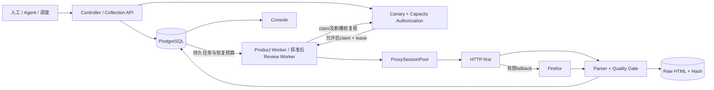

# Amazon 美国站网页爬虫与多 Agent 商品数据服务方案

> 更新日期：2026-09-04（本机main已发布，尚未远程部署）
> 当前生产对象：Amazon.com；自有 ASIN 1,093 条
> 当前状态：恢复表生产迁移已执行；美国站可选ZIP与简明控制台已发布到本机main并重启控制台。正式配置仍保留90001，没有新增真实采集批次，不能宣称新的无固定ZIP模式已经完成实机性能验收。尚未push或远程部署公司电脑。
>
> 本机已发布变更：[美国站采集与简明控制台](develop_us_marketplace_20260904.md)。ZIP留空为美国站观察，填写才要求指定地区；正式配置的90001仍未改动，切换采集模式时再明确清空。下文旧固定ZIP运行结论保留为历史，不改写raw/evidence。
>
> 历史文档合并依据：共同基线 `c3af4b2`、用户方案原文和候选 `3524076`；完整原文和补丁的可核验归档见文末。

## 0. 场景设想

系统按 ASIN 类型、字段重要性和业务时效执行定时采集，也接受运营或 Agent 发起的小批按需刷新。所有调用进入同一套任务、代理会话、解析、质量、证据和存储链路，避免多个脚本各自抓取、结果互相覆盖。

### 0.1 数据查询与新鲜度

Agent 或运营查询商品时，先由 `Collection API` 查看 PostgreSQL 中的最新快照、采集时间和质量状态：

- 数据仍在有效期内：直接返回现有结果；
- 数据过期但允许刷新：创建受控 `refresh_request`；
- 数据不存在：只允许为已登记 ASIN 创建小批任务；
- 采集失败：继续返回上一次有效快照，同时明确标出最新刷新失败、失败时间和原因；
- 价格或地区不完整：返回字段级 `partial/unavailable/unknown`，不能把旧值或未知值冒充当前完整事实。

`Collection API` 隐藏 PostgreSQL DSN、代理凭据、Cookie、Worker、Firefox、租约和重试细节。普通 Agent 只需要查询、批量查询、按需刷新和查询 job 终态。

### 0.2 两种运行模式

1. **生产批次**：形成可追溯快照、历史、raw HTML、run receipt 和成本记录；
2. **按需刷新**：一次只处理少量已登记 ASIN，返回 job 和请求后的新 evidence。

两种模式使用相同的采集 Adapter、商品身份门和 PostgreSQL 事实源。当前不允许 Agent 直接运行 Selenium、读取数据库密码或绕开质量门。

## 1. 执行摘要

### 一句话结论

“**自建 HTTP-first 爬虫 + 有界代理会话池 + 按需 Firefox fallback + PostgreSQL 事实层 + 原始证据 + Collection API + 统一 Console**”。代理 IP 只是会话的一部分，不能把“换 IP”当作 Amazon 访问控制的完整解决方案。

### 当前路线

1. **商品主线**：HTTP 默认采集商品页；Firefox 只在明确原因下 fallback；商品、评论、媒体分开计量和失败。
2. **代理会话**：每个内部会话绑定一个 DataImpulse 选择器、独立 CookieJar/opener、地区上下文、请求预算和健康状态。
3. **数据事实**：PostgreSQL 保存任务、租约、商品、评论、evidence、operation 和 run；raw HTML 按内容 hash 压缩保存到本地。
4. **多 Agent 使用**：Agent 只访问本机 loopback Collection API，不接触代理或数据库凭据。
5. **评论分析**：先使用现有 top reviews 和官方聚合洞察做方法验证；独立评论 Worker 与商品 Worker 分离。

### 当前结论

- 2026-09-01 美国 VPN 下的隔离 100-ASIN 商品运行曾得到 92 个商品成功、8 个同 Parent 的 sibling variant redirect、0 blocked；说明解析、身份和 PostgreSQL 主链能够工作。
- 2026-09-03 DataImpulse 非 Amazon canary 测试 34 个会话，其中 31 个可用且运行内出口均不同，成功容量按 3 ASIN/槽计算为 93。
- 第一轮固定3-ASIN Amazon测试为 **3 actions processed、0个新商品成功**：一个会话返回Amazon CAPTCHA，另一个会话连续发生TLS EOF并被错误复用。该真实复现驱动了坏槽隔离、实际容量、轮询、Unicode和指标修复。
- 修复后使用同一固定3-ASIN仅复测一次：`requested=3`、`recorded=3`、2个商品成功、1个同Parent合法Sibling Child跳转、0普通failed、0 blocked；说明调度缺陷得到控制，但仍观察到1次CAPTCHA，且ZIP 90001没有确认。
- 以上为截至2026-09-03固定3条的历史结论，不代表后来20条已通过。随后20条仍出现访问控制熔断，代理出口到Amazon的稳定性、目标地区上下文和成本仍需验收。
- 2026-09-04批准代码加入付费代理 stock Firefox CONNECT认证中继、商品逐ASIN会话、持久恢复预算及固定cohort存活consumer；它们是受控恢复手段，不是目标站成功证明。生产仍只接受付费代理，不接受VPN/直连。

## 2. 原始业务目标

项目目标不是交付一个单次脚本，而是为多个 Agent 和运营角色提供统一的 Amazon 美国站数据服务：

- 当前自有 ASIN：1,093 条；
- 后续可扩展到自有、竞品和候选 ASIN 3,800–5,800 条；
- 支持当前值、历史、变更、来源、字段置信度和批量查询；
- 支持价格、库存、Offer、Buy Box、Listing、变体、评分、评论、A+、规格和媒体 URL；
- 支持按业务优先级设置日、周、月和事件触发周期；
- 任一结论能够回到 raw、hash、采集时间、运行和解析器版本。

系统优先解决数据可靠性和可解释性，不承诺每个已失效商品都采集成功，也不把 Amazon 商品自身问题归入代码故障。

## 3. 当前系统的准确定位

### 3.1 稳定主线与隔离候选必须分开

| 层级 | 当前状态 | 含义 |
|---|---|---|
| 正式代码 | `main`已快进至`35240763b21ceaff8d3f14be20b2fcf21c412df6` | 本次仅再合并用户主报告；代码相对批准候选不变，部署不等于真实验收 |
| 冻结候选 | 同一`3524076`，tree `cd2c91a4639e51c7e07db5ff650fdca54f46c4bb` | 候选保持冻结；基础恢复提交为`951a2b5` |
| 历史基线 | `c3af4b2`、`da6949e` | 分别为集成前主线、固定3条修复时点；后文运行数据只证明对应历史版本 |

文档中的“已实现”默认指稳定主线或有明确候选标注的代码；“真实验证”必须同时给出运行证据。候选代码存在不等于生产部署完成。

### 3.2 已经具备

- PostgreSQL claim、lease、状态历史和失败恢复；
- HTTP-first 与枚举化 Firefox fallback；
- 商品身份、Parent/Child、canonical 和 sibling variant 识别；
- full/partial/invalid 地区上下文；
- 商品快照、媒体 URL、内容模块和商品页 top reviews；
- raw HTML gzip、内容 hash 和 evidence；
- run/operation、真实耗时和流量口径；
- loopback Console；
- DPAPI CurrentUser 凭据仓；
- Agent 查询和最多 5 条按需刷新；
- DataImpulse HTTPS CONNECT认证、中继到stock Firefox、有界代理会话池；
- 同一pre-claim容量Gate、持久恢复预算、普通批次与refresh-only存活消费代码；恢复新表仍须显式生产迁移。

### 3.3 仍未完成

- 20条以上样本中的代理目标站成功率；
- Firefox 认证代理的真实 407/CONNECT 生产验证；
- ZIP 90001 在代理/Firefox路径下的稳定确认；
- 独立评论分页 Worker；
- 代理供应商账单与本地字节对账；
- 20、100、1,093 条在当前代理方案下的真实验收。

## 4. ASIN 目标池设计

### 4.1 主数据

`asin_master` 使用 `tenant_id + marketplace + asin + subject_type` 表达业务关系，并保存来源、URL、优先级和有效状态。ASIN 不因商品下架或列表更新而删除历史。

当前生产 tenant：

```text
owned_us_asin_20260902_full_01
```

当前 manifest 来自授权文件 `美国仓Asin清单.xlsx` 的 `Sheet2!A2:A1094`，共 1,093 条唯一合法 ASIN。manifest 是导入载体，PostgreSQL 才是生产任务和结果事实源。

### 4.2 自有、竞品和候选

- `own`：运营确认的自有商品；
- `competitor`：人工确认的正式竞品；
- `candidate`：搜索、类目或关联商品发现的待审核对象。

候选必须经过审核后才进入正式周期任务。搜索结果不能自动扩大生产抓取范围。

### 4.3 Parent、Child 和清单过期

页面 input ASIN、canonical ASIN、Parent ASIN、当前 Child 和明确 Child 集合共同决定身份：

- canonical 等于任务 ASIN：普通商品；
- canonical 指向唯一 Parent，且任务 ASIN 在明确 Child 集合：合法 Child→Parent；
- 页面跳向同 Parent 下另一个活跃 Child：`sibling_variant_redirect`；
- 页面已变成无关 ASIN：真正身份不一致；
- 404、下架、合并或旧清单：商品状态问题，不等于爬虫崩溃。

系统不得把兄弟商品的价格、标题或媒体静默写到原任务 ASIN。

### 4.4 美国配送上下文

默认目标是：

```text
country = US
currency = USD
postal_code = 90001
```

身份、明确 US 和明确 USD 是商品成功硬门。ZIP 是字段级质量门：

- `full`：确认 90001/US/USD；
- `partial`：US/USD可信，但 ZIP 未确认或观察到其他美国 ZIP；
- `invalid`：明确非 US、非 USD 或关键上下文矛盾。

`partial` 商品可以保留身份、标题、规格、A+、媒体和评论摘要，但价格、库存、Buy Box、配送不能宣称适用于 90001。

## 5. Agent 使用场景与字段需求

### 5.1 Agent 场景

| 场景 | 主要数据 | 推荐新鲜度 |
|---|---|---|
| 自有商品运营 | 价格、库存、Offer、Buy Box、变体、评论趋势 | 高 |
| 竞品监控 | 价格、卖家、排名、Listing变化、评论计数 | 中/高 |
| 选品与市场分析 | 竞品集合、价格带、类目、卖点和用户诉求 | 中 |
| 内容分析 | 标题、Bullets、描述、A+、规格和媒体 | 低/中 |
| RAG/问答 | 最新事实、历史差异、来源和质量 | 查询时返回 |

### 5.2 字段组

- 身份：ASIN、Parent/Child、品牌、卖家、canonical；
- 交易：价格、优惠、Offer、Buy Box、可售和购买限制；
- 内容：标题、Bullets、描述、规格、A+、品牌故事；
- 媒体：主图、变体图、视频/海报 URL 和元数据；
- 评价：评分、评论数量、top reviews、独立评论游标；
- 上下文：国家、货币、requested/observed ZIP、置信度；
- 证据：source、captured_at、raw/hash、parser/schema、错误和流量。

### 5.3 字段质量原则

每个字段都应能回答：何时观察、从哪里观察、是否完整、是否适用于目标地区、最新刷新是否成功。旧快照可以继续服务查询，但必须与最新失败分开显示。

## 6. 自建网页爬虫技术方案

### 6.1 采集架构



### 6.2 任务与断点

`PostgresWorkerStorage` 使用 `FOR UPDATE SKIP LOCKED` 原子领取任务，并写 `lease_token/owner/expires_at`。只有持有正确租约的 Worker 可以提交结果。异常进程只能在租约过期后被回收，不能由多个 Worker 同时覆盖。

| 文件/符号 | 职责 | 不负责 |
|---|---|---|
| `crawler.ps1` | Windows 统一控制、preflight、run_id、单实例、统一 Console、PostgreSQL run ledger 与文件receipt镜像 | 解析页面、直接写商品表 |
| `scripts/amazon_us_worker.py` | HTTP/Firefox 适配、解析、质量门、运行编排 | 保存生产凭据、下载媒体二进制 |
| `HttpFirstAdapter` | HTTP 请求、gzip 响应体计量、run-scoped CookieJar、Firefox 懒加载 | 跨 run/tenant/worker 会话共享 |
| `SeleniumFirefoxAdapter` | 隔离临时 profile、ZIP/USD 设置、BiDi 控制、DOM 获取 | 个人 profile、自动登录、反检测 |
| `BrowserNetworkLedger` | 请求分类、资源阻止、主文档/子资源 nullable 计量 | 代理商计费真值 |
| `BrowserFallbackLedger` | `run_id + ASIN + fallback_reason` 去重 | 业务重排队或代理切换 |
| `RunScopedAmazonCookieSession` | Cookie 筛选、内存存储、scope 校验、销毁 | Cookie 持久化或日志输出 |
| `scripts/postgres_worker_storage.py` | claim/lease、事务写商品/评论/evidence、状态历史 | 网络访问 |
| `scripts/collection_console.py` | PostgreSQL tenant枚举、显式tenant-scoped只读查询、批次/run/ASIN领域投影与流量汇总 | 触发采集、修改状态 |
| `scripts/postgres_run_ledger.py` | 幂等创建`collection_run`，写run请求数、终态与receipt JSON | 商品/evidence事实写入 |
| `scripts/operation_ledger.py` | 独立记录egress、canary、preflight、probe/run/reviews控制操作及失败阶段、真实耗时、安全egress_id和脱敏容量事实 | ASIN requested/recorded、代理URL、凭据或出口IP |
| `scripts/egress_operation.py` | 由正式控制器执行批准出口健康检查，只输出HTTP状态、分类、耗时和字节 | 保存响应正文、代理URL、用户名或密码 |
| `scripts/proxy_canary.py` | 对全部计划槽执行非Amazon HTTPS认证/CONNECT/TLS、延迟与运行内出口去重，写operation事实 | 输出或持久化出口IP、端口映射、凭据或正文 |
| `scripts/proxy_capacity_gate.py` | 读取最新同tenant canary，按配置指纹、新鲜度和计划action容量决定允许/拒绝 | 领取任务、访问Amazon或修改商品状态 |
| `scripts/backfill_identity_evidence.py` | 幂等把旧`asin_mismatch` raw中的严格Parent/Child身份元数据补入既有evidence context | 写兄弟商品快照、改变原始error_code |
| `scripts/collection_metrics.py` | SQLite 历史 evidence 的离线指标 | PostgreSQL 生产写入 |

商品和评论具有不同 `task_stage`。商品成功后才进入独立评论阶段；评论失败不得覆盖已成功商品。

`recovery_scheduler.py`管理跨run预算和冷却，`recovery_consumer.py`保持固定cohort消费存活，详见12.4。旧任务的延迟回调绑定原task/lease，不得消耗新任务预算；新action前关闭旧Firefox/中继。Agent每次poll持续回收到期lease。`backfill_identity_evidence.py`仅是另行批准的显式工具，本次启动、预检和迁移均不自动回填历史。

### 6.3 HTTP-first

HTTP Adapter 使用 `urllib`、gzip、独立 CookieJar 和 HTTPS CONNECT 认证。它优先获取初始 HTML、JSON-LD、页面内嵌数据和公开字段，流量与时延通常低于浏览器。

单次 fetch 允许有限 transport retry。内部重试耗尽后，错误必须返回会话调度层；调度层决定隔离、换槽或终止，不能无限重试。

### 6.4 ProxySession

正确会话不是一个裸 IP，而是：

```text
provider selector
+ CookieJar
+ urllib opener
+ header/context
+ ASIN budget
+ health
+ evidence
```

商品广度默认`proxy_product_session_scope=per_asin`，每个ASIN使用新的批准代理槽；单ASIN评论多页保持粘滞上下文，独立评论Worker仍未投产。旧`bounded`模式最多3 ASIN/槽的历史容量不能套用到当前逐ASIN模式。槽选择器不等于新IP保证，canary去重也不证明目标站信誉。

CAPTCHA/WAF/403等访问控制立即隔离；单次action同一ASIN最多换一个新session，并受总任务预算、访问控制策略和租约限制。Transport与访问控制分开计数，内部transport重试耗尽的坏槽不能继续服务后续ASIN。端口代码硬上限64，发布时记录的配置为50槽；以冻结配置与新canary事实为准，不自动增加供应商出口。

### 6.5 非 Amazon canary 与容量 Gate

canary 只验证批准的非 Amazon HTTPS 目标，作用是确认：

- 代理认证；
- CONNECT/TLS；
- 端口可达；
- 延迟；
- 运行内不同出口数量。

真实出口 IP 只在内存中比较，不输出、不持久化。canary 不是 Amazon 成功证明。

容量Gate在claim/fetch前验证配置hash、凭据generation、事实新鲜度、可用槽和并发预约。Gate拒绝时不得领取任务或访问Amazon。

所有健康探针仅接受精确允许列表中的非Amazon HTTPS目标，禁止重定向；未知/失败/拒绝事实、计数矛盾、过期、凭据轮换、可用槽不足均fail closed。PostgreSQL通过配置hash advisory lock与具体脱敏槽租约防止跨进程/tenant超卖，Worker每次claim及新槽前复核TTL。Controller在创建collection run前预约，Agent refresh与公开Worker入口共用同一门，SQLite live禁止。

operation保存白名单容量明细；run/receipt绑定canary operation_id、事实/过期时间、配置/generation和每次预约快照。未测试为null/unknown，全部已测试失败才是已知0。`canary -Limit 5`对应当前consumer瞬时最多5个ASIN及其替换槽，不是总cohort 20/100；冷却后授权过期则等待新canary，不偷偷重领或访问。

### 6.6 Firefox fallback

Firefox只在枚举化原因下启动，使用真实stock Firefox、隔离临时profile和WebDriver BiDi，默认阻止image、font、media和明确广告/遥测资源。缺少BiDi/handler时fail closed；顶层文档与iframe/子资源分开计量，无法归因、fetch_error或pending字节保留unknown。

认证路径为Firefox→loopback CONNECT认证中继→已批准DataImpulse代理，TLS端到端、不解密、不MITM。凭据只由DPAPI/env进入进程内存，不写profile、扩展、日志或evidence；中继不自动回退直连。HTTP仍是urllib/OpenSSL，Firefox使用真实浏览器传输，不伪造TLS或指纹。

访问控制恢复仅走明确有界策略：保留原HTTP challenge证据、隔离当前槽，在获准的新槽进行有限stock Firefox验证；同action不会无限切换，仍为challenge则停止该恢复链并进入持久冷却/熔断。403/429/login等具体门及预算以批准代码为准，不自动填写或破解验证码。

只有 Firefox 明确确认 ZIP/US/USD 后，筛选后的匿名 Amazon Cookie 才能桥接到同一 run 的 HTTP CookieJar。个人浏览器 Cookie、跨 run Cookie 和账号登录状态不进入商品 HTTP 主线。

认证代理下的 Firefox 407/CONNECT 仍需独立真实验证；未通过前不能把 Firefox 当作可靠生产兜底。

### 6.7 Parser 与 Quality Gate

解析器统一提取商品、媒体、内容模块和评论摘要。质量门依次检查：

1. CAPTCHA/WAF/login/403/429；
2. ASIN身份与canonical；
3. 404和核心字段；
4. US/USD；
5. ZIP full/partial；
6. 商品事务保存。

失败 evidence 不能覆盖上一次有效快照。

### 6.8 Raw 与 Evidence

raw HTML使用UTF-8原始字节SHA-256内容寻址并压缩为`.html.gz`；读取时按解压后二进制校验，避免文本CRLF正规化产生假阴性。数据库只保存相对路径、hash、来源、状态、时间、解析器版本、上下文和流量。同ASIN同body可跨run复用内容文件，旧`.html`与既有gzip保留；本次集成不改写历史。

CAPTCHA正文可以作为受控raw保存；代理密码、Cookie、Authorization和真实出口IP不得进入raw索引、日志、Console或receipt。

## 7. 评论采集与分析

### 7.1 业务目标

评论分析要识别用户诉求、购买动机、痛点、质量问题、使用场景、正反主题、少数意见和趋势，而不是只抓三星以下，也不是机械翻完所有评论。

### 7.2 数据与工具优先级

```text
Amazon Customer Feedback / Opportunity Explorer 聚合洞察
→ 卖家精灵或现成工具同 cohort 对照
→ 商品页 top reviews
→ 获准后独立评论 Worker 补原文
→ 本地主题/属性情感分析
```

官方 Customer Feedback API 提供主题、提及量、星级影响、趋势和片段，不提供完整原始评论语料。公司账户角色、Brand Registry 和应用授权仍需正式核验。

### 7.3 抽样规则

大评论集按以下维度分层：

- 1–2星、3星、4–5星；
- 新近与历史；
- high-helpful 与普通评论；
- Parent下不同Child；
- 自有与竞品；
- 正面、负面、混合和少数意见。

分析必须保留样本数、时间范围、ASIN/变体和可回到原文的代表证据。评分影响不能冒充销售因果关系。

### 7.4 独立评论 Worker 边界

评论 Worker 具有独立队列、租约、游标、run 和失败状态。初期如需测试账户，只能在可见隔离 Firefox 中由用户手动登录；代码不接触密码/OTP，不读取个人浏览器 profile，不把登录 Cookie 桥接给商品 HTTP。

该 Worker 尚未完成生产实现。当前商品页 top reviews 可用于离线分析原型，但不能代表全量评论。

## 8. 多 Agent 共享服务架构

### 8.1 Collection API

Collection API 是自建本机 loopback 服务，负责：

- 查询单个或最多100个快照；
- 提交1–5个已登记ASIN刷新；
- 查询job终态；
- 返回请求后的新evidence、耗时和流量。

`refresh-only` Worker不能领取普通全量队列。Agent scoped key由DPAPI中的主密钥派生，子进程不获得DSN或代理凭据。

### 8.2 端口和入口

| 端口/入口 | 用途 |
|---|---|
| `8765` | Agent API；不是网页首页 |
| `8770`（可配置为8774等） | Console网页 |
| `run_owned_full_secure.ps1` | 固定tenant的安全人工入口 |
| `crawler.ps1` | 底层正式控制器 |

Agent业务命令应自动确保本机服务存在，但 liveness 与 readiness 必须分开：Worker blocked 后历史查询仍应可用，新 refresh 被拒绝。

Controller内部仅向已验证loopback Console业务`/api`请求附进程环境中的API Key header；health/ready身份检查不带Key。浏览器401显示locked/需要本地API Key，不伪装offline；用户取消后本标签页自动刷新不再弹窗，只有主动API Key按钮重新请求输入。主Key不通过URL、日志或receipt公开。Agent等待采用有界轮询/退避并尊重本机429的Retry-After，Windows CLI JSON无需手动设置PYTHONUTF8。

### 8.3 Weknora边界

PostgreSQL保存高频结构化事实；Weknora只接收经过质量校验的商品档案、变化摘要、评论分析和研究笔记。Agent查询当前价格应读PostgreSQL，不应从RAG文档猜测实时事实。

## 9. 数据模型、状态和接口契约

### 9.1 核心表

| 表/视图 | 用途 |
|---|---|
| `asin_master` | tenant-scoped ASIN主数据 |
| `item_state` | 当前任务、重试、阶段和租约 |
| `state_history` | 状态变化审计 |
| `refresh_request` | Agent按需刷新job |
| `collection_evidence` | 每个action的来源、raw/hash、错误、流量和上下文 |
| `product_snapshot/product_latest` | 商品历史与最新快照 |
| `media_asset` | 媒体URL与元数据 |
| `content_module` | Bullets、A+、描述、规格等 |
| `review_summary/review_page_state/review_record` | 评论统计、分页断点与幂等原文 |
| `collection_run` | ASIN采集run与receipt |
| `operation_run` | canary、preflight、run等控制操作 |

窄表`proxy_capacity_reservation`用于跨进程原子预约脱敏session槽，相关代码已集成。新增`recovery_job`保存任务跨run预算/冷却/终态，`recovery_egress`保存共享出口暂停/串行门，`recovery_batch`保存不可变cohort/deadline；三表代码与迁移已交付，但本次生产只读预检仍报告缺表，尚未执行生产迁移。

### 9.2 状态语义

| 状态 | 含义 |
|---|---|
| `pending` | 等待商品任务 |
| `running` | 已被租约领取 |
| `product_done/reviews_pending` | 商品完成，评论仍待采 |
| `succeeded` | 当前任务阶段成功 |
| `blocked` | CAPTCHA/WAF/403/login等访问控制 |
| `failed` | transport、解析、上下文或确定性商品失败 |

`processed`表示action已终结，不等于商品成功。健康接口和Console必须分别显示processed、succeeded、failed和blocked。

### 9.3 证据完整性

- HTTP响应可计量时记录压缩body bytes；
- Firefox主文档或子资源无法可靠计量时为 `null/unknown`；
- TLS EOF没有完整响应体，网络字节不能写成“已知0”；
- raw文件大小不能代替代理账单；
- 每次run必须绑定授权它的canary事实、配置、凭据generation和容量预约；
- requested/recorded按唯一ASIN，attempt_actions另计；每条attempt_evidence保留全部raw/hash/错误与流量，capacity_authorizations保留全部批次授权；
- 最终Console/API不可用时保持unknown/incomplete，不把数据库已有证据投影成0；历史receipt纠正只能产生可审计派生投影。

## 10. 容量、频率和成本

### 10.1 建议周期

| 数据 | 重要自有ASIN | 普通自有ASIN | 竞品 |
|---|---|---|---|
| 价格/库存/Buy Box | 6–24小时 | 1–3天 | 3–7天 |
| 标题/规格/A+ | 3–7天 | 7–14天 | 14–30天 |
| 商品身份 | 每次刷新 | 每次刷新 | 每次刷新 |
| 评论增量 | 1–3天 | 3–7天 | 7–14天 |
| 评论分析 | 新增量触发或每周 | 每周 | 双周/月度 |

周期是初始配置，不是永久合同；应根据两周真实变化率、成功率和预算调整。

### 10.2 当前容量模型

历史初始成功路径按3 ASIN/会话估算（仅解释旧记录，不是当前启动容量）：

```text
slot_capacity = available_unique_sessions × 3
```

该旧值不包含CAPTCHA重试、TLS坏槽和Firefox成本，不能把93条算术容量当作93条成功承诺。当前逐ASIN模式每个瞬时ASIN预留主槽及最多一个替换槽；consumer一次最多5 ASIN，20/100分批运行，不需要同时预约40/200槽。

主文档HTTP重试与Firefox导航共享串行许可，`recovery_request_interval_seconds`默认且最低5秒。浏览器必要子资源保持原生加载，但受240请求等预算控制。冷却尊重Retry-After；初始新槽也可能CAPTCHA，低速不是成功保证。

### 10.3 流量和账单

| 类别 | 本地是否可见 | 是否账单真值 |
|---|---|---|
| HTTP压缩响应body | 是 | 否 |
| Firefox主文档/子资源 | 部分，允许unknown | 否 |
| raw HTML文件大小 | 是 | 否 |
| DataImpulse后台 `U1-U0` | 需人工/供应商数据 | 是 |

成本公式：

```text
cost_per_success = (C1 - C0) / successful_asins
retry_amplification = total_attempts / processed_actions
```

当前仍缺少供应商账单与本地计量的正式校准。用户2026-09-04提供的8/28–9/4后台窗口为295.35MB、1773请求、$0.29；这是窗口用量，不是余额，也不是新20条成本。旧103MB推算作废，下一真实批次须单独记录U0/U1并注明其他消费者和账单延迟。

## 11. 当前真实问题

### 11.1 固定3-ASIN前后对比

修复前非Amazon canary：

```text
planned/tested/available/unique = 34/34/31/31
arithmetic capacity = 93
```

固定ASIN：`B0CC2FRY3J`、`B0CC2JBW2H`、`B0CJFNJCNV`。

第一轮真实测试：

| ASIN | 真实链路 | 结果 |
|---|---|---|
| `B0CJFNJCNV` | session-02返回HTTP 200 CAPTCHA；session-03重试TLS EOF | failed |
| `B0CC2JBW2H` | 继续复用session-03，TLS EOF | failed；数据库仍有旧快照 |
| `B0CC2FRY3J` | 继续复用session-03，TLS EOF | failed；无新商品快照 |

第一轮为3 actions processed、0个新商品成功。`completed_actions=3`属于命名误导，不能作为成功率。

修复后新canary与同一cohort复测：

```text
canary planned/tested/available/unique = 34/34/34/34
capacity = 102/3
run = agent-refresh-20260903T072554976255Z-1e6f7f69
requested/recorded/inferred = 3/3/0
completed/variant/failed/blocked = 2/1/0/0
```

| ASIN | 修复后结果 | 说明 |
|---|---|---|
| `B0CC2JBW2H` | completed | 新HTTP 200商品快照，进入`reviews_pending` |
| `B0CJFNJCNV` | completed | 新HTTP 200商品快照，进入`reviews_pending` |
| `B0CC2FRY3J` | variant redirect | 页面当前/canonical为同Parent下`B0CC2JBW2H`，任务ASIN仍在明确Child集合；属于商品族跳转，不是采集失败 |

新会话链为 `session-01 CAPTCHA → session-02成功`，随后session-02正常服务其余ASIN。TLS EOF没有在复测中再次出现；`A CAPTCHA → B transport error → 下一ASIN C`由确定性回归测试证明坏槽会被隔离，尚缺新的真实TLS故障样本验证。

### 11.2 问题分层

1. **Amazon访问控制仍存在**：复测首会话仍得到HTTP 200 CAPTCHA，但有界切换到新会话后恢复；不能据此宣称CAPTCHA已消失；
2. **代理目标链路需更大样本**：第一轮session-03访问Amazon时TLS EOF，复测未重现；普通api.ipify canary仍不能代表Amazon链路；
3. **会话调度缺陷已修复候选**：transport重试耗尽后隔离坏槽，下一ASIN换新session；真实复测未触发该分支，离线确定性测试已覆盖；
4. **容量、轮询、编码与指标已修复候选**：按实际job数量申请容量，客户端限速并处理`Retry-After`，Windows JSON强制UTF-8，health拆分processed/succeeded/failed/blocked；
5. **计量仍有unknown**：本轮HTTP压缩响应总计1,203,117 bytes；Firefox主文档/子资源各有unknown，不能生成伪数字；
6. **浏览器兜底仍未验收**：认证代理Firefox路径没有形成已验证的生产兜底；
7. **地区质量仍未关闭**：两个成功商品均为partial，未确认ZIP 90001，价格/库存/Buy Box/配送不能作为90001结论。

### 11.3 为什么直连/VPN曾成功，代理反而失败

直连或VPN可能拥有更稳定的TLS路径、更好的出口信誉，以及一致的IP/Cookie/地区状态。住宅代理提供更多出口，但同时增加代理认证、CONNECT隧道、住宅端点离线、共享出口历史和上下文不连续。

因此代理不是天然升级。只有坏槽能及时淘汰、会话状态隔离、目标站真实验证和成本可控时，代理池才产生净收益。

### 11.4 固定3条修复时点（历史记录）

专门修复已形成干净候选提交：

```text
commit = da6949e50578f7338b08a18fdee57ede309ada3e
tree = aed0fb61663baeec5de93fb92b64b204c215a5d3
delta = 29 files, +1123/-115
```

验证包括422个离线测试通过、4个DSN Gate测试在DPAPI短进程中单独4/4通过、compileall、Node、PowerShell AST、diff和凭据扫描。真实canary、固定3-ASIN、raw解压/hash、Console、operation、容量预约释放和端口清理均完成。当时提交未push/tag且未合入稳定主线；本次正式代码已快进到包含后续修复的3524076，不能沿用当时的部署状态。

### 11.5 后续证据与本次发布边界

- 原始来源清单SHA-256：`f0b8fb0fb892edcefe188bfd531dd5434387579e1cb4f69fae7657aa69013e0e`。最初只初始化1,093条并遇批准823端口network_error/TCP不通，当时没有Amazon访问控制响应；这段历史不能替代后来真实诊断。
- 2026-09-03离线重放26份raw：全部hash通过，3 CAPTCHA、4同Parent兄弟变体、19同ASIN商品页；一条曾CAPTCHA后又有正常页。旧34/34唯一出口、容量102、P95 2356.1ms为当时canary事实；缺新generation/明细/预约合同的旧operation不能授权当前代码。
- 历史固定3条清单指纹`117ae0753d074291e44ff4cb1ea6a6298683b0cdc9e40c1b31bb816aa7538038`；旧Gate20清单、指纹`89054e06d4189131ed0a3f6aa0762c5197d84990c1e795f0f75e53cb70296ece`及16 completed/3 variant/1 context失败的历史结果完整保留在候选原文归档，不冒充下一发布cohort。
- `run-control-20260903T080031964Z-36480-18da69560c`：requested20、recorded10、6 completed、3 variant、1 blocked、10 unrequested；两个槽同ASIN连续CAPTCHA后停止，HTTP已知4,049,923 bytes，无TLS错误。原终端0/20来自Console API缺Key的401投影错误，不是数据库0条。原始10条evidence保持不变。
- 近时间同ASIN`B0DPMD58CN`、同HTTP客户端/解析器：两个DataImpulse新会话CAPTCHA，诊断性美国VPN直连200并解析$11.99，raw hash匹配。这支持当时代理出口信誉/路径为主要剩余问题，不证明换UA/TLS必然成功；VPN只作诊断，不是正式生产出口。
- 冻结候选的完整离线发布记录：528 passed/28 skipped，28项PG测试另经DPAPI隔离库全部通过；Node行为4项、compileall、Node语法、PowerShell AST、diff及凭据扫描通过，独立delta审查APPROVE。详见[恢复交付记录](recovery_delivery_20260904.md)。这些是候选阶段记录，本次文档合并不重复全量也不冒充新联网验证。

## 12. 质量、监控和失败恢复

### 12.1 每个run必须显示

- requested、recorded、processed、succeeded、failed、blocked、variant；
- HTTP/Firefox来源和fallback原因；
- session使用、隔离、network error和重试；
- CAPTCHA/WAF/403/429/login；
- ASIN身份与Parent/Child关系；
- full/partial/invalid地区质量；
- 标题、价格、媒体、A+和评论覆盖；
- known/unknown流量；
- 活跃耗时与墙钟跨度；
- canary operation、配置hash、凭据generation和容量预约。

### 12.2 停止条件

以下任一出现时不自动扩大：

- CAPTCHA/WAF/403/429或login；
- transport坏槽被重复使用；
- requested与recorded不一致；
- raw/hash/evidence缺失；
- unknown bytes被写成0；
- 身份不一致却保存了其他商品；
- partial价格被当作90001完整结果；
- Agent本地限流或job状态无法回查；
- 代理账单与本地口径无法解释。

### 12.3 恢复策略

- 商品404/下架/变体：更新业务状态，不惩罚代理；
- CAPTCHA/WAF：隔离session，同ASIN最多一次新session；
- TLS/transport重试耗尽：隔离transport-bad session，下一ASIN换槽；
- 429：尊重`Retry-After`，不立即无限换IP；
- Worker崩溃：释放/等待租约恢复；
- 评论失败：保留商品快照和评论游标；
- Console/API失败：不改变PostgreSQL商品事实。

### 12.4 当前持久恢复合同

新任务默认最多3次claim、12次HTTP/Firefox导航许可、240次允许的Firefox资源请求、24小时逻辑deadline；换run、凭据或端口不重置任务预算。完成/业务变体与访问控制/transport分别处理，refresh终态与预算/业务结果同事务提交。

共享出口按最近20个唯一ASIN/stage记录结果；连续2个阻断，或至少3样本且3阻断、比例至少15%时暂停，冷却至少1小时并尊重更长Retry-After；半开只放一个。访问控制不会被换run无限规避。

普通Controller和Agent refresh使用同一持久门。固定cohort consumer最多存活5400秒，批内最多5 ASIN；冷却期间释放容量、只轮询PG，重新打开同run不延长deadline。新鲜canary缺失时继续等待而零fetch；不能通过手工重复入队重置任务预算。逻辑24小时预算不等于本次允许联网24小时。

## 13. 迁移和发布建议

### 保留

- PostgreSQL唯一事实源；
- HTTP-first + Firefox fallback；
- 商品/评论/媒体分离；
- raw/hash/evidence；
- DPAPI和loopback Agent接口；
- 有界重试、阻断停止和历史快照保护。

### 当前部署门

1. 冻结候选3524076已ff-only进入正式目录，只有本报告进行三方整合；用户原文、候选原文、有效binary patch和stash均保留。最新正式文档提交SHA以集成回执为准。
2. 正式`release_readiness.py`只读检查；当前缺`recovery_job/recovery_egress/recovery_batch`，输出`schema_migration_required`、production_writes=0，不是DSN未配置。
3. 两份固定SQL只在标记隔离测试库dry-run并rollback。生产apply必须由主控确认授权、固定正式HEAD和SQL hash后单事务执行；本次尚未执行。
4. 生产迁移后再冻结新的未采20条manifest（exclusive-create，不覆盖旧样本），记录hash、配置和预算；`canary -Limit 5`仅验证瞬时批次容量，允许后主控运行固定20，最多5400秒。
5. 请求分母固定，attempt/raw/hash/evidence/授权/known-unknown齐全；20未通过不得扩大100，更不启动1,093全量或评论。代码集成、进程启动、canary成功均不是业务Go。
6. 回滚先停采集并保留恢复预算/历史表，不DROP、不回填，不直接启动忽略新预算的旧Worker。生产写者回滚需另审兼容与预算。

完整命令与Go/No-Go清单见[生产发布操作包](production_release_20260904.md)。其中最初的主控执行角色已由本次授权转交唯一writer完成集成；本次采用`stash apply`而非pop，保留stash。正式集成结果及文档SHA以本次回执覆盖操作包的预集成时点描述。

### 不迁移

- SQLite生产双写；
- 免费/开放代理；
- 个人Cookie或浏览器profile；
- 无限轮换、验证码破解、anti-detect、MITM/Selenium Wire；
- 把Weknora当实时商品数据库。

## 14. 分阶段实施计划

### 阶段0：修复已确认调度缺陷（不等于业务问题全部关闭）

- 已TDD复现“CAPTCHA→TLS EOF→后续ASIN错误复用”；
- 已实现transport-bad session隔离和替换；
- 已修复Agent实际容量、轮询、Unicode和指标；
- 同一固定3-ASIN复测为2 completed、1 variant、0普通failed、0 blocked。

### 阶段1：20-ASIN商品灰度

- 复用固定cohort，不替换失败样本；
- 检查session淘汰、重试放大、CAPTCHA率和bytes/success；
- 商品问题与采集问题分别报告。

### 阶段2：100-ASIN与代理对照

- 只有20条链路稳定后执行；
- 正式生产只使用批准付费代理；历史VPN对照仅作诊断证据，不启用direct_vpn生产模式；
- 使用真实供应商账单校准流量成本。

### 阶段3：1,093自有ASIN生产批次

- 按优先级分批，不一次性全量冲击；
- 启用调度、kill switch、日报和异常队列；
- 连续多个周期稳定后再扩大竞品。

### 阶段4：评论与分析

- 先用top reviews做离线主题原型；
- 核验官方API与卖家精灵能力；
- 获得测试账户和合规授权后开发独立评论Worker；
- 使用分层样本和人工金标验收主题、情感和证据。

## 15. 业务流程与反爬原理

### 15.1 总体原则

Amazon访问控制可能同时观察出口信誉、Cookie、地区状态、请求频率、请求序列、HTTP客户端特征和会话累计行为。当前证据不能证明其中某一个是唯一原因。

正确路线是降低请求、保持上下文一致、隔离失败会话、保留证据和有限重试；不是伪装指纹或无限换IP。

### 15.2 结果处理矩阵

| 结果 | 商品处理 | 会话处理 | 是否扩大 |
|---|---|---|---|
| 正常商品页 | 解析并质量校验 | 消耗预算 | 可继续观察 |
| sibling variant | 记录业务关系 | 会话健康 | 不算代码失败 |
| 404/下架 | 商品状态更新 | 会话健康 | 不惩罚代理 |
| CAPTCHA/WAF | 不写商品成功 | 立即隔离 | 停止或有限重试 |
| TLS/transport耗尽 | 保存fetch_error | 隔离坏槽 | 不复用该槽 |
| 429 | 冷却 | 记录独立原因 | 不立即无限换IP |
| partial ZIP | 保存非敏感字段 | 不提交错误Cookie | 不宣称90001价格 |

### 15.3 安全边界

- 不自动解决CAPTCHA；
- 不登录个人Amazon账号；
- 不读取个人浏览器Cookie；
- 不使用免费/公开代理；
- 不无限轮换；
- 不做指纹伪装、anti-detect、MITM或Selenium Wire；
- 不把代理用户名、密码、完整URL、Cookie、Authorization或出口IP写入日志和数据库；
- 真实测试必须固定样本、低流量并有停止条件。

## 附：名词解释与验证边界

| 术语 | 含义 |
|---|---|
| Action | 一次商品或一页评论的逻辑处理，可能包含多个HTTP尝试 |
| Processed | Action已结束；不表示商品成功 |
| Lease | Worker对任务的限时占用证明 |
| ProxySession | 代理选择器、CookieJar、opener、上下文、预算和健康的组合 |
| Canary | 非Amazon代理连接与出口检查，不是Amazon成功证明 |
| Capacity Gate | 在claim/fetch前判断是否有新鲜、匹配且足够的会话容量 |
| Evidence | URL、来源、状态、hash、raw指针、上下文和流量 |
| `null/unknown` | 没有可靠计量证据，不等于0 |
| Variant redirect | 同Parent下商品身份变化，属于业务结果 |
| VoC | Voice of Customer，评论主题、诉求、情感和行动分析 |
| ABSA | 属性级情感分析，一条评论可同时包含多个属性和不同情感 |

### 本次三方整合的原文保全

备份目录位于仓库外发布输出：`D:\woring\爬虫\outputs\amazon-production-release-20260904\integration-20260904T053603Z`。

| 来源 | 归档文件 | SHA-256 |
|---|---|---|
| 用户0–15节方案原文 | [main_report.user.original.md](../../outputs/amazon-production-release-20260904/integration-20260904T053603Z/main_report.user.original.md) | `86ed5be017e93653841687cd3b5f1a6d7ee95ede68ea58628207e61b4708d2e3` |
| 批准候选3524076完整技术与历史原文 | [main_report.candidate.3524076.md](../../outputs/amazon-production-release-20260904/integration-20260904T053603Z/main_report.candidate.3524076.md) | `51f4ec4d574fa4450d860f53b646970fc76faddb5646c2433b2e51850c8d0fed` |
| 用户相对旧基线有效binary patch | [main_report.user.v2.patch](../../outputs/amazon-production-release-20260904/integration-20260904T053603Z/main_report.user.v2.patch) | `7900d25a302b2fade6479a647570f8c0232fded69f87abc9ca014d3378279f85` |

共同基线为`c3af4b2`，用户stash对象`7d9febf7233c804eece7c1e6c5ddca58b77c0029`保留。首个0字节patch不是恢复依据，未删除；有效依据为v2与原文。候选旧章节中的Selenium/BiDi实现说明、评论工具研究/授权清单、历史运行、旧cohort与测试矩阵完整保留在候选归档和Git对象；本报告将当前合同置于6/8/9/10/12/13节，历史证据置于11节，不把旧的“未配置测试DSN”“默认3 ASIN/槽”“scope20 canary”当作当前状态。用户业务目标、场景、字段优先级、评论分层和Weknora边界保留。

本报告是方案与当前状态的主入口。具体操作命令见 [`crawler_control.md`](crawler_control.md)，Console见 [`collection_console.md`](collection_console.md)，Agent接口见 [`collection_api.md`](collection_api.md)，PostgreSQL部署见 [`postgres_production_worker.md`](postgres_production_worker.md)。代码、schema和新鲜运行证据优先于文档；发现不一致时先核对实现，再修正文档。
