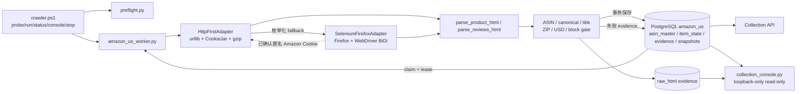

# Amazon US 采集系统技术说明

本文是 Amazon 美国站采集项目的单一技术权威文档。代码、PostgreSQL schema 和新鲜测试证据优先于本文；两者不一致时必须先按实现核对并修正文档。

## 1. 项目目标、范围与结论

### 1.1 目标

系统以 PostgreSQL 为任务、租约、断点、商品结果和历史的唯一事实源，按“HTTP first → Selenium Firefox fallback → Parser/Quality Gate → PostgreSQL transaction”采集 Amazon.com 公开商品页面。当前优化目标是在不降低标题、价格、A+、媒体 URL、内容模块和评论状态质量的前提下，使代理流量可计量、Firefox 降级可解释、匿名 ZIP 会话可在同一次运行内安全复用。

### 1.2 当前实现范围

- HTTP 使用 `urllib`、内存 `CookieJar`、`HTTPCookieProcessor` 和 gzip；
- Firefox 使用 Selenium `4.47.0`、正式 Mozilla Firefox、geckodriver 和 WebDriver BiDi；
- Firefox 只在枚举化原因获准时使用，屏蔽 image、font、media 和明确广告/遥测请求；
- 商品身份、Amazon.com、US、USD 是硬门；ZIP `90001` 是字段级软门。ZIP 未确认时可保存 partial 商品，但只有 Firefox 明确确认 ZIP/US/USD 后才把隔离 Cookie 提交给本次 HTTP 会话；
- 商品、独立评论分页和媒体二进制是不同状态/成本口径；默认只保存媒体 URL 与元数据；
- PostgreSQL 保存当前状态、追加快照、评论断点和 evidence；原始 HTML 保存到本地 evidence 目录；
- 本地只读 Console 展示任务、商品、evidence 和四类流量。

### 1.3 明确不做

- 不读取个人 Firefox/Chrome profile、Cookie、Token 或登录态；
- 不自动登录、不破解 CAPTCHA、不绕过 AWS WAF/访问控制；
- 不做指纹伪装、代理轮换、开放代理扫描或个人账号轮换；
- 不迁移 Playwright，不引入 Selenium Wire、MITM 或媒体二进制下载；
- 不把 SQLite 恢复为生产事实源；SQLite 仅用于历史回放和离线测试。

### 1.4 当前结论

低流量控制、Cookie 桥接、fallback 去重、nullable 流量和 full/partial 上下文合同已通过离线测试。2026-08-31 的真实小批次已验证 HTTP/Firefox 混合采集、Cookie bridge 与 terminal failure；后续 10-ASIN run 暴露 Firefox 地址弹窗未把 Portland 97230 提交为 90001，本轮已增加 DOM click 与弹窗变体回归，但修复后的真实 Amazon 批次尚未运行。当前进程没有 `AMAZON_TEST_POSTGRES_DSN`，真实 PostgreSQL 集成测试明确跳过，也没有代理供应商后台 `U1-U0` 账单证据；不能从离线结果推断实机 ZIP 成功率或成本承诺。

## 2. 系统架构



### 2.1 模块职责

| 文件/符号 | 职责 | 不负责 |
|---|---|---|
| `crawler.ps1` | Windows 统一控制、preflight、run_id、单实例、Console、receipt | 解析页面、直接改数据库 |
| `scripts/amazon_us_worker.py` | HTTP/Firefox 适配、解析、质量门、运行编排 | 保存生产凭据、下载媒体二进制 |
| `HttpFirstAdapter` | HTTP 请求、gzip 响应体计量、run-scoped CookieJar、Firefox 懒加载 | 跨 run/tenant/worker 会话共享 |
| `SeleniumFirefoxAdapter` | 隔离临时 profile、ZIP/USD 设置、BiDi 控制、DOM 获取 | 个人 profile、自动登录、反检测 |
| `BrowserNetworkLedger` | 请求分类、资源阻止、主文档/子资源 nullable 计量 | 代理商计费真值 |
| `BrowserFallbackLedger` | `run_id + ASIN + fallback_reason` 去重 | 业务重排队或代理切换 |
| `RunScopedAmazonCookieSession` | Cookie 筛选、内存存储、scope 校验、销毁 | Cookie 持久化或日志输出 |
| `scripts/postgres_worker_storage.py` | claim/lease、事务写商品/评论/evidence、状态历史 | 网络访问 |
| `scripts/collection_console.py` | tenant-scoped 只读查询与流量汇总 | 触发采集、修改状态 |
| `scripts/collection_metrics.py` | SQLite 历史 evidence 的离线指标 | PostgreSQL 生产写入 |

## 3. 单 ASIN 执行与状态

```mermaid
flowchart TD
    A[item_state pending/reviews_pending] --> B[PostgresWorkerStorage.claim_task<br/>status=running + lease]
    B --> C{task_stage}
    C -->|product| D[HTTP fetch]
    C -->|reviews| R[独立评论 HTTP 页]
    D --> E{阻断或登录墙?}
    E -->|403/429/CAPTCHA/WAF/login| X[保存 evidence<br/>blocked 或冷却后 pending]
    E -->|否| F[解析 ASIN/canonical/title/ZIP/USD]
    F -->|明确 ASIN 跳转| Y[asin_mismatch<br/>不启动 Firefox]
    F -->|满足 fallback enum| G{本 run/ASIN/reason 未使用?}
    G -->|是| H[Firefox BiDi fetch]
    G -->|否| Z[去重抑制]
    H --> I[再次解析与质量门]
    I -->|身份+ZIP+USD通过| J[提交匿名 Cookie 到同 run HTTP Jar]
    F -->|HTTP已合格| K[商品事务]
    J --> K
    K -->|有独立评论 URL| L[product_done → reviews_pending]
    K -->|无分页 URL| M[succeeded]
    R -->|空页且允许 review_empty| H
    R -->|评论成功/下一页| N[review_page_state + review_record<br/>reviews_pending 或 succeeded]
    R -->|独立评论失败| O[保留商品快照与评论游标<br/>failed/blocked]
```



### 3.1 PostgreSQL claim 与租约

生产入口是 `run_postgres_actions()`。`PostgresWorkerStorage.claim_task()` 使用 `FOR UPDATE SKIP LOCKED` 原子领取任务，并写入：

- `lease_token`
- `lease_owner`
- `lease_expires_at`
- `status=running`

只有持有租约的 Worker 可以提交结果。异常退出后只能回收已过期租约；未过期任务不会被其他 Worker 重复领取。

### 3.2 `item_state` 状态

| 状态 | 含义 | 关键字段 |
|---|---|---|
| `pending` | 等待商品采集或冷却后重试 | `next_retry_at`, `attempts` |
| `running` | 已被 Worker 租约领取 | `lease_*`, `resume_status` |
| `product_done` | 商品事务已完成，准备评论阶段 | `task_stage=reviews` |
| `reviews_pending` | 独立评论分页仍有断点 | `next_review_url`, `next_review_page` |
| `succeeded` | 当前任务阶段完整结束 | 评论可能没有独立分页入口 |
| `blocked` | 403/CAPTCHA/WAF/login 等访问控制 | `block_reason`, `last_error` |
| `failed` | 非阻断错误；`attempts < max_attempts` 可有限重试，`attempts = max_attempts` 为终止失败 | `attempts`, `max_attempts`, `last_error` |

商品成功和评论成功不是同一个状态事实。独立评论失败必须保留已成功的 `product_snapshot`、`media_asset`、`content_module` 和商品页 `top_reviews`。

商品阶段的两类确定性失败在首次保存 evidence 后直接写为 `failed, attempts=max_attempts`：HTTP 404 且同时缺少 ASIN 与标题的 `missing_core_fields:asin,title`，以及已通过严格身份门确认的 `asin_mismatch`。普通 `claim_task()` 因此不会在下一 run 自动领取；显式 requeue/refresh 仍可重置 attempts。HTTP 连接/截断等 `fetch_error`、context/browser 可恢复错误、HTTP 200 缺字段和独立评论失败继续使用既有有限重试/游标语义。该表示复用现有字段，不需要 schema 迁移；升级前已经保存且 `attempts < max_attempts` 的历史失败不自动回填，若再次被领取，会在新规则下终止。

## 4. HTTP 匿名会话与 Cookie 桥接

### 4.1 会话边界

`RunScopedAmazonCookieSession` 的 scope 是：

```text
(run_id, tenant_id, worker_id)
```

`HttpFirstAdapter.begin_run()` 发现 scope 变化时会：

1. 关闭并丢弃已有 Firefox；
2. 清空旧 CookieJar；
3. 创建新 CookieJar 和 `HTTPCookieProcessor`；
4. 重建 `urllib` opener。

`close()` 同样关闭 Firefox 并清空 Jar。Cookie 值不进入 `context_json`、PostgreSQL、文件、stdout/stderr 或审计摘要。

Cookie 桥接是商品/评论结果之外的附加动作。导出 Cookie 或 scope 校验失败时，系统在 evidence 写 `cookie_bridge.status=failed` 和固定 `cookie_bridge_error`，仍保存已经通过业务门的商品/评论结果并终结租约；不会让 PostgreSQL 任务停留在 `running`。

### 4.2 Cookie 接受规则

只有 `commit_browser_context(..., context_confirmed=True)` 才会导出 Cookie。调用点必须已经确认：

- Firefox 的配送头包含配置 ZIP；
- `currencyOfPreference` 明确为 `USD`；未知货币不通过；
- 商品路径还必须通过目标 ASIN、canonical URL 和标题门禁；
- 评论路径必须是一次成功返回的 Firefox action，且 Firefox 内部 ZIP/USD 已确认。

每条 Cookie 还要满足：

| 属性 | 规则 |
|---|---|
| `domain` | 仅 `amazon.com`、`.amazon.com` 或其合法子域；拒绝相似外域 |
| `path` | 必须以 `/` 开始且无控制字符 |
| `secure` | 原样写入 Cookie 对象；仅 HTTPS 自动发送 |
| `expiry` | session Cookie 可为空；过期、非法或超范围时间拒绝 |
| `name` | 非空，拒绝分隔符和控制字符 |

HTTP 请求继续由标准 CookieJar 根据 domain/path/secure/expiry 决定是否发送，代码不手工拼接 `Cookie` header。

### 4.3 HTTP 计量

`HttpFirstAdapter.fetch()` 默认发送 `Accept-Encoding: gzip`。`last_transfer_bytes` 是一次 HTTP fetch 的压缩响应体字节；`action_http_transfer_bytes` 累计同一 action 内的全部 HTTP 尝试，包括重试、评论 portal URL 和备用 `/product-reviews/{ASIN}`。

该数值不包含请求头、TLS、代理协议开销，也不是代理商账单。代理计费必须用供应商后台前后差值。

## 5. Firefox 与 WebDriver BiDi

### 5.1 启动门

Firefox 选项固定启用：

- `options.enable_bidi = True`
- `page_load_strategy = "eager"`
- 独立临时 profile
- 配置指定的 Firefox/geckodriver
- 与 HTTP 相同的显式 HTTP(S) 代理端点

初始化必须同时获得 `driver.network` 并成功注册全部 handler。缺少 BiDi、handler 注册失败或 WebSocket 不可用时，适配器关闭 driver、清理 profile 并 fail closed；不会无拦截地继续 Firefox。

配送上下文提交使用隔离 Firefox 内的 Amazon 地址弹窗：填写 `GLUXZipUpdateInput` 后，Apply 与确认控件都通过 DOM click 触发页面 handler。确认控件兼容 `button[name=glowDoneButton]`、文本型 `Done/完成` button 和旧 `GLUXConfirmClose`；若 Apply 后页面已直接更新为目标 ZIP，则不要求二次按钮。页面必须在提交后、以及刷新商品模块后两次明确满足配送头含 `90001` 且 `currencyOfPreference=USD`，才设置 `context_initialized` 并允许 Cookie 桥接。任一步无控件、点击未生效、等待超时或刷新后退回其他 ZIP，均关闭 Firefox、返回固定 browser-unavailable 错误并保留原 HTTP evidence；runner 只在身份、Amazon.com、US、USD 硬门可信时把该商品保存为 partial，否则仍失败。

`current_window_handle`、导航、ZIP 设置、DOM 和响应状态读取处于同一个受保护生命周期。窗口已丢失或 browsing context 已销毁时，适配器先把浏览器流量保守标为 unknown，幂等清理 BiDi handler、driver 和临时 profile，再只向 runner 返回固定的 `Firefox browser session is unavailable`；原始 WebDriver 异常不进入任务错误或 evidence。

### 5.2 事件与计量

使用 Selenium 4.47 高层 API：

```python
driver.network.add_request_handler("before_request", request_handler)
driver.network.add_event_handler("response_completed", response_handler)
driver.network.add_event_handler("fetch_error", fetch_error_handler)
```

请求拦截使用 Selenium 4.47 公开 `Network.add_request_handler` 的 phase-based 调用，使 `Request.fail()` / `continue_request()` 在本 adapter 实例回调内立即执行。原因是推荐 deferred registry 会在用户 callback 返回后调用内部 `_resolve()`；Gecko 若已释放被拦截请求，`network.failRequest` / `network.continueRequest` 的 `no such request: Blocked request with id … not found` 会从后台线程逃逸。Adapter 仅精确识别这一条竞态：blocked 分支记录脱敏 `blocked_request_race_count` 并把对应子资源计为 unknown；allowed 分支记录脱敏 `continued_request_race_count`，从待定请求队列取回原 main/subresource bucket 并计一次 unknown。不记录 request id、URL、Cookie，不吞其他 WebDriverException，也不使用全局线程 hook、site-packages 修改或 monkeypatch。

`BrowserNetworkLedger` 在 action 开始时记录顶层 `current_window_handle`。顶层 context 的 `document` 计入 Firefox 主文档；iframe context 的 `document` 计入子资源。`response_completed.response.bytesReceived` 有合法值时累加；以下情况计为 unknown：

- `bytesReceived` 缺失、非法或负数；
- `fetch_error`；
- action 结束时仍 pending 的请求；
- response URL 因重定向、规范化或重复请求而无法匹配已登记请求；
- Selenium 高层 `FetchErrorParameters` 未暴露请求身份，无法可靠归类。

只要某一类别存在 unknown，该类别聚合 `bytes` 就是 `null`，不能用已知部分或 0 冒充完整值。

### 5.3 资源规则

| 请求类型/目标 | 行为 |
|---|---|
| `image` | `request.fail()` |
| `font` | `request.fail()` |
| `media` | `request.fail()` |
| `document` | 保留；顶层与 iframe 分开计量 |
| `script` | 保留 |
| `style` / `stylesheet` | 保留 |
| `xhr` / `fetch` | 保留 |
| `amazon-adsystem.com`、`doubleclick.net`、`googlesyndication.com` | 阻止 |
| 已知 telemetry host + path | 阻止 |
| 仅 path 名似遥测、但位于普通业务 host | 保留 |

资源阻止不改变媒体数据合同：解析器继续从 HTML、DOM 属性和内嵌 JSON 提取媒体 URL/A+，只是浏览器不下载图片、字体或视频二进制。

## 6. Firefox fallback 状态机

`FallbackReason` 只允许以下枚举：

| 值 | 触发条件 | 后续门禁 |
|---|---|---|
| `http_transport_error` | HTTP 响应截断、超时或连接错误，且配置了配送 ZIP | 浏览器仍要过 block、身份和上下文门 |
| `missing_asin` | HTTP HTML 缺 ASIN，且没有明确指向其他 ASIN | 再解析目标 ASIN |
| `missing_canonical_url` | HTTP HTML 缺 canonical | canonical 必须为 HTTPS amazon.com `/dp` 或 `/clp`；可为任务 ASIN，或有严格页面证据的 Parent ASIN |
| `missing_title` | 只缺核心标题 | 浏览器必须补出标题 |
| `context_mismatch` | ZIP 不符/缺证据，或国家/币种不可信 | 最多一次 Firefox；US/USD失败仍拒绝，只有ZIP失败可降为 partial |
| `review_empty` | 独立评论页无 review DOM，且 reported count > 0 | 不允许伪造评论成功 |

`BrowserFallbackLedger.claim(run_id, asin, reason)` 保证同一 run、ASIN、reason 最多一次。Evidence 保存最后一个 `fallback_reason` 和本 action 的 `fallback_reasons` 列表。

商品门禁优先级固定为：HTTP status/CAPTCHA/WAF/login block → 明确 ASIN/canonical identity mismatch → 缺核心字段 fallback → 最终 HTTP 404 且缺 ASIN+标题的 terminal missing-core → 一般 US/USD/ZIP context assessment → 最终质量与持久化。只要页面 input ASIN 已明确属于其他商品，就直接保存原 HTTP body/status/transfer 的 `asin_mismatch` evidence，不允许 ZIP/币种/国家错误触发 Firefox。唯一例外是严格 Child/Parent 关系：页面 ASIN 必须仍等于任务 Child，canonical 必须为 HTTPS Amazon 且指向页面唯一 `parentAsin`，并且 `landingAsin`、`currentAsin/current_asin`、`dimensionValuesDisplayData` 或 `colorToAsin` 的明确成员集合必须包含该 Child；缺任一证据仍是 `asin_mismatch`，不得把任务 ASIN改写为 Parent。

`asin_mismatch` 与 Firefox/core fallback 后仍为 HTTP 404 且同时缺 ASIN、标题的 `missing_core_fields:asin,title` 是商品身份/存在性终态，不因下一 run 自动重试。该 404 终态在一般 US/USD context 评估前保存，避免被误写成 `currency_not_observed` / `delivery_country_not_observed`；HTTP 200 或响应状态未知时的缺核心字段保持 `missing_core_fields` 有限重试，404 但身份字段完整的响应继续走既有可恢复/严格质量语义。

以下响应不允许升级 Firefox：

- HTTP 403、429；
- CAPTCHA / Robot Check；
- AWS WAF challenge；
- 登录墙；
- 页面已明确指向其他 ASIN；
- 只缺 `product_description` 等非核心字段。

`login_wall` 必须由明确认证页证据支持：页面标题为 Amazon Sign-In，或在没有商品身份三锚点（非空可见 `productTitle`、ASIN input、`https://amazon.com` 或 `https://www.amazon.com` 的 `/dp`/`/clp` canonical）时出现以 `/ap/signin` 为 action 的认证表单、`ap_email`、`ap_password`、`signInSubmit` 等强认证 DOM。普通导航中的 `/ap/signin` 链接及商品页隐藏 trade-in/feedback 组件中的 `Sign in to continue` 都不是充分证据；canonical 与 input ASIN 不一致交给后续 identity 门判定为严格 Child/Parent 或 `asin_mismatch`，不能先误触登录墙熔断。

HTTP 网络权限错误、连接错误和响应截断属于 `fetch_error`/`http_transport_error`，不是 Amazon `block_reason`。如果 HTTP 和 Firefox fallback 都失败，PostgreSQL 与 SQLite runner 都必须写一条 body 可空的 action evidence、把任务从 `running` 终结为失败并保留有限重试语义；不能依赖租约过期来掩盖未捕获异常。Windows `WinError 10013` 表示当前执行环境或出口权限失败，代码不得将其改写成 403/429/CAPTCHA/WAF，也不得通过绕过沙箱修复。

## 7. 解析、质量门与数据分层

### 7.1 商品解析

`parse_product_html()` 从 HTML/DOM/内嵌数据中产生：

- 身份：`asin`, `canonical_url`, `title`, `brand`；parser 内部另提取 `parent_asin` 与 `identity_child_asins` 供身份门使用，不新增商品 schema
- 商业：`price`, `availability`, `buy_box`
- 评价：`rating`, `reported_rating_count`, `reported_review_count`, `top_reviews`
- 内容：`bullets`, `product_description`, `specs`, `aplus_present`, `content_modules`
- 媒体：图片/视频 URL、placement、entry_type、ordinal 等元数据
- 评论入口：`review_link`, `review_section_anchor`

商品事务前必须满足目标 ASIN、canonical host/path、标题、Amazon.com、US 与 USD 硬门。严格 Child/Parent 成功时商品仍按 Child ASIN 保存，canonical 保留 Parent URL。ZIP 上下文写入现有 evidence `context_json`，无需 schema migration：

- `context_quality=full`：目标 ZIP 已由页面或受控 Firefox 明确确认；`postal_confirmed=true`；
- `context_quality=partial`：Firefox 已尝试但 ZIP 仍未确认，且身份/US/USD可信；商品、媒体 URL、A+、参数和 top reviews 正常保存，`postal_confirmed=false`，记录 `expected_postal`、`observed_postal` 与 `location_sensitive_fields_unverified=[price,availability,buy_box,delivery]`；
- `context_quality=invalid`：明确非 US、明确非 USD，或缺少 US/USD可信证据；仍按 `context_mismatch:*` 失败。

US 正向证据必须来自已确认 Firefox 上下文、配送字段明确写出 `United States/USA/U.S.`，或配送短语与美国 5 位 ZIP 的组合；Amazon.com 域名或 `$` 价格单独都不构成 US 证据。USD 正向证据来自明确 `$`/`USD` 价格或已确认 Firefox `currencyOfPreference=USD`。

Partial 不等于 90001 结果，不能用于断言价格、库存、buy box 或配送适用于目标 ZIP。Cookie bridge 只允许 full Firefox action。失败 evidence 不覆盖已有有效商品快照。

### 7.2 独立评论

`parse_reviews_html()` 处理 `review_id`、rating、title、body、URL、日期、locale、verified、review image URL 和下一页。评论分页状态存于 `review_page_state` 与 `item_state.next_review_*`。

portal 评论 URL 为空时可尝试稳定 `/product-reviews/{ASIN}`；两者均为空后，才允许一次 `review_empty` Firefox fallback。仍为空时保存 `empty_review_page`，保持评论游标，不把 200 空页写成评论成功。

### 7.3 媒体

默认配置 `save_media = "url_and_metadata_only"`。`media_asset` 和 `content_module.image_url` 保存 URL/元数据；系统不下载图片或视频二进制，媒体成本不并入商品 action。

## 8. PostgreSQL 数据合同

### 8.1 核心表

| 表/视图 | 用途 |
|---|---|
| `asin_master` | tenant-scoped ASIN 主数据与来源 |
| `item_state` | 当前任务状态、重试、评论游标、租约 |
| `state_history` | 状态转换审计 |
| `refresh_request` | API 发起的刷新任务 |
| `collection_evidence` | 每个 action 的来源、状态、hash、路径、流量和上下文 |
| `product_snapshot` / `product_latest` | 追加商品快照与最新视图 |
| `media_asset` | 当前媒体 URL/元数据 |
| `content_module` | bullets、A+、说明、规格等模块 |
| `review_summary` | 页面报告数、已抓数量、分页状态 |
| `review_page_state` | 每页评论断点 |
| `review_record` | review_id 幂等评论记录 |

所有生产读写必须包含 `tenant_id + marketplace + asin + subject_type`。SQLite 不参与生产双写。

### 8.2 Evidence 示例

```json
{
  "run_id": "run-20260831T120000Z-example",
  "url": "https://www.amazon.com/dp/B00RCPDCQU",
  "http_status": 200,
  "transfer_bytes": null,
  "source_type": "selenium_dom",
  "block_reason": null,
  "error_code": null,
  "context_json": {
    "expected_country": "US",
    "expected_currency": "USD",
    "postal_code": "90001",
    "fallback_reason": "context_mismatch",
    "fallback_reasons": ["context_mismatch"],
    "cookie_bridge": {
      "status": "committed"
    },
    "traffic": {
      "http_compressed_response_bytes": 184321,
      "firefox_main_document_bytes": null,
      "firefox_subresource_bytes": 42810,
      "firefox_main_document_known_count": 0,
      "firefox_subresource_known_count": 6,
      "firefox_main_document_unknown_count": 1,
      "firefox_subresource_unknown_count": 0,
      "blocked_resource_counts": {
        "image": 27,
        "font": 4,
        "media": 2
      },
      "blocked_request_race_count": 0,
      "continued_request_race_count": 0
    }
  }
}
```

示例中的数值只说明结构，不是实测结果。`transfer_bytes=null` 表示最终来源是 Firefox，不能把 HTTP 或 DOM 大小写进该字段。HTTP 已花费字节仍单独保存在 `context_json.traffic.http_compressed_response_bytes`。

## 9. 流量与成本口径

| 类别 | 数据源 | `bytes` 何时为 null | 是否代理账单 |
|---|---|---|---|
| HTTP compressed response | `action_http_transfer_bytes` | HTTP 响应体无法可靠计量 | 否 |
| Firefox main document | BiDi `response_completed` | 任一主文档 response unknown/fetch_error/pending | 否 |
| Firefox subresources | BiDi `response_completed` | 任一子资源 response unknown/fetch_error/pending | 否 |
| Proxy dashboard bill | 供应商后台 `U1-U0` | 未录入供应商数据 | 是 |

Console 的 overview 和 run 详情分别显示上述四类。Firefox 类别是否适用由对应 `context_json.traffic.firefox_*` 键判断，即使 action 最终 `source_type=http_html`，只要曾尝试 Firefox，unknown 仍必须计入并使 `bytes=null`。Raw HTML 文件大小是本地保存体积，不能代替任何网络或账单类别。

成本验收必须在独立 tenant、固定样本和隔离账单窗口中记录：

```text
billed_bytes = U1 - U0
billed_cost = C1 - C0
cost_per_successful_asin = billed_cost / successful_asins
```

## 10. 配置参考

正式 Windows 配置见 `config/amazon_us.windows.toml`。

| 配置 | 默认/示例 | 作用 |
|---|---|---|
| `request_timeout_seconds` | `30` | HTTP/Firefox 页面超时 |
| `http_max_attempts` | `2` | 单次 HTTP fetch 的有限尝试，最大 3 |
| `http_retry_backoff_seconds` | `0.5` | 传输错误退避 |
| `http_accept_encoding` | `gzip`（代码默认） | 压缩响应；仅 `gzip`/`identity` |
| `headless` | `true` | Firefox headless |
| `max_actions_per_run` | `10` | 单批 action 上限 |
| `max_attempts` | `3` | 任务失败上限 |
| `review_page_limit` | `0` | `0` 表示不以配置截断分页 |
| `geckodriver_path` | 固定仓库工具路径 | 禁止运行时随意下载未知驱动 |
| `firefox_binary` | 正式 Firefox 路径 | 使用本机 Mozilla Firefox |
| `proxy_url` | 空 | 单一批准 HTTP(S) 出口；URL 禁止内嵌凭据 |
| `proxy_username_env` / `proxy_password_env` | 空 | 只保存环境变量名，必须成对配置 |
| `global_requests_per_second` | `0` | 全局限速；上线前显式设置 |
| `egress_requests_per_second` | `0` | 单出口限速 |
| `rate_burst` | `1` | token bucket burst |
| `stop_on_block` | `true` | 阻断后停止当前批次 |
| `save_media` | `url_and_metadata_only` | 不下载媒体二进制 |
| `expected_country` | `US` | 地域门禁 |
| `expected_currency` | `USD` | 币种门禁 |
| `postal_code` | `90001` | 配送 ZIP 门禁 |

DSN 和密码只通过当前进程环境提供。不得写入 TOML、Git、日志或回执。

## 11. 运行与验证

### 11.1 离线检查

```powershell
.\.venv\Scripts\python.exe -m pytest tests -q -p no:cacheprovider
.\.venv\Scripts\python.exe -m compileall -q scripts tests
node --check console\app.js
git diff --check
```

### 11.2 PostgreSQL 初始化与预检

先由批准的本地密码管理方式设置 `AMAZON_US_POSTGRES_DSN` 和 `PGPASSWORD`，不要把值写入命令历史或文档。然后运行：

```powershell
if (-not $env:AMAZON_US_POSTGRES_DSN) { throw 'AMAZON_US_POSTGRES_DSN is required' }
.\.venv\Scripts\python.exe scripts\preflight.py --require-live --backend postgres --dsn-env AMAZON_US_POSTGRES_DSN
```

### 11.3 `3 → 10 → 20` 真实测试

下面命令会访问 Amazon，只有用户明确授权真实网络测试后才执行：

```powershell
.\crawler.ps1 probe -Limit 3
.\crawler.ps1 run -Limit 10
.\crawler.ps1 run -Limit 20
.\crawler.ps1 console
```

每一级必须使用新的 `run_id`。只有上一级无 403/429/CAPTCHA/WAF/login、上下文正确且字段质量稳定时才扩大。出现阻断立即停止，不自动换代理或重排 blocked。

Console 是常驻 Python 进程，代码更新后必须重启旧 Console 才会加载新的分类与汇总逻辑：先执行 `.\crawler.ps1 stop -All`，再由下一次 `probe/run` 自动启动，或单独执行 `.\crawler.ps1 console`。

Console 只在三项同时成立时复用：`.console.lock.json` 中的 PID+StartTime 仍指向受控 host、lock 的 tenant/raw HTML 身份匹配、readyz 与当前 `collection_console.py` 的 SHA-256 runtime fingerprint 一致。锁的 `start_time` 可能被 PowerShell `ConvertFrom-Json` 还原为 `DateTime`，也可能保持 ISO string；控制器将两者规范为 UTC 后按 ticks 精确比较，不使用宽松时间容差，也不只凭 PID 接管进程。仅 tenant/raw 目录匹配不足以证明进程受控。端口存在无有效 lock 的 listener 时，控制器 fail closed 并提示由操作者在控制器外处理；`stop -All` 不会任意终止未知 PID。

`probe` 的 Worker exit 0 只表示完成有界 action 循环，不代表商品质量通过。Worker 退出后，控制器会有界读取最终 run，打印最终 `recorded/requested`、completed、failed、blocked、inferred，并在 receipt v2 保存这些字段、四类 traffic、`worker_exit_code`、`quality_gate_ok` 与失败原因。Probe 只有在 recorded 等于请求数、inferred/failed/blocked 均为 0、且全部 item 为 evidence-attributed completed 时返回 0；否则状态为 `quality_failed` 并返回非零。普通 `run` 保留原 Worker exit 语义，但 receipt 同样提供最终观测字段。

### 11.4 PostgreSQL 集成测试

测试只读取 `AMAZON_TEST_POSTGRES_DSN`。变量不存在时应 skip，不索取或打印密码：

```powershell
.\.venv\Scripts\python.exe -m pytest tests\test_postgres_worker_integration.py -q -rs -p no:cacheprovider
```

## 12. 测试矩阵

| 行为 | 主要测试 |
|---|---|
| Cookie domain/path/secure/expiry、scope、销毁、脱敏 | `tests/test_low_traffic_controls.py` |
| Selenium 4.47 BiDi 注册与 fail-closed | `tests/test_low_traffic_controls.py`, `tests/test_http_adapter.py` |
| image/font/media 阻止与业务请求保留 | `tests/test_low_traffic_controls.py` |
| response/fetch_error/pending、顶层/iframe nullable 计量 | `tests/test_low_traffic_controls.py` |
| fallback enum、去重、阻断页不升级 | `tests/test_low_traffic_controls.py`, `tests/test_batch_pipeline.py` |
| PostgreSQL 商品/评论状态与 evidence | `tests/test_postgres_worker_entrypoint.py`, `tests/test_postgres_worker_storage.py` |
| 真实 PostgreSQL 租约/事务 | `tests/test_postgres_worker_integration.py`（需 DSN） |
| 标题、价格、A+、媒体 URL、内容模块 | `tests/test_parser_fixtures.py` |
| 四类流量指标与 Console unknown | `tests/test_collection_metrics.py`, `tests/test_collection_console.py` |
| Windows 控制入口 | `tests/test_crawler_control.py`, `tests/test_windows_entrypoints.py` |

## 13. 可观测指标与操作门

### 13.1 每个 run 必看

- action 数、唯一 ASIN、成功商品数；
- HTTP/Firefox `source_counts` 与 Firefox action 比例；
- `fallback_reason` / `fallback_reasons`；
- 被阻止的 image/font/media/广告/遥测数量；
- HTTP compressed、Firefox main、Firefox subresources 的 known/unknown；
- 403、429、CAPTCHA、WAF、login、ASIN mismatch；
- ZIP `90001`、country `US`、currency `USD`；
- `context_quality` 的 full/partial/invalid 数量，partial 的 expected/observed postal 与受影响字段；
- 标题、价格、A+、媒体 URL、内容模块和 top reviews 覆盖；
- `reviews_pending`、独立评论失败与商品成功的分离；
- 代理后台 `U1-U0`（仅付费流量校准时）。

### 13.2 停止条件

以下任一出现时不扩大样本：

- 访问控制信号；
- Cookie、fallback_reason 或 traffic evidence 缺失；
- 浏览器 bytes 被写成伪造 0；
- 明确非 US/非 USD，或 partial 风险未在 evidence/Console 显示；
- 明确其他 ASIN 仍启动 Firefox；
- 商品成功被评论失败覆盖；
- 媒体/A+字段相对离线 fixture 回归；
- 代理账单超预算或与本地流量口径无法解释。

## 14. 已验证、目标值与未验证项

| 类型 | 项目 | 状态 |
|---|---|---|
| 已验证 | PostgreSQL 是生产任务/结果唯一事实源；SQLite仅历史/离线 | 代码、schema、回归覆盖 |
| 已验证 | Cookie 过滤、同 run 隔离、退出销毁、敏感值不进 evidence/log | 离线测试 |
| 已验证 | BiDi 资源策略与 nullable 计量逻辑 | fake request/event 离线测试 |
| 已验证 | fallback enum、run/ASIN/reason 去重、阻断/登录/跳转不升级 | 离线 runner 测试 |
| 已验证 | 商品、评论断点、媒体 URL/A+解析不回归 | fixture/存储测试 |
| 目标值 | 商品成功率 | `>= 95%`，待真实批次 |
| 目标值 | US/USD 硬门正确率 | `100%`，待真实批次 |
| 目标值 | full/partial 可解释率 | `100%` evidence 与 Console 显示；ZIP full 比例待真实批次 |
| 目标值 | Firefox action 比例 | `<= 20%`，待真实批次 |
| 目标值 | 媒体 URL 与内容模块保留率 | `>= 95%`，待真实双跑 |
| 目标值 | 代理计费流量 | `<= 4 MB / successful ASIN`，待供应商账单 |
| 未验证 | Firefox/geckodriver 实机 BiDi bytes 与 fetch_error 事件完整性 | 需获批 Amazon 小样本 |
| 未验证 | 匿名 ZIP Cookie 桥接后的 Firefox 比例下降 | 需 `3 → 10 → 20` |
| 未验证 | 修复窗口丢失后的真实 3-ASIN 回归 | 需获准的非受限网络环境；不得在沙箱内绕过 WinError 10013 |
| 未验证 | 真实 PostgreSQL 集成（当前进程） | `AMAZON_TEST_POSTGRES_DSN` 缺失 |
| 未验证 | 代理后台计费与本地四类指标对账 | 需最小付费套餐和 `U1-U0` |

## 15. 术语

| 术语 | 简短解释 |
|---|---|
| Action | 一次商品或一页独立评论的逻辑处理单元，可能包含多个 HTTP 请求和有限 Firefox fallback |
| Lease | Worker 对任务的限时占用证明，避免并发重复领取 |
| CookieJar | 只存在内存中的匿名会话 Cookie 容器，由标准规则决定发送范围 |
| BiDi | WebDriver 双向协议，用于监听/拦截浏览器网络事件 |
| Evidence | 对一次 action 的 URL、来源、状态、hash、流量、上下文和 raw HTML 指针 |
| `null/unknown` | 计量证据不足；不是 0，也不能参与完整成本相加 |
| Proxy bill | 代理供应商后台实际计费差值，是成本真值，不等于本地响应体大小 |
