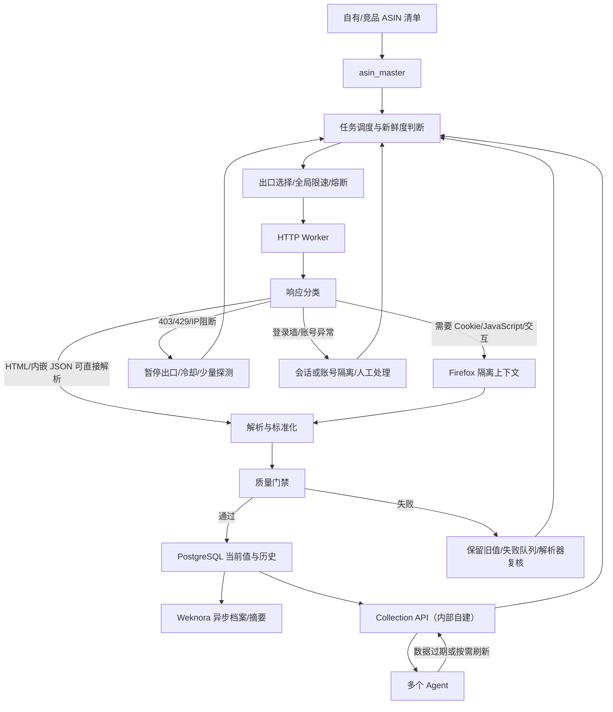

# Amazon 美国站网页爬虫与多 Agent 商品数据服务方案

> 研究日期：2026-08-26  
> 适用范围：Amazon.com；自有 ASIN ≤800、竞品 ASIN 3,000–5,000，总量 3,800–5,800  

## 0. 场景设想

系统按照 ASIN 类型、字段重要性和业务时效，定时执行每日或每周采集任务。

### 0.1 数据查询与新鲜度

当 Agent 或运营需要查询数据时，先通过 `Collection API` 检查现有数据的新鲜程度。

> `Collection API` 是自建的内部接口，负责隐藏爬虫、队列、重试、凭证和 Weknora 写入细节。
>
> Agent 可以通过它：查询某个 ASIN 当前数据；查询价格和评论历史；提交某个 ASIN 的按需刷新；查询采集任务进度。

查询和刷新规则如下：

- 如果数据仍在有效期内，直接返回 PostgreSQL 中的最新结果；
- 如果是紧急、一次性的临时查询，可以调用受控脚本立即采集；
- 临时采集结果默认只返回本次请求，不写入 Weknora，也不形成长期事实快照；
- 但应保留最小运行日志，包括 ASIN、采集时间、来源、成功/失败状态和错误原因；
- 如果后续确认该结果需要用于趋势分析或 Agent 长期回答，再经过质量校验后正式入库并发布到 Weknora。

### 0.2 两种运行模式

1. **定时任务**：负责形成可追溯的数据资产（只由管理人员执行）；
2. **按需脚本**：负责解决临时的新鲜度需求。

两者都使用同一套爬虫、解析和质量校验规则，避免出现多个 Agent 各自抓取、数据口径不一致的问题。

Weknora 不承担高频实时事实库。比如 Agent 查询“当前价格是多少”，应该通过 Collection API 查询 PostgreSQL；如果 Agent 查询“这个竞品最近为什么降价”“同类商品有什么共同卖点”，再使用 Weknora 中的档案和变化摘要。

## 1. 执行摘要

### 一句话结论

以“**自建网页爬虫主线 + 授权 IP 代理池与阻断熔断 + 受控多线程 + PostgreSQL 事实层 + Weknora 知识层 + 自建 Collection API + 统一多 Agent 服务**”建设 Amazon 数据能力。本版只确定网页采集方案和 Weknora 的功能边界。

### 路线

1. **网页爬虫主线**：对自有和竞品商品页统一使用 HTTP + Selenium Firefox 双层采集，覆盖标题、品牌、价格、Offer、Listing、A+、媒体、评分、评论统计和公开评论等页面字段；使用授权、可追溯的 IP 代理池，配合受控多线程、限速、缓存、真实性校验和熔断，不做验证码破解、指纹伪装或无限代理轮换。
2. **统一数据层**：PostgreSQL 保存结构化当前值、历史、来源、质量和任务状态；Weknora 保存商品档案、变化摘要、运营复盘和可检索知识；Excel 仅作为 ASIN 清单导入、人工确认和导出载体。
3. **统一服务**：Collection API 是我们自己建设的内部接口。多个 Agent 只访问该接口和事件，不直接访问 Amazon、Selenium、本地 SQLite/CSV 或 Weknora 原始管理接口。
4. **默认业务范围**：以固定访问环境下商品页面实际显示或渲染出的全部公开模块为采集边界，不在字段设计上主动排除评论、媒体、A+、Offer、配送和变体；媒体先保存 URL、类型、顺序和元数据，原始 HTML 完整留存。评论分页和媒体二进制下载只影响任务量、存储和合规审批，不改变“页面显示内容应有字段”的验收口径。

## 2. 原始业务目标

目标是为多个 Agent 提供统一的 Amazon 美国站商品数据能力：

- 自有 ASIN：不超过 800 个；
- 竞品 ASIN：约 3,000–5,000 个；
- 总池：约 3,800–5,800 个；
- 同一 ASIN 只应由统一采集服务负责，避免不同 Agent 重复抓取和口径不一致；
- 数据应支持最新查询、历史趋势、变更事件、批量查询和来源追溯。

这不是“写一个爬虫脚本”的任务，而是一个共享数据服务：目标池、页面采集、调度、质量、权限、存储和消费接口必须统一。

## 3. 当前 POC 的准确定位

当前 `amazon_us_handoff_windows` 是一个 Windows 单机、离线优先、受控小批量 POC：

- 输入是一份运营导出的 Amazon.com ASIN 清单子集，不是 Listing 全量；
- manifest 有 1,892 个 US ASIN，但实际状态为 1,891 pending、1 failed；
- 只有 1 条商品快照、0 条评论记录；
- SQLite 是事实源，CSV 是物化输出；
- HTTP 优先、Firefox 按需兜底，每次运行默认最多 10 个页面 action；当前 POC 不启用 IP 代理池。
- 具备断点、解析、403/429/CAPTCHA 检测、离线 fixture 和确定性验收。

`latest_verification.json` 的 `ok=true` 仅表示结构验收通过；同一文件的 `phase=collecting` 表明采集尚未完成。因此 POC 能证明“部分链路和解析器基线存在”，不能证明规模覆盖、吞吐、字段准确率、生产稳定性或多 Agent 共享能力。

### 3.1 Weknora 在整体方案中的定位

接收经过质量校验的商品档案、变化摘要和研究笔记，提供文档管理、版本更新、关键词/语义检索和 Agent 问答使用。Weknora 不承担高频实时事实、任务队列或 IP 状态。

数据分层：

```text
Amazon 商品页
      ↓
HTTP/Firefox 爬虫 → Normalizer → Quality Gate
      ↓
PostgreSQL：当前快照、历史、来源、质量、任务状态
      ↓（异步 JSON/Markdown 发布）
Weknora：商品档案、变化摘要、评论分析、研究笔记
      ↓
多个 Agent
```

PostgreSQL 保存可比较、可更新的事实，例如价格、Offer、评分、评论数量、BSR、父子变体、来源和采集时间。Weknora 保存适合问答和检索的档案、变化摘要、评论分析和业务规则。Excel 只用于 ASIN 清单导入、人工确认和报表导出，不作为多个 Agent 的共享事实源。

写入 Weknora 前必须把结构化快照物化为带元数据的 JSON/Markdown，至少包含 `asin`、`captured_at`、`source`、`quality_status` 和 `schema_version`。当前不预设区域名称、条目数量或既有知识结构，落地时通过最小写入、更新、检索和删除回放确认实际权限与功能。

## 4. ASIN 目标池设计

### 4.1 主数据表

建议建立 `asin_master`：

```text
asin_master(
  tenant_id, marketplace, asin, subject_type,
  brand, seller_or_account_ref,
  parent_asin, variant_group,
  source_type, source_record_id, source_url,
  discovered_at, approved_at, approved_by,
  priority, refresh_policy, active_status,
  effective_from, effective_to, owner, provenance_hash
)
```

业务唯一键建议为：

```text
tenant_id + marketplace + asin + subject_type
```

同一 ASIN 若分别用于自有运营和竞品对照，应保留两种业务关系，不能以一条记录覆盖另一条来源。

### 4.2 自有 ASIN

自有 ASIN 由运营提供清单并人工确认归属。导入时记录来源文件、导入批次、审批人和生效时间；无法证明归属的 ASIN 不自动标记为自有。

### 4.3 竞品 ASIN

竞品 ASIN 来源分为四类：运营已有竞品表、Amazon.com 关键词搜索结果、类目/相关商品/相似商品/竞品页面关联位，以及系统自动发现的候选。所有来源都只生成候选，不自动进入正式监控；由运营结合功能、目标人群、价格带、使用场景、替代关系和广告竞争关系确认。

流程：

```text
candidate → pending_review → active
                         ↘ rejected
active → paused → retired
```

搜索结果只能生成 `candidate`，不能自动进入 `active`。每条竞品记录关键词/类目、发现时间、搜索页面、审核人、所属竞品组和优先级。

运营当前提供的是业务规模和人工监控范围（自有约 50–100 个、竞品约 300 个），不等于已有可直接导入的完整清单。当前开发测试使用补货 ASIN；正式上线前需运营交付自有清单和已确认竞品清单，或先交付关键词/类目供系统生成候选。

### 4.4 美国配送上下文

商品基础信息采集默认固定一个美国 ZIP（当前测试使用 `90001`，Los Angeles, CA），并在页面和证据中记录配送上下文。美中 `60601`、美东 `10001` 只在需要比较区域库存、配送或运费时按需启用；不为基础商品数据默认重复采集三遍。州和城市作为 ZIP 的审计信息，不替代 ZIP。

### 4.5 变体和增删

- 父子变体关系从商品页面的变体选择器、页面内嵌数据和链接关系提取；无法确认的关系标记为 `inferred`，冲突时进入人工复核。
- 名单采用版本化快照和软删除；ASIN 停用不删除历史快照。
- 新增 ASIN 先进入低频观察，字段质量稳定后再提升优先级。
- 删除/失效只停止新任务，不覆盖历史事实。

## 5. Agent 使用场景与字段需求

### 5.1 Agent 场景

| Agent 场景 | 主要读取 | 新鲜度要求 |
|---|---|---|
| 自有商品运营 | 价格、可售/购买限制、Offer、Buy Box、Listing、变体、评论趋势 | 高 |
| 竞品监控 | 价格、促销、可售、卖家、排名、评论计数、Listing变化 | 中/高 |
| 选品/市场分析 | 搜索排名、类目、BSR、价格历史、竞品集合 | 中 |
| 内容分析 | 标题、Bullets、描述、A+、媒体 URL、规格 | 低/中 |
| RAG/问答 Agent | 最新快照、历史差异、来源、质量状态 | 按查询返回 |

### 5.2 默认字段原则

字段必须同时记录：值、来源、观察时间、schema/parser 版本、字段置信度、质量状态和降级原因。不能只返回裸 JSON 或 CSV。

本方案按以下字段组统一采集：

- 身份、目录、父子变体和规格；
- 价格、优惠、Offer、Buy Box、卖家、配送；
- 可售提示、购买限制和页面显示的库存提示；
- BSR、类目排名、搜索位置；
- 评分、评论数量、摘要和增量评论；
- Bullets、描述、A+、品牌故事、媒体；
- 历史、差异、来源和字段级质量。

页面显示的评论正文、评论统计、媒体 URL、A+和其他公开模块均属于字段覆盖范围；是否抓取全部评论分页、是否下载媒体二进制，作为任务量、存储和合规审批项单独控制，但不得因此丢失页面上已显示的字段或原始证据。

### 5.3 字段的落库和知识库写回

| 内容 | PostgreSQL | Weknora | Excel |
|---|---|---|---|
| ASIN、SKU、店铺、品牌、分类 | 主表和关系 | 商品档案索引 | 导入/确认 |
| 价格、可售提示、Offer、Buy Box、评分 | 当前值和历史 | 变化摘要 | 报表导出 |
| 标题、Bullets、描述、A+、规格 | 结构化快照 | 可检索商品档案 | 人工审核 |
| 评论计数、摘要、增量评论 | 记录和时间线 | 评论分析报告 | 选定结果导出 |
| 原始 HTML、响应、质量事件 | 索引和引用 | 不直接存原始高频日志 | 不建议 |

原始 HTML 的当前 POC 实现是本机文件系统：`data/amazon_us/<run>/raw_html/US/<asin>/<run_id>.html`，数据库/CSV 保存相对路径、哈希、采集时间、来源和解析器版本。对象存储尚未接入；生产环境再将该目录替换为公司批准的 S3 兼容对象存储，保留同一引用字段和生命周期策略。

Weknora 写入应由独立的 `knowledge_publisher` 任务完成，而不是由每个采集 Worker 直接写入。发布条件至少包括：核心字段质量门禁通过、来源和时间完整、内容脱敏/版权边界明确、已有档案的变化可追溯。Agent 查询时优先读取 PostgreSQL 的最新事实；需要语义检索时读取 Weknora 的档案和摘要，并同时返回事实时间和质量状态。

## 6. 自建网页爬虫技术方案

### 6.1 采集架构

自有和竞品 ASIN 都从 Amazon.com 页面采集。竞品先通过关键词、相关商品类型和类目搜索形成候选，再人工确认后进入 `asin_master`。所有页面使用同一套任务、解析、质量和证据链。

```text
asin_master
    ↓
任务调度（page_type / priority / freshness）
    ↓
IP 代理池选择（授权出口 / 全局令牌桶 / 熔断状态）
    ↓
HTTP Worker（httpx/requests.Session）
    ↓ 动态字段缺失或页面异常
Browser Worker（Selenium + Firefox）
    ↓
BeautifulSoup/lxml 解析 + 多选择器回退
    ↓
质量门禁 + 原始 HTML/哈希 + 结构化快照
```

### 6.2 HTTP Worker

HTTP Worker 负责初始 HTML、JSON-LD、页面内嵌 JSON 和可缓存字段。它速度快、资源消耗低，作为默认路径；通过缓存、错峰、令牌桶和按字段刷新频率减少请求量。

### 6.3 Firefox Worker

只有 HTTP 缺少关键字段、页面需要 JavaScript 渲染或需要交互时才启动 Firefox。Firefox 负责动态价格/Offer、变体、A+、媒体、评论加载和页面交互后出现的字段，不作为每个 ASIN 的默认访问方式。

### 6.4 任务与断点

任务状态使用 `pending → leased → fetching → parsing → succeeded`，失败进入 `retryable`、`blocked_retryable` 或 `dead_letter`。每条任务记录 lease、heartbeat、attempt、next_retry_at、last_error、出口标识和幂等键；进程中断后租约过期任务自动回收，不靠人工修改 CSV。

### 6.5 解析、质量和证据

解析器使用 CSS 选择器、XPath、JSON-LD、页面内嵌 JSON 和多套备用选择器，统一输出标准字段。质量门禁检查目标 ASIN、核心字段、价格格式、页面真实性、状态码、挑战页和结构漂移。异常结果不得覆盖上一次有效快照，必须保留原始 HTML、响应哈希、采集时间和解析器版本。

### 6.6 反爬边界

- 使用批准、可追溯的 IP 代理池和稳定的会话策略；IP 被阻断时按第 15.5 节执行隔离、冷却、探针和受控故障切换；
- 通过缓存、错峰、页面类型频率分级和令牌桶降低请求压力；
- 200 空页面必须识别为异常，不能当作成功；
- 403、429、CAPTCHA、登录墙和安全挑战进入熔断/人工队列；
- 不破解验证码、不注入反检测脚本、不用无限代理轮换掩盖来源；
- 记录 `blocked_reason`、时间窗口、页面类型和恢复条件。

### 6.7 IP 代理池与多线程的明确选型

本方案**采用 IP 代理池[^5]，但用途是故障隔离和有限切换，不是用无限代理规避封禁**。代理池只包含公司批准、来源可追溯的出口；当前出口出现 403、429 或挑战页时暂停，冷却后探测，最多切换到一个健康备用出口。备用出口也异常时停止新增请求并转人工。

需要区分方案选型和当前 POC：**生产方案采用 IP 代理池，现有 Windows POC 尚未接入代理池，因此 POC 的运行结果不能代表代理池接入后的效果。**

本方案**采用受控多线程（Worker Pool[^6]）提高吞吐**：

- HTTP Worker 使用少量线程池处理静态页面；
- Firefox Worker 使用彼此隔离的浏览器实例处理动态页面，不在同一个浏览器实例内共享多线程会话；
- 每个出口单独限速，每个 ASIN 任务只允许一个 Worker 同时处理；
- 所有线程共享总请求预算，不能通过增加线程数或代理数突破限流；
- 初始并发只作为待实测参数，不能直接承诺生产吞吐。

因此，可以简单把选型理解为：**“授权 IP 代理池负责被限制后的隔离和备用线路；多线程负责在限制范围内提高处理速度；两者都受统一限速和熔断约束。”**

## 8. 多 Agent 共享服务架构

多 Agent 共享服务的核心原则：

- Control Plane[^1] 管理 ASIN、采集策略、权限和出口规则；
- Queue/Task Plane[^2] 管理任务优先级、领取、租约、心跳、重试和失败队列；
- Fetcher/Normalizer[^3] 统一 HTTP、Firefox 和页面字段口径；
- 数据存储层保存主数据、当前快照、任务、差异和允许留存的原始证据；
- Agent 访问层通过 API 提供最新值、历史、变化、任务状态和来源质量；
- Agent 不直接运行爬虫、不直接写数据库、不读取个人浏览器会话。

### 8.1 Weknora 接入层

Weknora 不是任务队列或实时事实库，而是 PostgreSQL 事实层之上的知识消费层。当前不预先假设已建立哪个区域，只按它能提供的知识库、文档、版本和检索功能设计一条异步 `knowledge_publisher` 流程：

```text
有效快照/变化事件
       ↓
变化合并、脱敏、模板化
       ↓
商品档案 Markdown/JSON
       ↓
Weknora 知识库版本化写入
       ↓
Agent 语义检索和问答
```

发布内容分为三类：

1. 商品档案：低频更新的标题、品牌、规格、A+、媒体和变体说明；
2. 变化摘要：价格、可售提示、Buy Box、评分、评论数和 Listing 的时间线变化；
3. 运营研究：竞品对比、市场分析、产品评审和人工确认结论。

Agent 查询实时价格、可售提示或任务状态时，优先读取 PostgreSQL/Collection API；查询“这个竞品最近为何变化”或“同类商品有哪些共同卖点”时，使用 Weknora 的档案和摘要。两者的返回结果都必须携带数据时间、来源和质量状态。

落地时只需验证 Weknora 实际提供的文档创建、更新、检索、版本/删除和权限能力；不把“已建区域、条目数量或现成 ASIN 表”写入方案前提。

推荐能力而非固定中间件：关系库可用 PostgreSQL 兼容方案，队列可用 Redis/RabbitMQ/SQS 类方案，对象存储使用 S3 兼容接口；最终以公司现有基础设施和运维能力确定。当前本机阶段只使用本地 raw HTML 目录，不把对象存储已上线写入验收结论。

### 8.2 Collection API（内部自建）

`Collection API` 是我们在采集服务外面自建的一层内部 HTTP API。它给多个 Agent 提供统一入口，隐藏爬虫脚本、Firefox Worker、IP 代理池、队列、缓存、重试和 Weknora 写回细节。

第一版可以只实现以下能力：

```http
GET  /v1/asin/US/{asin}?fields=price,reviews,listing
POST /v1/asin/US/{asin}/refresh
GET  /v1/asin/US/{asin}/history?field=price
GET  /v1/jobs/{job_id}
```

请求到达后，Collection API 先检查最近快照是否满足 `freshness` 要求；不满足时创建一个采集任务，由 HTTP 爬虫优先、Firefox 爬虫兜底。Agent 不直接运行脚本，也不直接读取出口凭证或个人浏览器会话。

## 9. 数据模型、任务状态和 API 契约

### 9.1 快照

```text
snapshot_id
 tenant_id, marketplace, asin, subject_type
 field_group, schema_version, collector_version
 egress_id, egress_state
 value_json, confidence, quality_status
 retrieved_at, observed_at, raw_hash, evidence_ref
```

### 9.2 任务状态

```text
scheduled → ready → leased → running → succeeded
                         ├→ retry_wait → ready
                         ├→ quality_failed
                         ├→ blocked_retryable → cooldown → probe → ready
                         └→ dlq
lease_expired → ready
```

错误必须区分网络、5xx、429、权限/403、CAPTCHA/访问拒绝、结构漂移、空值、业务停用。出口本身另有 `healthy / suspect / blocked / cooldown / half_open / retired` 状态，不能把任务状态和 IP 状态混为一谈。

### 9.3 幂等

```text
tenant + marketplace + asin + subject_type
+ field_group + scheduled_window + collector_policy
```

同一任务重复投递不重复写入；新的观察生成新 snapshot，不覆盖原证据。

### 9.4 Agent API

```http
GET /v1/asin/US/{asin}?fields=identity,price,availability
POST /v1/asin/batch
GET /v1/asin/US/{asin}/history?field=price&from=...&to=...
GET /v1/changes?subject_type=competitor&field=price&since=...
GET /v1/jobs/{job_id}
```

统一响应至少包含 `schema_version`、`retrieved_at`、`freshness`、`source`、`quality_status`、`subject_type` 和字段值。

### 9.5 Weknora 文档契约

写入 Weknora 的商品档案或变化摘要必须带有可检索元数据：

```text
document_id
asin
subject_type
document_type = product_profile | change_summary | research_note
source_snapshot_ids
captured_at / generated_at
valid_until
schema_version
quality_status
```

`valid_until` 用于防止 Agent 把过期知识当成实时事实。商品档案可以按版本更新；变化摘要采用追加或按时间窗口重建，不应直接覆盖 PostgreSQL 中的原始快照。Weknora 写入失败不能阻塞核心采集任务，只能把 `knowledge_publish` 标记为待重试。

## 10. 容量、频率、吞吐和成本模型

### 10.1 刷新场景

- 低频：自有每日一次，竞品每 7 日一次；
- 标准：自有每日一次，竞品每日一次；
- 高频：自有核心价格/可售提示/Buy Box 每 4 小时，竞品每日一次。

### 10.2 基础任务量

| 场景 | 总逻辑任务/日（3,800） | 总逻辑任务/日（5,800） |
|---|---:|---:|
| 低频 | 1,228.6 | 1,514.3 |
| 标准 | 3,800 | 5,800 |
| 高频 | 7,800 | 9,800 |

任务量按“ASIN × 页面类型 × 刷新频率”计算；价格、Offer、评论、媒体和变体不是同一种任务，不能简单按 ASIN 数量估算。

### 10.3 首轮完成时间

在“HTTP Worker 以单 ASIN 计时、Firefox Worker 以页面完成计时”的规划变量下：

| 规模 | 1 Worker 理论 | 4 Workers 理论 | 8 Workers 理论 |
|---|---:|---:|---:|
| 3,800 | 按实测单 ASIN 时长计算 | 约为单 Worker 的 1/4 | 约为单 Worker 的 1/8 |
| 5,800 | 按实测单 ASIN 时长计算 | 约为单 Worker 的 1/4 | 约为单 Worker 的 1/8 |

按 50% 有效利用率的保守估计约为理论时间的 2 倍；实际还要叠加队列等待、质量重跑、冷却和 IP 阻断恢复，不能把并发数直接当作 SLA。

### 10.4 成本

自建爬虫成本包括 HTTP/Firefox Worker、任务库、队列、对象存储、监控、出口线路和维护人力。评论分页、媒体下载、失败重试和长期原始 HTML 留存会显著增加成本；首轮只用 POC 实测数据估算，不引用其他方案的单价。

### 10.5 关键容量结论

- 当前 Windows 每小时 10 action 与目标规模无关，不能作为生产容量基准。
- 生产容量必须同时观察有效页面率、HTTP → Firefox 降级比例、IP 代理池可用率、阻断率、冷却时长、队列积压和字段完整率。
- 5,800 个 ASIN 不默认每天全量抓取；先按字段新鲜度分层，再根据 POC 的阻断率和恢复时间扩容。

### 10.5.1 HTTP/Firefox 容量模型

HTTP 和 Firefox 两条采集路径不能共用同一个“每分钟请求数”假设，规划时应分别测量：

| 路径 | 规划起始假设 | 说明 |
|---|---:|---|
| HTTP Worker | 5–10 秒/ASIN | 适合初始 HTML、缓存和低频字段 |
| Firefox Browser Worker | 20–60 秒/ASIN | 适合动态价格、变体、A+、媒体和异常页面 |
| 初始并发 | 4 个 HTTP + 2 个浏览器 | 通过 20+20 试跑后再扩容 |

如果 5,800 个 ASIN 全部需要浏览器，按 8 个有效浏览器槽位粗算，理论页面时间约 6–12 小时；还需叠加启动、等待、重试、冷却和阻断时间。若大部分简单字段由 HTTP 完成，整体时间会下降；若抓全量评论分页，任务量会显著增加。以上只是容量规划变量，不是成功率或 SLA 承诺。

实际吞吐还受全局请求预算、IP 代理池可用率和 IP 阻断后的冷却时间约束，不能按“代理数量 × 单代理并发”线性放大；容量验收必须记录有效页面率、阻断率和恢复时间。

自建爬虫的月度成本主要是 Worker、数据库、队列、对象存储、监控、授权出口线路和维护人力。首期只用小批量实测结果估算，不把理论吞吐当作承诺。

## 12. 质量、监控和失败恢复

### 质量门禁

- ASIN 格式、marketplace 和唯一性；
- 标题/品牌非空率；
- 价格数值、币种、单位和时间；
- 变体父子关系一致性；
- 字段类型和枚举；
- 来源、批次、响应哈希、parser/schema版本；
- 关键字段突变、空响应和结构漂移；
- 自有/竞品抽样 Gold Set 准确率；
- 新鲜度和完整率。

质量失败不得覆盖上一有效快照；要保存证据并进入 quality_failed 或人工队列。

### 监控指标

- 队列积压、claim/lease超时、heartbeat丢失；
- 采集成功率、p50/p95延迟、429/403/CAPTCHA/5xx；
- 按出口统计的有效页面率、429/403/挑战率、健康状态、冷却剩余时间和备用线路切换次数；
- 字段空值率、质量失败率、结构漂移数；
- 新鲜度达标率、变更事件延迟；
- 每 ASIN/字段/采集路径成本；
- DLQ 数量、人工重排队量、API错误率和权限拒绝。

### 恢复

- 429：尊重 Retry-After，按出口和页面类型分区退避；
- 403/CAPTCHA：blocked，隔离当前出口并人工审查；仅允许批准出口之间的受控故障切换，不得通过更换身份、Cookie 或无限代理轮换规避阻断；
- 网络/5xx：指数退避 + jitter；
- 结构漂移：暂停写入、保留旧值、触发解析器复核；
- 达到重试上限：DLQ、人工 requeue、审计记录；
- 出口级 circuit breaker[^4] 防止故障扩散；出口熔断时按第 15.5 节执行冷却、探针和受控切换。

## 13. POC 迁移建议

POC 向生产迁移时执行以下改造：

### 保留

- ASIN/canonical 校验；
- 字段解析概念和离线 fixtures；
- 评论分页游标思想；
- 状态转换、证据记录、确定性验收规则；
- 403/429/CAPTCHA 硬闸门。

### 改造

- manifest 改为版本化 `asin_master`；
- 数据契约增加 tenant、own/competitor、parent/child、collector_version、字段置信度、版本/diff、lease和错误分类；
- 解析器拆成 Fetcher Adapter + Normalizer + Quality Gate；
- 评论正文、媒体 URL、A+ 和页面公开模块纳入字段覆盖；评论分页和媒体二进制仅作为任务量、存储及合规审批项控制。

### 迁移

- SQLite/CSV → 集中关系库、对象存储、查询 API 和事件；
- Windows 每小时任务 → 调度器、队列、租约、Worker；
- 本地共享文件 → 统一服务和权限控制；
- 结构化快照 → Weknora 商品档案/变化摘要的异步发布，不直接把原始高频表写入知识库。

### Weknora 迁移顺序

1. 先确认目标 Weknora 知识库的管理员、写入、更新、删除和检索权限。
2. 设计商品档案、变化摘要和研究笔记三种文档模板。
3. 用 20 个已审核 ASIN 做 PostgreSQL → Markdown/JSON → Weknora 的回放测试。
4. 验证版本更新、过期标记、权限隔离和删除回滚。
5. 仅在知识发布成功后开放给 Agent 语义检索；实时字段仍由 Collection API 查询 PostgreSQL。

### 淘汰

- 把 FBA 补货建议当 Listing 全量；
- 以每小时10 action推导生产容量；
- 多 Agent 共享 SQLite/CSV；
- 旧 PA-API 5；
- 自动验证码处理、代理/IP/身份规避。

## 14. 分阶段实施计划

先把目标、字段、异常处理和合规边界定清楚，再用授权小批量实测，最后逐步扩大范围。测试用于验证参数和效果，不用于主动制造 Amazon 封禁。

### 一周 MVP 交付范围

| 日程 | 主要目标 | 阶段结果 |
|---|---|---|
| 第 1 天 | 确认 ASIN 样本、页面字段清单、访问环境和验收指标 | 知道采什么、在什么上下文采、如何判定成功 |
| 第 2–3 天 | 接通 HTTP/Firefox、解析、原始 HTML、PostgreSQL/SQLite 状态和质量门禁 | 有一套可运行的采集链路 |
| 第 4 天 | 完成断点、重试、403/429/IP 熔断、账号/会话隔离和故障注入 | 逆流程可演示、可审计 |
| 第 5 天 | 运行 20 个自有 + 50 个竞品 ASIN，输出实测表和失败清单 | 得到第一版真实指标和 Go/No-Go 结论 |

一周交付的是 MVP 和实测报告，不承诺在一周内完成 3,800–5,800 个 ASIN 的生产扩容。竞品扩容到 3,000–5,000 个属于后续批次，每批 500–1,000 个，必须以前一批指标稳定为前提。

### 后续扩容阶段（不计入一周 MVP）

### 阶段 0：先定规则（1–2 个工作日）

- 确认自有/竞品 ASIN、字段优先级和刷新频率；
- 确认评论正文、媒体二进制和页面采集的合规边界；
- 确认 IP 代理池、全局请求预算和 IP 阻断处置规则；
- 确认预算上限和首轮验收标准。

### 阶段 1：搭好系统骨架（3–5 个工作日）

- 建立 `asin_master`、任务状态、HTTP/Firefox Worker、解析器和质量门禁；
- 建立出口登记、健康评分、熔断/冷却/探针状态；
- 接好 PostgreSQL、Weknora 发布模板和最小 Collection API；
- 完成离线 fixture 和验收逻辑；
- 本阶段不访问真实 Amazon，不接入生产密钥。

### 阶段 2：用 200 个 ASIN 实测（3–5 个工作日）

以 100 个自有 + 100 个竞品 ASIN 为样本，验证字段返回率、准确率、HTTP → Firefox 降级、失败重试、阻断率、IP 代理池的隔离/冷却/探针/受控切换、成本，以及 PostgreSQL → Weknora 的发布链路。

### 阶段 3：先服务自有 ASIN（约 1 周）

先上线自有商品页的高优先级字段，通过 Go/No-Go 后再扩展字段和刷新频率。

### 阶段 4：竞品分批扩容（1–2 周）

每批加入 500–1,000 个竞品 ASIN，观察成功率、成本、新鲜度、阻断率和 DLQ；只有指标稳定后才继续扩容。

### 阶段 5：持续调优

根据真实成功率和运维数据调整 HTTP/Firefox 比例、刷新频率、缓存、历史保留和 IP 代理池规模；爬虫主线保持可独立运行。


## 15. 业务流程与反爬原理

这一章用于汇报时快速说明“数据从哪里来、如何采集、如何应对异常、Agent 如何使用”。核心原则是降低访问风险、保证数据可追溯，而不是强行绕过 Amazon 的安全机制。

### 15.1 总体原则

- HTTP 优先，降低 Firefox/Selenium 的浏览器访问量；
- 缓存已有结果，并按字段设置不同刷新频率；
- 错峰采集，使用令牌桶控制并发和请求速率；
- 识别 403、429、验证码、登录墙和空页面；
- 失败进入重试、熔断或人工处理队列；
- 保存原始 HTML、采集时间、来源和解析器版本；
- 不破解验证码、不注入反检测脚本、不依赖无限代理轮换。

### 15.2 业务流程



### 15.3 步骤

1. 系统**建立 `asin_master`**：这张表记录每个 ASIN 的站点、自有还是竞品、商品类型、优先级、需要采集的字段、上次采集时间和数据新鲜度要求。
2. **系统创建采集任务**：每个 ASIN 都是一条独立任务，任务会记录当前状态、租约、尝试次数、下次重试时间和错误原因。
3. **HTTP 爬虫优先**：HTTP Worker 直接请求商品页面并获取原始 HTML。HTTP 的速度快、资源消耗低，适合处理大多数静态页面，所以作为第一层采集方式。
4. **Firefox/Selenium 负责动态页面的补充**：只有在 HTTP 缺少关键字段、需要 JavaScript 渲染或需要交互时才启动 Firefox，用于处理动态价格/Offer、变体、A+、媒体、评论加载和交互后出现的字段。
5. **响应分类与会话处理**：区分可直接解析的 HTML/内嵌 JSON、需要 Cookie/JavaScript 的动态页面，以及 403/429/挑战页；Cookie 使用独立会话，安全挑战不进入解析链路。
6. **解析与标准化**：综合 CSS 选择器、XPath、JSON-LD、页面内嵌 JSON 和备用选择器，统一生成 `price`、`buy_box`、`seller`、`rating`、`review_count`、`title`、`brand`、`bullets`、`dimensions`、`images`、`a_plus` 等标准字段。
7. **质量门禁**：检查页面是否属于目标 ASIN、核心字段是否存在、是否为空页面、是否遇到 403/429/验证码/登录墙、价格格式是否正确、页面结构是否漂移，以及来源和采集时间是否完整。异常结果不能覆盖原来的有效数据。
8. **分层保存**：PostgreSQL 保存当前事实、历史变化、任务状态和来源；对象存储保存原始 HTML 和解析证据；Weknora 保存商品档案、变化摘要、评论分析和运营结论。
9. **统一消费入口**：Collection API 是我们自建的内部接口，负责查询当前值、查询历史、提交按需刷新和查询任务进度。Agent 不直接运行爬虫、不直接操作 Firefox，也不接触出口凭证。

### 15.4 异常处理边界

**反爬应对**：HTTP 优先，减少浏览器访问；对已经采集的数据进行缓存；根据字段重要性设置不同刷新频率；错峰采集，避免短时间集中访问；使用令牌桶控制并发和请求速度；对 403、429、验证码、登录墙和空页面进行识别；失败后进入重试、熔断或人工队列；保存原始 HTML、采集时间、来源和解析器版本。

### 15.5 IP 被阻断后的具体处置

“IP 被封”按**访问出口被限制**处理，使用 **IP 代理池**。

#### 识别和处理步骤

1. **发现异常**：看到 403、429、验证码、Robot Check、Access Denied、登录墙，或出现 200 但页面为空、ASIN 不一致、跳转到挑战页，先按阻断处理。
2. **暂停当前出口**：该出口立即停止领取新任务；正在执行的任务保存断点，不能用异常页面覆盖原来的有效数据。
3. **等待并确认**：有 `Retry-After` 就按它等待；没有就逐步延长等待时间。冷却后只用 2～3 个 ASIN 做低速探测，确认返回真实商品页后再恢复。
4. **有限切换**：如果公司有经过批准的备用出口，最多切换一次，并以低速运行；不按请求频繁换 IP。
5. **再次失败**：备用出口也被限制时，停止新增请求，返回最近一次有效数据并标记过期，转人工处理，不无限换 IP。

#### IP 资源的简单要求

只准备少量来源、责任人和用途可追溯的公司授权出口；每个出口记录成功率、403/429 次数和最近使用时间。禁止使用来源不明的开放代理、无限代理轮换、验证码破解或指纹伪装。所有出口共享一个总请求预算，不能因为出口变多就把访问量成倍放大。

每次阻断至少记录出口、时间、ASIN、状态码、Retry-After、拦截页面摘要、响应哈希、恢复结果和任务断点。Agent 在阻断期间读取最近一次有效快照，并明确标注 `stale=true`。

### 15.6 可能遇到的反爬问题与处理

除 IP 限流外，3,800–5,800 个 ASIN 的页面采集中较可能遇到 Cookie/会话校验、动态 JavaScript、请求签名、区域参数、空页面和页面结构漂移。它们要按“能正常处理的页面技术”与“不能破解的访问控制”分开处理：

| 问题 | 发生可能性 | 方法 | 处理方案 | 不做的事 |
|---|---|---|---|---|
| Cookie、会话过期、CSRF/会话 Token | 中/高 | Cookie Jar；Session Isolation | HTTP 使用独立 Cookie Jar；Firefox 使用隔离的临时浏览器上下文；Cookie 过期则重新打开正常页面获取 | 不复制个人 Cookie，不跨出口共享会话，不伪造 Token |
| Cookie/请求头过大（431） | 中 | Header Minimization | 只发送必要请求头和当前会话 Cookie；识别 431 后清理过期 Cookie、缩小头部并延期任务 | 不把整套浏览器 Cookie 原样塞进 HTTP 请求 |
| 页面由 JavaScript 动态渲染 | 高 | HTTP First + Firefox Fallback | 先取 HTML/内嵌 JSON；缺字段时交给 Firefox 执行页面原有脚本，再读取渲染后的 DOM | 不为每个 ASIN 默认启动浏览器，不注入反检测脚本 |
| 请求参数包含时间戳、Nonce、签名或混淆 | 中 | DOM/HTML Extraction；Parser Versioning | 优先读取最终渲染结果；公开字段在页面 HTML/DOM 中存在时不复刻内部请求；解析失败则冻结写入、记录版本并更新解析器 | 不逆向私有接口签名，不批量破解或伪造签名参数 |
| HTTPS/抓包后响应是加密或二进制 | 中（评论、媒体、动态模块更可能） | Evidence-only Fallback | 仅记录 URL、状态码、响应头、耗时和内容哈希；能从正常浏览器 DOM 得到的字段照常采集 | 不做 TLS 中间人解密，不收集凭证，不重放受保护请求 |
| 登录墙、验证码、Robot Check、安全挑战 | 中/高 | Circuit Breaker + Manual Queue | 标记 `blocked`，保存证据，进入熔断/冷却/人工队列；返回最近一次有效快照并标记过期 | 不自动打码、不绕过验证、不用换 Cookie 或无限换 IP 突破 |
| 账号被限制、冻结或要求重新验证 | 默认低（默认不登录采集公开页）；若使用获批账号则为中 | Account Quarantine | 立即停止该账号的全部任务，撤销会话租约，保留最近有效快照和证据；由账号负责人确认是否恢复 | 不共享个人账号，不复制个人 Profile/Cookie，不自动注册或轮换账号 |
| ZIP/区域/配送上下文导致价格或可售不同 | 中 | Context Keying | 把区域参数作为任务维度记录；不同上下文分别保存快照，不能混写 | 不用一个区域结果冒充全部美国站结果 |
| 页面结构漂移、200 空页面、ASIN 不匹配 | 高 | Quality Gate + Parser Fallback | 多选择器回退 + ASIN/标题质量门禁；异常只进入 `quality_failed`，保留旧值和原始证据 | 不把 HTTP 200 直接当作采集成功 |

判断原则：**如果数据在正常访问页面的 HTML、内嵌 JSON 或渲染 DOM 中可见，就通过解析器解决；如果数据只存在于受保护的私有接口、加密载荷或安全挑战之后，就停止该字段采集并记录缺口，不通过逆向、抓包解密或身份伪装强行获取。**

### 15.7 反爬结论的依据与适用边界

本节把“已知事实、工程推断和待实测项”分开，避免把经验参数说成 Amazon 的固定规则。

| 结论 | 依据 | 对本方案的直接影响 | 结论级别 |
|---|---|---|---|
| 429 是限流信号，不等于永久封禁 | HTTP 状态语义规定 429 表示请求过多；`Retry-After` 可给出再次请求前的等待时间 | 读取并记录 `Retry-After`；没有该字段时退避；同一出口、页面类型和任务分区降速 | 已证实的协议事实 |
| 限流维度不一定只有 IP | 公共 HTTP 语义明确指出，限制可能按 IP，也可能按用户、授权应用或 Cookie | 不能把“换 IP”当作唯一恢复手段；必须同时隔离会话、账号和任务上下文 | 已证实的协议事实 |
| 403 不适合立即原样重试 | 403 表示服务器理解请求但拒绝处理；无请求条件变化时重复请求通常仍会失败 | 当前出口停止领取新任务，进入冷却/人工审查；保留最后一次有效快照 | 已证实的协议事实 |
| 批量任务应拆分、限速并可停止 | 爬虫工程规范普遍要求遵守站点规则、控制速率、分批访问，并在连续403或429时暂停 | 采用全局令牌桶、批次上限、出口熔断和可恢复断点；不以并发数线性放大访问量 | 工程规范依据 |
| 浏览器会话应隔离 | Firefox/Selenium 支持为每个运行上下文创建临时 Profile | 不导入个人浏览器 Profile；每个 Worker 使用临时会话；Cookie 只在任务和出口边界内有效 | 工具能力事实 |
| Amazon 可能限制自动化访问，且不能靠逆向或绕过解除 | Amazon 业务访问政策对自动化系统、停止访问要求和安全机制规避设有限制 | 默认只采集公开页面；遇到挑战、登录墙、私有接口或加密载荷时停采、留证、人工处理 | 业务政策事实 |
| “每小时多少请求不会被封”没有可直接套用的公开阈值 | Amazon 不公开本项目可复用的固定封禁阈值；限流还会受资源、会话、区域和时间窗口影响 | 报告只能给出初始参数和测量方法，不能给出“安全请求数”承诺 | 未知，必须实测 |

因此，“HTTP 优先所以不容易被封”不能作为方案结论。能够成立的表述是：**HTTP 减少浏览器资源和页面交互次数，缓存、分批、限速和可停止设计降低访问压力；是否触发限制以及限制对象，必须以授权小批量运行数据为准。**

### 15.8 IP、会话和账号的处置优先级

设计假设是：长期运行中至少会出现出口、会话或账号层面的访问阻断，因此验收标准不是“永不被封”，而是“阻断可识别、任务不丢失、旧数据可用、恢复有边界、连续失败会停机”。

三类状态必须分别处理，不能用一个“换 IP”动作覆盖所有故障：

1. **任务故障**：网络超时、5xx、空页面、解析失败。原任务保留游标，指数退避，超过上限进 DLQ。
2. **出口故障**：同一出口在多个 ASIN 上出现 403、429 或挑战。停止该出口新任务，进入冷却和低速探针；只有获批备用出口健康时，才允许一次受控切换。
3. **会话/账号故障**：Cookie 失效、登录墙、账号验证或冻结。撤销会话租约，隔离账号，停止该账号关联任务，人工确认后再决定是否恢复。默认公开页面采集不依赖登录账号，因此不设计“自动换号”兜底。

如果出口、会话或账号在同一时间窗连续出现阻断，系统返回最近一次有效数据并标记 `stale=true`，停止新增请求，进入人工处理；不能通过无限换IP、换Cookie或换账号把阻断隐藏掉。

一句话汇报：**先识别阻断属于任务、出口、会话还是账号，再按对应流程停止、保存断点、冷却和人工确认；只有获批备用出口通过低速探针后才受控恢复，连续阻断就全局暂停，不靠不断换 IP、Cookie 或账号试到成功。**

一句话概括：**统一 ASIN 任务，HTTP 主采集，Firefox 按需兜底，质量门禁后分层保存，Agent 通过 Collection API 获取最新数据。**

## 附：名词解释与验证边界

| 名词 | 本方案中的含义 |
|---|---|
| Control Plane[^1] | 任务管理部分，负责 ASIN、优先级、频率、权限和采集规则。 |
| Queue/Task Plane[^2] | 任务排队部分，负责领取任务、记录断点、重试和失败任务。 |
| Fetcher/Normalizer[^3] | 采集和整理部分，Fetcher 负责取页面，Normalizer 负责把不同页面整理成统一字段。 |
| Worker | 实际执行一次页面请求或浏览器访问的进程。 |
| DLQ | 失败任务暂存队列，达到重试上限后进入，等待人工处理。 |
| Collection API | 自建的内部接口，Agent 通过它查询数据或提交刷新，不直接运行爬虫。 |

[^1]: Control Plane 可理解为“任务管理台”。
[^2]: Queue/Task Plane 可理解为“任务队列和状态记录”。
[^3]: Fetcher/Normalizer 可理解为“采集器和字段标准化器”。
[^4]: circuit breaker 可理解为“发现连续异常后先自动暂停，避免故障继续扩散”。
[^5]: IP 代理池可理解为“少量经过批准的备用网络出口”，不是公开代理列表。
[^6]: Worker Pool 可理解为“多个采集进程并行处理任务”，每个进程仍受统一限速约束。

本文已经包含目标范围、字段口径、系统架构、任务状态、容量模型、成本构成、反爬处置、Weknora 功能和 Collection API 责任边界。当前仍需通过授权小批量 POC 验证：页面字段实际返回率、HTTP → Firefox 降级比例、Cookie/动态模块可用性、IP 阻断率、恢复时长、评论和媒体字段完整度，以及 Weknora 的最小写入与检索链路。
