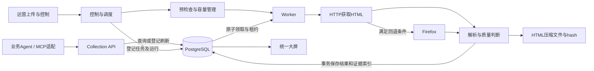

# Amazon 美国站采集与 Agent 数据服务：技术方案评审稿

日期：2026-09-08。用途：供公司技术同事评估架构、确定改进方向并划分协作任务。

本文依据本地主线代码和外部候选的隔离复测整理。它不是部署完成声明，也不承诺已达到生产吞吐。已有 [main_report.md](main_report.md) 保留更完整的设计和历史记录，但其中部分提交、迁移和发布状态已过时；当前版本归属以本节为准，生产进程实际运行版本需要单独核验。

## 1. 要解决的业务问题

运营人员和业务 Agent 需要按 ASIN 获取 Amazon.com 商品信息，查询已有数据，按需刷新，并追踪变化。系统应提供统一入口，让商品清单、采集任务、结果、历史和错误可以相互核对。

原项目记录的自有商品规模为 1,093 个 ASIN，后续规划覆盖自有、竞品和候选商品约 3,800–5,800 个。它们是规划规模，并非已完成全量采集验收的数量。

核心体验：上传 Excel/CSV → 立即看到批次和成员 → 启动采集 → 查看进度 → 下载结果；停止后可以启动下一批。Agent 查询与刷新通过 API/MCP 接入同一事实源。

### 数据范围和质量

| 数据组 | 内容与边界 |
|---|---|
| 商品身份 | ASIN、canonical、品牌、Parent/Child及变体关系；不把兄弟变体的结果静默记到原ASIN |
| 交易信息 | 价格、货币、库存/可售状态、Offer/Buy Box及配送上下文；字段支持程度需要按样本验收 |
| 商品内容 | 标题、卖点、描述、规格、A+、图片和视频URL及元数据；默认不下载媒体二进制 |
| 评价信息 | 评分、数量、商品页top reviews；独立评论分页另计任务、耗时和完成度 |
| 排名 | BSR与关键词搜索排名是不同能力；不可互相替代，逐项确认实现及覆盖率 |
| 来源 | 采集时间、URL、原始HTML指针、hash、解析器版本、质量状态和错误原因 |

缺失的可选字段允许为空。身份错误不能算成功；地区或货币不符合要求时，允许保留可用的非交易字段，但必须标识适用范围，不能把非美元价格当作合格美国站价格。

## 2. 本次评审涉及哪些版本

| 对象 | 可追溯标识 | 本次定位 |
|---|---|---|
| 本地自研主线 | main / `2bef2598d4c9c25828e6f5469390ae5405b5d79a` | 本次读取的主体架构；现有origin指向T3L000/amazon-crawler。未核验生产部署版本 |
| GitHub远端主线 | main / `088bb24a9c1ca8704b3ec958983acd489dd2067b` | 2026-09-08通过已认证GitHub API只读核验；私有仓库，与上述本地main不同 |
| 发给外部协作者的源码ZIP | SHA256 `ea30676cffa7ecc644997170e3f33295c0c45e09ec221e790d49d74167f43e96` | 外部修改的比较基线，不能等同当前本地主线 |
| 9月7日外部返回包 | SHA256 `ae7cd5425b65100225d02c0525f27439c5b577144a7bb7a813a98449d1bd1e67` | 做过隔离功能复测和条件性离线性能实验 |
| 9月8日外部返回包 | SHA256 `4f2529372b3cfb424c5c893f3daa0b6cd429689dc71d1a057d1903af1dc4f79e` | 含两个双击入口、批次协调器及质量策略调整；关键链路验收仍有失败 |

外部包不是主线的自动升级包。不能把它的新批次表、容量模型或宽松质量策略描述为主线已经采用的实现。

## 3. 整体架构

主要路线为 Python + PostgreSQL + HTTP优先采集 + 按需Firefox渲染 + 原始证据存储 + Console + Collection API。

图表达共同设计方向；当前人工批次与Agent刷新仍需在所选最终版本中完成统一集成验收。

### 为什么采用这条路线

- HTTP优先：商品初始HTML能提供部分目标字段，成功时省去完整浏览器渲染成本。
- Firefox按需使用：处理需要渲染或上下文确认的页面；每次回退记录原因，便于判断成本是否值得。
- PostgreSQL集中存储：任务、租约、结果和历史可事务处理，运营与Agent读取同一来源。
- 原始HTML另存：可以离线复现解析问题，减少为调试重复访问Amazon；文件保存压缩HTML，数据库保存索引和hash。
- 采集与查询解耦：历史数据查询不必等待网络采集，刷新通过异步任务返回结果。

### 主线代码导航

| 文件 | 主要职责 |
|---|---|
| [crawler.ps1](../crawler.ps1) | 人工采集控制、预检查和运行管理 |
| [amazon_us_worker.py](../scripts/amazon_us_worker.py) | HTTP/Firefox适配、解析、上下文检查和采集循环 |
| [postgres_worker_storage.py](../scripts/postgres_worker_storage.py) | 任务领取、租约和商品/评论/证据事务写入 |
| [proxy_capacity_gate.py](../scripts/proxy_capacity_gate.py) | 代理容量授权及预约 |
| [recovery_scheduler.py](../scripts/recovery_scheduler.py) | 恢复预算、冷却和请求许可 |
| [collection_api.py](../scripts/collection_api.py) | 商品查询、历史、刷新请求及job查询，读/刷新权限划分 |
| [agent_collection_service.py](../scripts/agent_collection_service.py) | Agent数据服务运行支持 |
| [collection_console.py](../scripts/collection_console.py) | 大屏与数据库状态投影 |
| [postgres_schema.sql](../schema/postgres_schema.sql) | 主体数据结构；其他能力还需对应迁移文件 |

## 4. 数据库如何发布和消费任务

发布任务是向数据库登记待处理记录。Worker轮询可领取任务，在事务中使用 `FOR UPDATE SKIP LOCKED` 领取一条记录，同时写入租约标识、持有者和过期时间。其他Worker跳过已锁定记录，继续领取别的任务。

网络访问在领取事务结束后执行，避免整个网络等待过程长期持有行锁。写入结果时再次核对租约；商品快照、证据索引和状态更新应在同一事务中完成。Worker崩溃后，任务按租约和恢复策略处理，不能永远留在处理中。

| 主线数据 | 用途 |
|---|---|
| asin_master | ASIN及租户、自有/竞品/候选关系 |
| item_state | 任务阶段、状态、重试和租约 |
| refresh_request | Agent按需刷新请求 |
| product_snapshot及最新结果投影 | 商品历史和当前数据 |
| collection_evidence | 采集来源、raw/hash、上下文和错误 |
| review_summary / review_page_state / review_record | 评论统计、分页进度和评论记录 |
| collection_run / operation_run | 采集运行及预检查等操作记录 |

外部候选另外引入 `batch/batch_item`、`batch_progress` 和 `egress_endpoint/egress_slot`：把一次上传显式建成批次，让成员进度和容量租约各有记录。它解决批次归属的方向有价值，但与原 `item_state`、Agent刷新及质量策略之间的兼容尚需完成。

## 5. Agent如何调用

已有Collection API不是空白。主线代码包含商品、历史、证据、批量查询、异步刷新和job查询，并区分 `read-agent` 与 `refresh-agent`。现有MCP/客户端应复用这些能力，再适配最终批次接口。

从代码确认的现有路由包括：

| 调用 | 用途 |
|---|---|
| GET /v1/asin/US/{asin} | 查询已有商品 |
| GET /v1/asin/US/{asin}/history | 查询历史 |
| GET /v1/asin/US/{asin}/evidence | 查询证据 |
| POST /v1/asin/batch | 批量读已有快照 |
| POST /v1/asin/US/{asin}/refresh | 提交单商品刷新 |
| POST /v1/asin/refresh | 提交有界批量刷新 |
| GET /v1/jobs/{job_id} | 查询刷新job |

这是方案级路由导航，不替代请求字段、认证和错误码的接口参考。参见 [collection_api.md](collection_api.md)，联调时以所选提交的路由实现为准。

目标合同：普通查询只读；显式刷新登记任务并尽快返回ID；Agent轮询任务，最终取得新数据、采集时间及质量状态。重复提交需要幂等；只读身份不能刷新或停止；Agent无需接触数据库和代理凭据。

网页大批次的创建、停止、进度及结果与现有刷新job不是天然同一个接口。统一批次查询、停止权限和MCP映射是待集成事项。Agent发起的批次必须能在大屏看到，不能另开一套不可见的Worker。

## 6. 多Worker和速度：哪些已经证明

数据库原子领取在发给外部协作者的旧基线中已经存在。外部候选新增了显式批次协调器及按批次补充Worker，不是从零引入数据库并发能力。

外部协调器默认每批2个Worker，可配置 `--workers-per-batch`；配置能填写更大的数字，并不代表该并发已通过真实采集验证。程序并发、浏览器资源、代理连接额度和目标站请求压力要分别考虑。

### 现有性能证据的边界

9月7日外部包的实验，用同一Python进程内的两个线程分别调用真实Worker循环和BatchStore，使用固定小HTML、独立数据库，并在实验进程内临时绕过两个写库缺陷。原始HTML文件持久化被关闭，未执行真实协调器、多进程启动、代理、限速器或Amazon请求。

| 实验条件 | 单Worker循环 | 双Worker循环 |
|---|---:|---:|
| 模拟响应无网络等待，100条×3轮 | 平均314.59条/分钟 | 平均640.71条/分钟 |
| 每次模拟响应等待1秒，24条×3轮 | 平均50.03条/分钟 | 平均98.72条/分钟 |

这只是特定简化负载下的局部基准，不能称为生产爬虫速度或通用架构上限，也未证明外部修改比旧主线更快；当时没有做两版本同条件对照。两条循环并发不等价于部署入口的双进程验收。

主线 `recovery_scheduler.py` 中还存在至少5秒的请求许可间隔；它没有进入上述实验。此前按“5秒页面+0.19秒处理”得到的23条/分钟也只是算术假设，不是主线或新包真实实测。

### 下一次性能验收设计

固定版本、配置、字段、样本、网络环境和并发数，先20条预跑，再100条正式测量。分别记录商品与评论，避免用复用旧快照提高新采集吞吐。

- 有效吞吐 = 本批符合身份/地区/字段要求的新成功商品数 ÷ 从启动到收尾的墙钟分钟数。
- 同时报总请求、重试、CAPTCHA/429、失败、变体、地区partial数、浏览器回退率、流量和单条延迟分布。
- 对比1、2及后续目标并发；只有持续合格吞吐提高才说明扩容有收益。
- 先商定目标批次规模、完成时限、字段正确率和预算，再选择所需并发；目前没有达成最低每分钟成功数合同。

反爬会造成波动，它应作为测试结果的一部分，不是无法做性能测试的理由。

## 7. 9月8日外部候选的具体情况

这次仅复测关键路径，没有运行新包完整测试集。新建隔离PostgreSQL库，执行该包建表及迁移脚本，原样使用真实Worker/BatchStore；替换网络响应，没有临时修补业务代码。

结果为3项失败、3项通过：

| 检查 | 证据与含义 |
|---|---|
| 两种商品成功写库 | 空数字问题已消失，但均因 `task_stage=complete` 不满足只允许product/reviews的约束而失败 |
| 未配置容量不得请求 | 新包按无限容量处理并发起模拟采集；这与此前要求不一致，需明确直连测试与生产容量策略 |
| CAPTCHA和批次预显示接口 | 两项通过；大屏检查为接口级，非完整浏览器验收 |
| 地区偏差策略 | 包内测试通过：要求US/USD时，香港配送、HKD19.99可以原样保存且不回退浏览器。证明策略被放宽，不代表数据质量通过 |

两个BAT的含义也需澄清：前端启动Console；后端用固定CSV和Windows配置跑一次旧manifest模式的单Worker，没有batch-id。网页有另一套协调器启动接口，两者需要统一。`--limit 5`限制动作数，未保证5个新成功商品；还受配置中max_actions_per_run限制。

这些是外部候选的发现，不应归因到未执行同样复测的主线。Windows DPAPI自带测试曾在本机失败、在对方环境通过；未完成同版本同环境根因对照，不能断言全部是对方代码问题。

## 8. 希望同事参与评审的决策

| 决策点 | 当前建议 | 希望评审的内容 |
|---|---|---|
| 批次模型 | 保留明确的批次和成员归属，复用既有任务、结果与Agent接口 | 新batch_item与旧item_state如何迁移，避免两套状态源 |
| 数据质量 | 将身份、国家/货币、指定ZIP、可选内容分层 | 哪些字段允许partial，哪些可进入业务成功指标 |
| 采集后端 | HTTP优先，Firefox有原因才回退 | 实测HTTP成功率、回退价值、会话生命周期及失败处理 |
| 并发方案 | 先验证实际进程和部署入口，再逐级扩容 | 常驻Worker或受控HTTP并发池是否值得；现有串行许可范围是否合适 |
| Agent集成 | 我方负责现有MCP适配，后端提供稳定统一接口 | job/batch映射、幂等、权限、刷新上限和结果格式 |
| 发布验收 | 空库部署、关键链路与真实小批次均提供证据 | 状态矩阵、迁移兼容、版本固定和停止后恢复 |

## 9. 协作分工和完成标准

建议外部协作者负责其交付代码的采集、批次调度、大屏与接口修复；我方负责选定集成基线、现有Agent/MCP接入和业务验收；公司技术同事参与数据库状态设计、并发方案和接口评审。该分工是建议，待团队明确负责人。

完整状态流程：上传 → 预检查 → 容量预约 → 领取/采集 → 完成或停止 → 释放容量 → 启动下一批。服务重启和进程异常都应有明确恢复状态。

约定场景至少覆盖正常完成、预检查失败、CAPTCHA、预检查阶段停止、采集阶段停止、进程异常、停止后立即启动下一批及重启恢复。修复后重跑约定矩阵，连续三轮通过；另用实际Agent完成查询、刷新、进度查询和结果读取，并核对大屏一致性。

## 10. 放入公司Git的建议

公司提供的 `https://github.com/DEDC-JINKUN` 是组织主页，不是具体项目仓库地址。公开页面不列出公共仓库，这不代表组织没有私有仓库，也不能据此确定我们是否有写权限。

现有源码仓库为 [T3L000/amazon-crawler](https://github.com/T3L000/amazon-crawler)，已确认是私有仓库；同事需已有访问权限，或接收单独发送的Markdown文件。远端 [docs/main_report.md](https://github.com/T3L000/amazon-crawler/blob/main/docs/main_report.md) 已存在，可用来了解该远端版本的技术方案；本文仍为本地评审稿，尚未上传。远端与本地main的提交不同，不可把两份文档当作同一版本。

先共享本文供评审，再由团队指定具体仓库与分支。若需要新建，建议独立私有爬虫仓库，避免把爬虫工作目录的其他项目一起提交。后续按主题建分支和PR，让同事可以逐项评论和验收。

首批建议包含：本文、所选版本源码、依赖与配置模板、迁移脚本、离线样本、独立集成测试和运行说明。历史main_report可作为补充材料，但应注明时点；外部返回包采用独立候选分支，评审后再整合。真实凭据、业务原始清单、数据库文件和运行缓存不属于源码交付。

## 附：证据与读取边界

- 主线代码：本次读取的commit为 `2bef2598d4c9c25828e6f5469390ae5405b5d79a`；仅静态检查，未重跑主线功能测试或查询生产库。
- 历史方案：[main_report.md](main_report.md)、[README](../README.md)；其中迁移/发布叙述有冲突，因此未将其历史状态升级为当前运行结论。
- 外部候选测试：对应4f2529372b3c包的独立 `test_real_worker.py` 和 `validation.xml`，保存于本地候选验收目录；向公司提交该候选时应一起提供，并将数据库连接改为隔离测试配置。
- 公司组织页面：[DEDC-JINKUN](https://github.com/DEDC-JINKUN)，2026-09-08读取。browser_capability=仅发现应用打开面板工具，无可读取DOM的内置浏览器；browser_backend=web只读静态访问；browser_attempted=仅完成能力检查，未进行浏览器导航；escalation_reason=无浏览器读取后端；plugin_dependency=无；final_url=https://github.com/DEDC-JINKUN；visible_excerpt=This organization has no public repositories；limitations=未认证的静态页面，不能查看私有仓库或验证权限。
